# 机械切分视觉复核

## 总体统计

本次复核读取报告中的 50 个样本图像，并结合核心区间、前后帧图像、动作摘要与核心纯度进行判断。判据优先使用图像：核心前后画面必须能够解释为一个连续动作意图，不能明显跨越两个独立意图或完全没有可观察变化。

| 指标 | 数量 |
|---|---:|
| 样本总数 | 50 |
| `intact=true` | 40 |
| `intact=false` | 10 |
| 平均置信度 | 0.74 |

## 逐样本结果

| sample_index | intact | confidence | 理由 | 图像 |
|---:|:---:|---:|---|---|
| 0 | true | 0.82 | 矿道后退由近壁到通道，前后画面连贯，符合一个后退意图。 | 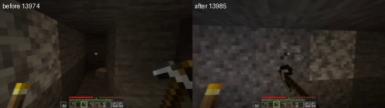 |
| 1 | true | 0.76 | 草地地形在前后帧发生连续位移，空动作可解释为微小视角/移动噪声。 | 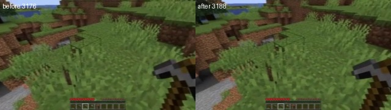 |
| 2 | true | 0.70 | 黑暗矿道中工具目标和朝向保持一致，攻击段虽变化小但未见切段。 | 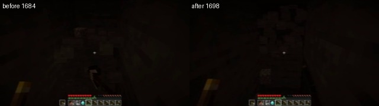 |
| 3 | true | 0.78 | 草地坑道前后视角连续，空动作对应观察转向而非两个独立片段。 | 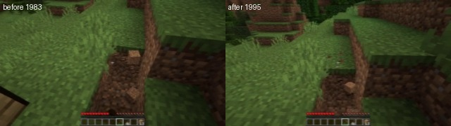 |
| 4 | true | 0.85 | 树木与工具位置连续变化，符合一次完整砍伐/攻击过程。 | 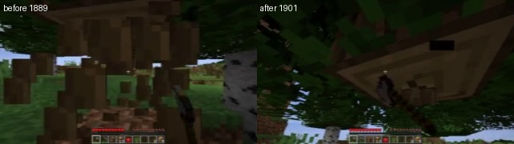 |
| 5 | true | 0.67 | 暗处矿道目标变化不明显，但工具和朝向稳定，攻击意图仍连续。 | 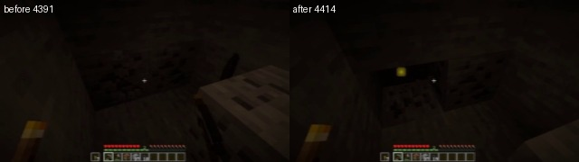 |
| 6 | false | 0.75 | 两帧合成界面几乎完全相同，缺少可观察的动作结果，核心意图不可确认。 | 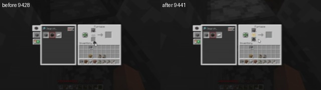 |
| 7 | true | 0.91 | 水面、岸线和角色位置连续变化，前进加跳跃构成完整移动段。 | 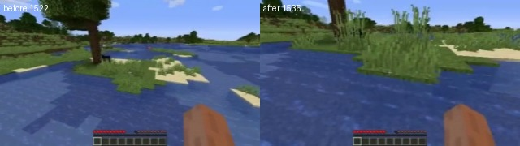 |
| 8 | true | 0.74 | 矿道中火把、方块和工具连续变化，边走边攻击可视为单一意图。 | 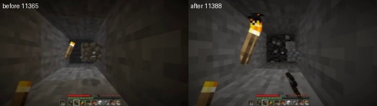 |
| 9 | true | 0.77 | 洞穴通道与火把位置前后连续，前进段未出现明显意图断点。 | 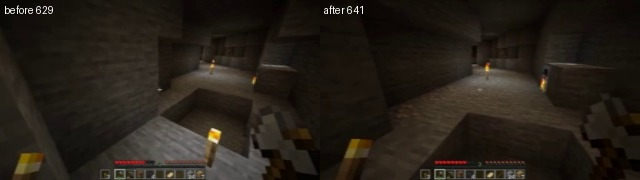 |
| 10 | true | 0.73 | 工作台/矿道场景仅发生连续的小幅视角调整，未见硬切。 | 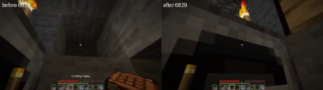 |
| 11 | false | 0.66 | 暗场前后几乎无可见目标变化，核心攻击无法从图像确认是否完整。 | 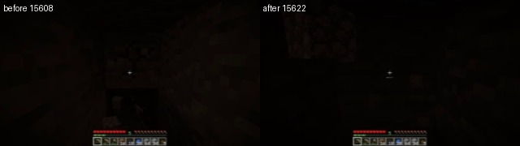 |
| 12 | false | 0.68 | 暗处方块和工具轮廓基本不变，核心攻击的起止意图缺乏视觉证据。 | 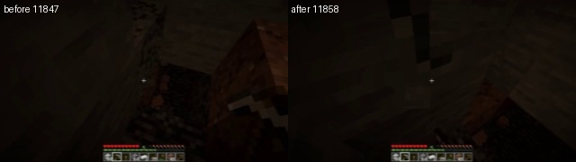 |
| 13 | true | 0.88 | 草原、水面和沙滩明显连续位移，前进跳跃动作完整。 | 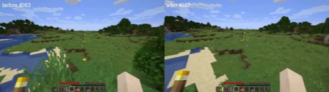 |
| 14 | true | 0.79 | 矿洞中火把、石壁和工具姿态一致，攻击目标连续。 | 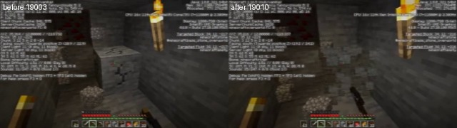 |
| 15 | true | 0.81 | 洞穴从近壁转向有火把的通道，属于连续观察转向而非切断。 | 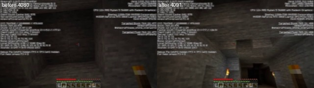 |
| 16 | true | 0.84 | 合成界面前后布局稳定，光标和物品变化可归于同一交互意图。 | 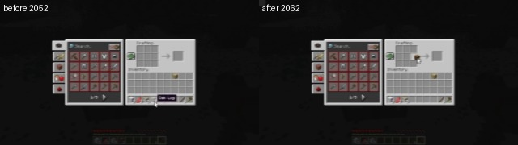 |
| 17 | true | 0.72 | 矿道前后均对准同一通道并持续攻击，目标连续。 | 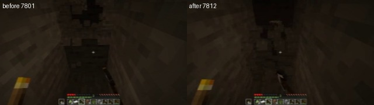 |
| 18 | true | 0.71 | 黑暗矿道的火把/方块轮廓连续，攻击片段未显示意图切换。 | 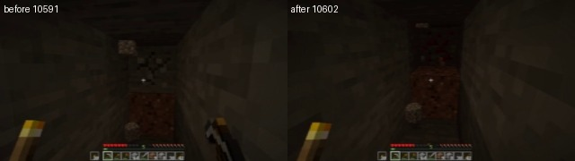 |
| 19 | true | 0.86 | 树木和地面方块从前到后连续变化，砍伐意图完整。 | 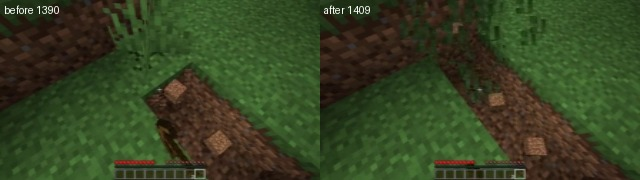 |
| 20 | false | 0.83 | 两帧均近乎纯黑且核心为空动作，无法确认连续可观察意图。 | 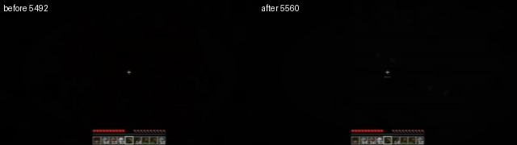 |
| 21 | true | 0.82 | 矿壁与工具位置连续，攻击目标未改变，核心完整。 | 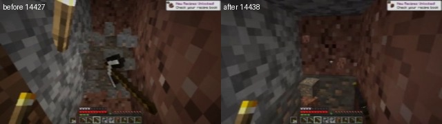 |
| 22 | true | 0.78 | 熔岩、石壁和通道前后连贯，视角变化仍属于同一观察意图。 | 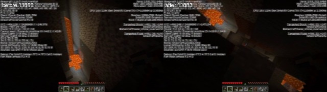 |
| 23 | false | 0.86 | 熔岩场景前后方位变化较大且核心为空动作，难以确认单一连续意图。 | 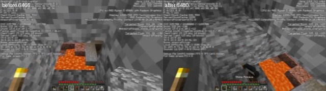 |
| 24 | true | 0.74 | 黑暗矿道工具与目标轮廓一致，攻击过程可视为连续。 | 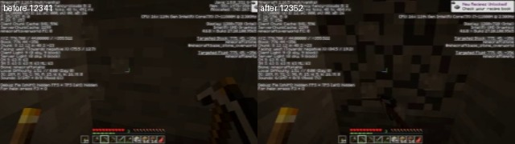 |
| 25 | true | 0.93 | 桦树由完整到明显破坏，攻击结果清晰，核心完整。 | 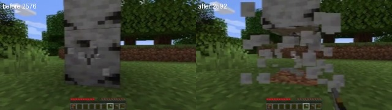 |
| 26 | true | 0.9 | 石洞由近壁移动到开阔出口，前进意图连续且方向一致。 | 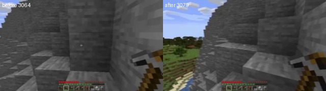 |
| 27 | true | 0.72 | 暗矿道中工具、矿石和朝向稳定，攻击段没有明显切断。 | 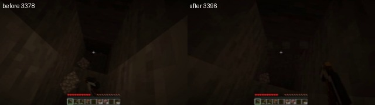 |
| 28 | true | 0.76 | 合成界面前后处于同一交互状态，物品变化属于同一操作。 | 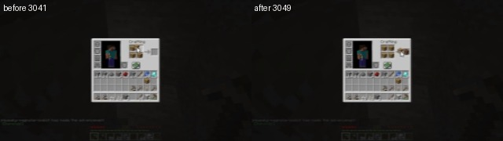 |
| 29 | false | 0.82 | 合成界面前后变化很小且核心为空，无法从图像确认有效意图。 | 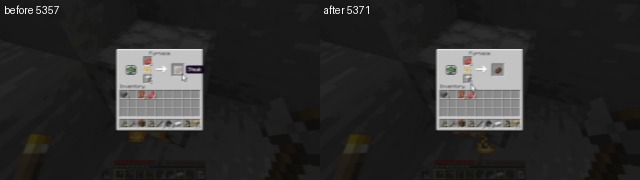 |
| 30 | true | 0.84 | 夜间草原位置和视角连续，前进跳跃没有明显边界断裂。 | 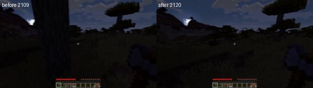 |
| 31 | false | 0.79 | 合成界面几乎固定，空动作核心缺少可观察的连续结果。 | 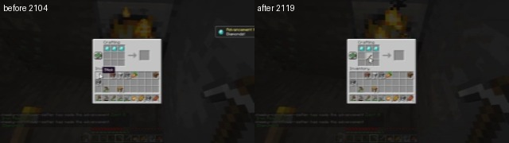 |
| 32 | true | 0.75 | 合成界面切回矿洞是单次连续状态转换，前后画面可以连贯解释。 | 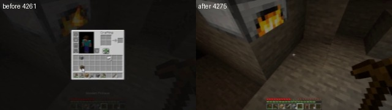 |
| 33 | true | 0.88 | 煤矿方块和工具连续对齐，攻击意图明确。 | 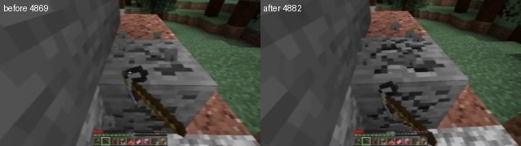 |
| 34 | true | 0.7 | 暗矿道前后仍保持同一通道和朝向，未观察到意图切换。 | 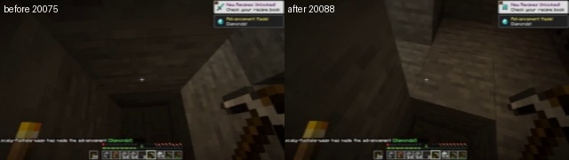 |
| 35 | true | 0.8 | 矿道方块、火把和工具变化连续，属于完整攻击过程。 | 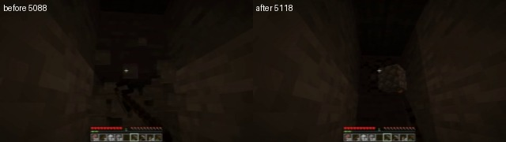 |
| 36 | true | 0.87 | 前进、左移和攻击共同导致矿道位置变化，仍是一个复合意图。 | 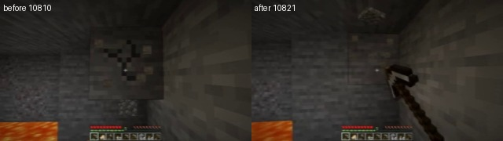 |
| 37 | true | 0.81 | 草地和树冠视角发生连续转移，空动作对应观察移动。 | 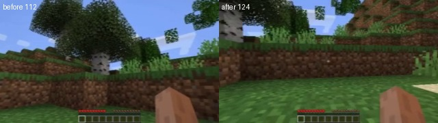 |
| 38 | false | 0.73 | 黑暗画面前后几乎没有可确认位移，核心前进意图缺乏视觉证据。 | 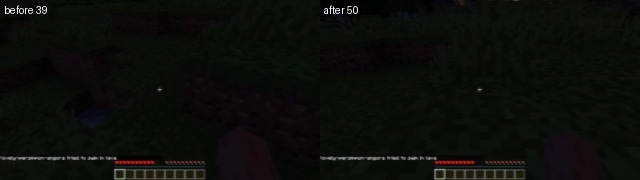 |
| 39 | true | 0.76 | 矿道两帧对准同一石壁，攻击工具连续出现。 | 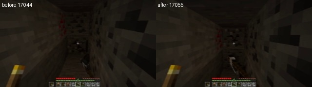 |
| 40 | true | 0.8 | 草原由近景移动到山坡方向，前进跳跃意图完整。 | 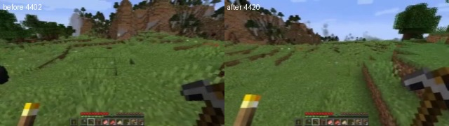 |
| 41 | true | 0.72 | 合成界面前后保持同一布局，物品交互属于同一操作段。 | 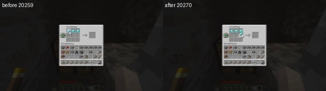 |
| 42 | true | 0.86 | 洞穴火把和通道位置连续，前进左移跳跃未被切断。 | 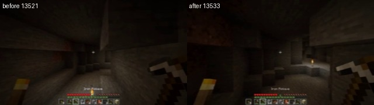 |
| 43 | true | 0.69 | 暗矿道中前进攻击保持同一目标方向，虽变化小但连贯。 | 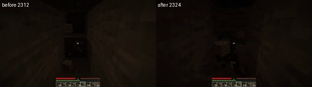 |
| 44 | true | 0.88 | 石块破坏前后工具和目标一致，攻击意图清晰。 | 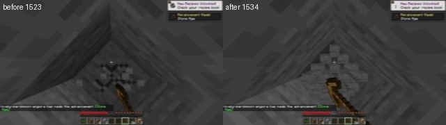 |
| 45 | true | 0.84 | 矿洞方块由近到远连续变化，攻击未跨越明显场景边界。 | 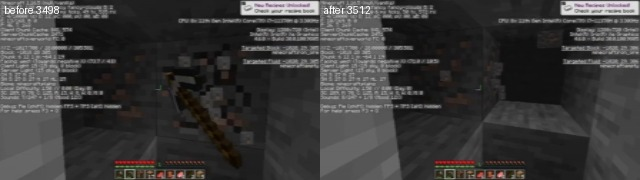 |
| 46 | false | 0.73 | 暗处前后缺少可见目标变化，单凭图像无法确认攻击完整性。 | 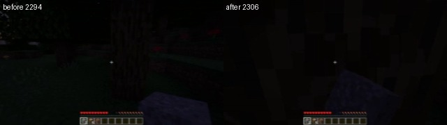 |
| 47 | true | 0.95 | 长段连续挖掘同一类石壁，前后目标和工具关系高度一致。 | 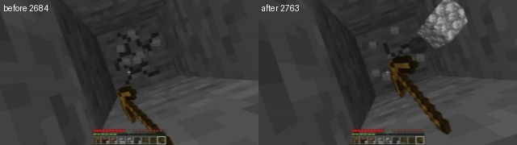 |
| 48 | true | 0.83 | 合成界面物品状态发生连续变化，仍是同一交互意图。 | 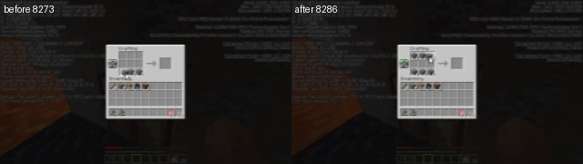 |
| 49 | false | 0.9 | 两帧几乎全黑且核心纯度仅0.5，无法支持完整连续意图判断。 | 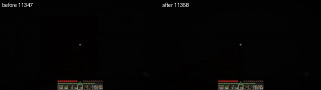 |
