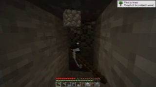
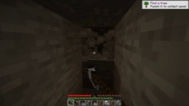
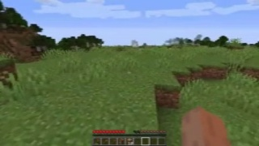
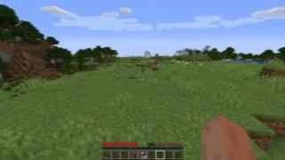

# 带图动作训练任务 Demo

本目录给出四类微调测试题。所有动作题都绑定同一 episode 的连续图片。每题同时保存标准
答案、查看标准答案后的适配性判断、未查看标准答案时的盲答，以及盲答与标准答案的比较。

## 任务契约

| 类型 | 训练输入 | 训练目标 | 约束 |
| --- | --- | --- | --- |
| 动作优化 | 图片、原动作、宏观目标、优化规则 | 优化后的动作序列 | 保持时长和有效控制，只修复与宏观意图冲突的噪声 |
| 反序列生成 | 图片、宏观目标、同一优化规则 | 优化后的动作序列 | 输入中禁止出现原动作序列 |
| 预测判断 | 过去图片、四个候选动作 | 候选标签 | 不提供过去动作、未来图片和未来动作 |
| 意图判断 | 具有明确连续含义的图片、四个宏观意图 | 宏观意图标签 | 不要求恢复逐 tick 精确动作 |

动作序列统一采用四个 50 ms tick：

```text
<|action_start|> ; tick_1 ; tick_2 ; tick_3 ; tick_4 <|action_end|>
```

精确动作答案来自人类示范轨迹。它表示可复现的合适动作，不表示唯一最优动作。

## 1. 动作优化

题目编号：`action_optimization_001`

图片按 `t-12、t-8、t-4、t` 排列：





输入：

```json
{
  "objective": "持续采掘准星附近的石块，并保持向右贴近目标",
  "original_action": "<|action_start|> ; D MouseLeft ; D ; D MouseLeft Mouse 2 7 ; D MouseLeft Mouse 5 23 <|action_end|>",
  "optimization_rule": "保持四个 tick、移动方向和有效视角修正；消除会中断宏观意图的偶发漏按"
}
```

标准答案：

```text
<|action_start|> ; D MouseLeft ; D MouseLeft ; D MouseLeft Mouse 2 7 ; D MouseLeft Mouse 5 23 <|action_end|>
```

带答案判断：合适。答案只补齐第二个 tick 的 `MouseLeft`，保留 `D`、动作时长和有效视角
修正。它消除了采掘中断，没有加入图片与目标无法支持的新动作。

无答案盲答：

```text
<|action_start|> ; D MouseLeft ; D MouseLeft ; D MouseLeft Mouse 2 7 ; D MouseLeft Mouse 5 23 <|action_end|>
```

盲答结论：与标准答案完全一致。

## 2. 反序列生成

题目编号：`inverse_action_generation_001`

图片按 `t-12、t-8、t-4、t` 排列：


训练输入：

```json
{
  "objective": "持续采掘准星附近的石块，并保持向右贴近目标",
  "optimization_rule": "生成四个连续 tick；保持宏观动作连续，只保留图像支持的移动、交互和视角修正"
}
```

该输入没有 `original_action`。标准答案仍使用与动作优化题相同的优化方法和输出协议：

```text
<|action_start|> ; D MouseLeft ; D MouseLeft ; D MouseLeft Mouse 2 7 ; D MouseLeft Mouse 5 23 <|action_end|>
```

带答案判断：可作为弱监督答案。图片与采掘目标支持持续 `D MouseLeft`；精确鼠标数值来自
示范轨迹，因此答案可以用于复现示范，不能标记为唯一最优控制。

无答案盲答：

```text
<|action_start|> ; D MouseLeft ; D MouseLeft ; D MouseLeft Mouse 2 7 ; D MouseLeft Mouse 5 23 <|action_end|>
```

盲答结论：命中标准示范，且没有从题面读取原动作。

## 3. 预测判断

题目编号：`future_action_choice_001`

图片只包含动作发生前的 `t-12、t-8、t-4、t` 历史帧：






未来 200 ms 的最佳示范选择：

| 选项 | 动作摘要 |
| --- | --- |
| A | 四个 tick 保持静止 |
| B | 四个 tick 持续 `W+space` |
| C | 四个 tick 持续 `S` |
| D | 四个 tick 持续 `MouseLeft` |

标准答案：`B`。

带答案判断：合适。答案对应数据轨迹中的后续示范。输入没有过去动作、未来画面或未来动作，
四个候选互不相同。该答案表示示范选择，不表示所有可行策略中的唯一最优选择。

无答案盲答：`B`。连续历史画面支持维持向前运动状态，跳跃选项与轨迹示范一致。

## 4. 意图判断

题目编号：`macro_intent_classification_001`

图片按时间顺序排列：


| 选项 | 宏观意图 |
| --- | --- |
| A | 打开背包整理物品 |
| B | 脱离目标并向后撤退 |
| C | 持续采掘准星附近的石块 |
| D | 原地等待环境变化 |

标准答案：`C`。

带答案判断：合适。连续画面围绕同一近距离方块目标，来源轨迹还有
`minecraft.mine_block:minecraft.stone` 事件证据。宏观标签不依赖精确鼠标数值，稳定性高于
逐 tick 逆动力学标签。

无答案盲答：`C`。画面表现为围绕同一方块持续执行交互，其他三个选项缺少视觉支持。

## 训练使用建议

| 数据 | 建议用途 | 权重 |
| --- | --- | ---: |
| 动作优化 | 有条件序列修正 | 1.0 |
| 反序列生成 | 视觉到优化控制序列 | 0.5 |
| 预测判断 | 无动作历史的未来控制分类 | 1.0 |
| 意图判断 | 视觉表征与宏观规划辅助目标 | 1.0 |

反序列生成的精确鼠标值存在视觉不可辨识性，建议降低权重。实际扩充数据时应保留来源 episode、
观察帧、动作帧范围和标签来源，并按 episode 划分训练集与验证集，防止相邻帧泄漏。
