# 八方面 LoRA 多任务训练数据生成

本目录与 `bc_datasets/minestudio/` 同级。生成器从 MineStudio 的 `image`、`action` 和
`meta_info` 真实轨迹采样八类训练数据：未来控制、逆动力学、动作时序与幅度、GUI 状态、
事件结果、短期状态转移、目标条件控制和协议翻译。

逆动力学使用窗口级动作族标签，不要求从画面恢复不可辨识的逐 tick 精确动作。逆动力学、
相机变化、事件结果和短期状态转移使用 `t` 到 `t+4` 的五张连续帧，并在题面声明图片按
时间顺序排列。相机方向、事件名称和状态转移也声明固定 JSON 结构与合法值。

未来控制和目标条件控制只提供动作发生前的历史帧，不提供答案区间内的未来画面，避免
训练输入发生时间泄漏。

## 目录内容

| 文件 | 作用 |
| --- | --- |
| `generator.py` | 八类数据的采样、标签生成和 JSONL 写出 |
| `__main__.py` | `python -m bc_datasets.training_capabillity_demo` 命令入口 |
| `__init__.py` | 对外导出生成 API 和确定性标签函数 |

## 运行

```bash
python -m bc_datasets.training_capabillity_demo \
    --dataset-dir runs/bc_datasets/minestudio-data-10xx-v110 \
    --output-dir runs/bc_datasets/training-capability-demo \
    --samples-per-aspect 100 \
    --overwrite
```

输出目录包含 `questions.jsonl`、`answer_key.jsonl`、`manifest.json` 和 `images/`。输出目录
由调用方指定，不保存在本代码目录中。八类题均写入 `include_in_training=true` 和
`review_status=accepted_for_training`；`assessment_scope` 与 `known_risks` 用于控制采样
权重和分题型统计。

未来控制标签是轨迹中的人类示范，并非唯一最优动作。目标条件由未来任务事件进行
hindsight relabel，推理时需要规划器提供同类目标。事件结果在 200 ms 窗口内可能缺少
明显视觉证据，适合作为低权重世界模型监督。

## 八种训练案例

下列案例来自生成器以 `seed=20260731` 实际采样的结果。示例省略来源 episode、帧号和
审计字段，只保留组成训练对所需的图片、Prompt、附加输入和目标答案。

| 方面 | 图片输入 | 训练目标 |
| --- | --- | --- |
| `future_control` | 4 张动作前历史帧 | 复现后续 4 个 tick 的示范动作 |
| `inverse_dynamics` | 5 张连续过渡帧 | 判断窗口级按键族和粗相机运动 |
| `timing_and_magnitude` | 5 张连续过渡帧 | 判断相机方向与幅度分箱 |
| `visual_gui_state` | 1 张当前帧 | 判断 GUI 与玩家背包状态 |
| `event_outcome` | 5 张连续过渡帧 | 从候选事件中输出实际事件及增量 |
| `short_horizon_transition` | 5 张连续过渡帧 | 描述位置、视角、GUI、快捷栏和事件变化 |
| `goal_conditioned_control` | 4 张动作前历史帧 | 根据 hindsight goal 复现示范动作 |
| `protocol_translation` | 无图片 | 把结构化 tick 翻译成动作 token 契约 |

### 1. 未来控制

- 图片：`t-12、t-8、t-4、t` 四张历史帧。
- Prompt：`Reproduce the demonstrated next 200 ms control from the visual history. Output only one action block.`
- 训练范围：`behavior_cloning`。答案是数据中的示范，不是唯一最优动作。

题目图片（从左到右为 `t-12、t-8、t-4、t`）：


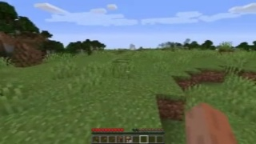


完整题目：

```json
{
  "id": "future_control_000000",
  "aspect": "future_control",
  "prompt": "Reproduce the demonstrated next 200 ms control from the visual history. Output only one action block.",
  "images": [
    "images/future_control_000000_00004603_0.jpg",
    "images/future_control_000000_00004603_1.jpg",
    "images/future_control_000000_00004603_2.jpg",
    "images/future_control_000000_00004603_3.jpg"
  ],
  "inputs": {
    "previous_action": "<|action_start|> ; W ctrl ; W space ctrl ; W space ctrl ; W space <|action_end|>"
  },
  "assessment_scope": "behavior_cloning",
  "known_risks": ["the demonstrated action is not the unique optimal action"],
  "review_status": "accepted_for_training",
  "include_in_training": true
}
```

输入：

```json
{
  "previous_action": "<|action_start|> ; W ctrl ; W space ctrl ; W space ctrl ; W space <|action_end|>"
}
```

目标答案：

```text
<|action_start|> ; W space ; W space ; W space ; W space <|action_end|>
```

### 2. 逆动力学

- 图片：`t、t+1、t+2、t+3、t+4` 五张连续帧。
- Prompt：根据按时间排列的 200 ms 视觉过渡，输出窗口级移动键、交互键和粗相机运动。
- 训练范围：`inverse_dynamics_auxiliary_training`。

题目图片（从左到右为 `t、t+1、t+2、t+3、t+4`）：

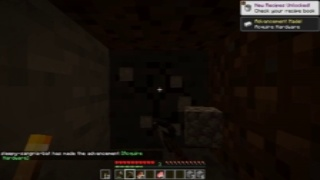
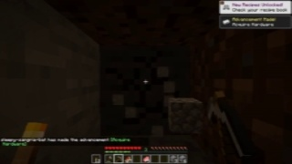

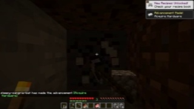
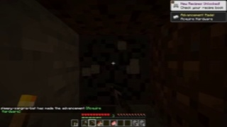

完整题目：

```json
{
  "id": "inverse_dynamics_000000",
  "aspect": "inverse_dynamics",
  "prompt": "The five images are consecutive frames in chronological order across 200 ms. Infer only the coarse action families visible across this transition. Answer JSON with movement_keys (subset of W,A,S,D,space,shift,ctrl), interaction_keys (subset of MouseLeft,MouseRight,E,Q), and camera with pitch_direction/yaw_direction in positive,negative,stable and magnitude in small,medium,large.",
  "images": [
    "images/inverse_dynamics_000000_00007805_0.jpg",
    "images/inverse_dynamics_000000_00007805_1.jpg",
    "images/inverse_dynamics_000000_00007805_2.jpg",
    "images/inverse_dynamics_000000_00007805_3.jpg",
    "images/inverse_dynamics_000000_00007805_4.jpg"
  ],
  "inputs": {},
  "assessment_scope": "inverse_dynamics_auxiliary_training",
  "known_risks": ["coarse action families can remain ambiguous under occlusion or negligible displacement"],
  "review_status": "accepted_for_training",
  "include_in_training": true
}
```

目标答案：

```json
{
  "movement_keys": [],
  "interaction_keys": ["MouseLeft"],
  "camera": {
    "pitch_direction": "stable",
    "yaw_direction": "negative",
    "magnitude": "small"
  }
}
```

### 3. 相机时序与幅度

- 图片：`t` 到 `t+4` 五张连续帧。
- Prompt：判断整段相机运动；方向只能取 `positive、negative、stable`，幅度只能取
  `small、medium、large`。正 yaw 表示向右，正 pitch 表示向下。

题目图片（从左到右为 `t、t+1、t+2、t+3、t+4`）：

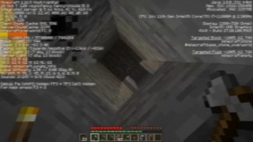
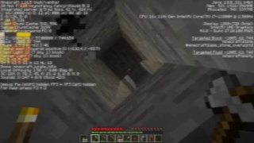
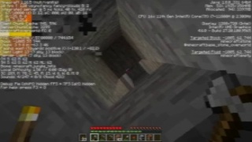
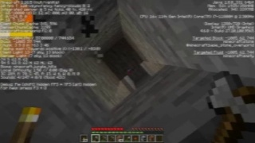
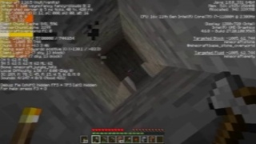

完整题目：

```json
{
  "id": "timing_and_magnitude_000000",
  "aspect": "timing_and_magnitude",
  "prompt": "The five images are consecutive frames in chronological order across 200 ms. Classify the recorded camera motion across them. Answer JSON with pitch_direction and yaw_direction chosen from positive, negative, stable, and magnitude chosen from small, medium, large. Positive yaw turns right; positive pitch looks down, following the recorded camera coordinate convention.",
  "images": [
    "images/timing_and_magnitude_000000_00008065_0.jpg",
    "images/timing_and_magnitude_000000_00008065_1.jpg",
    "images/timing_and_magnitude_000000_00008065_2.jpg",
    "images/timing_and_magnitude_000000_00008065_3.jpg",
    "images/timing_and_magnitude_000000_00008065_4.jpg"
  ],
  "inputs": {},
  "assessment_scope": "auxiliary_training",
  "known_risks": [],
  "review_status": "accepted_for_training",
  "include_in_training": true
}
```

目标答案：

```json
{
  "pitch_direction": "positive",
  "yaw_direction": "positive",
  "magnitude": "large"
}
```

### 4. GUI 状态

- 图片：当前时刻 1 张图。
- Prompt：`Is a GUI open, and is it the player inventory GUI? Answer as JSON booleans.`

题目图片：

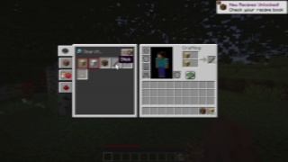

完整题目：

```json
{
  "id": "visual_gui_state_000000",
  "aspect": "visual_gui_state",
  "prompt": "Is a GUI open, and is it the player inventory GUI? Answer as JSON booleans.",
  "images": ["images/visual_gui_state_000000_00001275_0.jpg"],
  "inputs": {},
  "assessment_scope": "auxiliary_training",
  "known_risks": [],
  "review_status": "accepted_for_training",
  "include_in_training": true
}
```

目标答案：

```json
{
  "gui_open": true,
  "player_inventory_gui": true
}
```

### 5. 事件结果

- 图片：`t` 到 `t+4` 五张连续帧。
- Prompt：从给出的候选事件中，输出过渡期间实际发生的事件及数值增量。
- 训练范围：`world_model_weak_supervision`。

题目图片（从左到右为 `t、t+1、t+2、t+3、t+4`）：

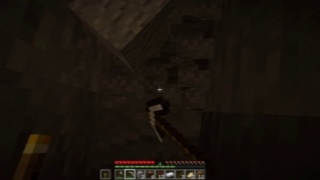
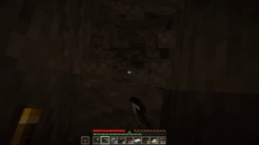
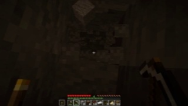
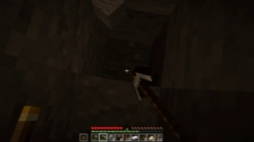
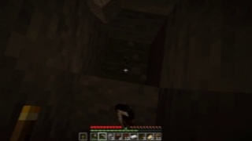

完整题目：

```json
{
  "id": "event_outcome_000000",
  "aspect": "event_outcome",
  "prompt": "The five images are consecutive frames in chronological order across 200 ms. Which listed non-timer game events occurred during the demonstrated transition? Return a JSON object mapping only candidate event names to numeric increments.",
  "images": [
    "images/event_outcome_000000_00006231_0.jpg",
    "images/event_outcome_000000_00006231_1.jpg",
    "images/event_outcome_000000_00006231_2.jpg",
    "images/event_outcome_000000_00006231_3.jpg",
    "images/event_outcome_000000_00006231_4.jpg"
  ],
  "inputs": {
    "executed_action": "<|action_start|> ; shift MouseLeft ; shift MouseLeft ; shift MouseLeft ; W shift MouseLeft <|action_end|>",
    "candidate_events": [
      "minecraft.mine_block:minecraft.andesite",
      "minecraft.use_item:minecraft.iron_pickaxe"
    ]
  },
  "assessment_scope": "world_model_weak_supervision",
  "known_risks": ["the event label can be correct while visually imperceptible in 200 ms"],
  "review_status": "accepted_for_training",
  "include_in_training": true
}
```

输入：

```json
{
  "executed_action": "<|action_start|> ; shift MouseLeft ; shift MouseLeft ; shift MouseLeft ; W shift MouseLeft <|action_end|>",
  "candidate_events": [
    "minecraft.mine_block:minecraft.andesite",
    "minecraft.use_item:minecraft.iron_pickaxe"
  ]
}
```

目标答案：

```json
{
  "minecraft.mine_block:minecraft.andesite": 1,
  "minecraft.use_item:minecraft.iron_pickaxe": 1
}
```

### 6. 短期状态转移

- 图片：`t` 到 `t+4` 五张连续帧。
- Prompt：描述已观察到的位置方向、视角方向、GUI、快捷栏和事件变化。
- 训练范围：`world_model_training`。

题目图片（从左到右为 `t、t+1、t+2、t+3、t+4`）：

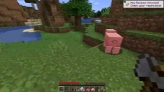
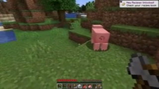
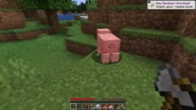
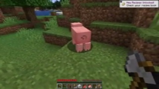
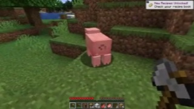

完整题目：

```json
{
  "id": "short_horizon_transition_000000",
  "aspect": "short_horizon_transition",
  "prompt": "The five images show the supplied 200 ms action transition in chronological order. Describe the observed player-state change. Return JSON with position_direction{xpos,ypos,zpos} and view_direction{yaw,pitch}, each using positive,negative,stable; gui_change using opened,closed,unchanged; hotbar_changed as a boolean; and events as an event-to-increment object.",
  "images": [
    "images/short_horizon_transition_000000_00002893_0.jpg",
    "images/short_horizon_transition_000000_00002893_1.jpg",
    "images/short_horizon_transition_000000_00002893_2.jpg",
    "images/short_horizon_transition_000000_00002893_3.jpg",
    "images/short_horizon_transition_000000_00002893_4.jpg"
  ],
  "inputs": {
    "executed_action": "<|action_start|> ; W Mouse 75 13 ; W Mouse 85 5 ; W Mouse 45 4 ; W Mouse 5 0 <|action_end|>",
    "initial_state": {
      "gui_open": false,
      "player_inventory_gui": false,
      "hotbar_slot": 1
    }
  },
  "assessment_scope": "world_model_training",
  "known_risks": ["five consecutive frames may still not expose hidden state or world-axis orientation"],
  "review_status": "accepted_for_training",
  "include_in_training": true
}
```

输入：

```json
{
  "executed_action": "<|action_start|> ; W Mouse 75 13 ; W Mouse 85 5 ; W Mouse 45 4 ; W Mouse 5 0 <|action_end|>",
  "initial_state": {
    "gui_open": false,
    "player_inventory_gui": false,
    "hotbar_slot": 1
  }
}
```

目标答案：

```json
{
  "position_direction": {
    "xpos": "negative",
    "ypos": "stable",
    "zpos": "positive"
  },
  "view_direction": {
    "yaw": "positive",
    "pitch": "positive"
  },
  "gui_change": "unchanged",
  "hotbar_changed": false,
  "events": {}
}
```

### 7. 目标条件控制

- 图片：`t-12、t-8、t-4、t` 四张历史帧，不包含答案区间的未来画面。
- Prompt：根据 hindsight task goal，复现后续 200 ms 的示范控制。
- 训练范围：`goal_conditioned_behavior_cloning`。

题目图片（从左到右为 `t-12、t-8、t-4、t`）：

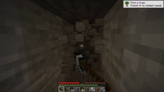
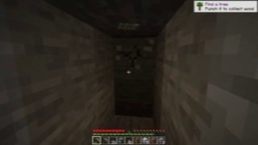


完整题目：

```json
{
  "id": "goal_conditioned_control_000000",
  "aspect": "goal_conditioned_control",
  "prompt": "Given the hindsight task goal, reproduce the next 200 ms demonstrated control. Output only one action block.",
  "images": [
    "images/goal_conditioned_control_000000_00004152_0.jpg",
    "images/goal_conditioned_control_000000_00004152_1.jpg",
    "images/goal_conditioned_control_000000_00004152_2.jpg",
    "images/goal_conditioned_control_000000_00004152_3.jpg"
  ],
  "inputs": {
    "hindsight_goal": "minecraft.mine_block:minecraft.stone",
    "previous_action": "<|action_start|> ; D MouseLeft ; D MouseLeft ; D MouseLeft ; D MouseLeft <|action_end|>"
  },
  "assessment_scope": "goal_conditioned_behavior_cloning",
  "known_risks": ["the hindsight event goal must be supplied by a planner at inference"],
  "review_status": "accepted_for_training",
  "include_in_training": true
}
```

输入：

```json
{
  "hindsight_goal": "minecraft.mine_block:minecraft.stone",
  "previous_action": "<|action_start|> ; D MouseLeft ; D MouseLeft ; D MouseLeft ; D MouseLeft <|action_end|>"
}
```

目标答案：

```text
<|action_start|> ; D MouseLeft ; D MouseLeft ; D MouseLeft Mouse 2 7 ; D MouseLeft Mouse 5 23 <|action_end|>
```

### 8. 协议翻译

- 图片：无。
- Prompt：把四个结构化 50 ms tick 翻译成严格的命名 token 动作契约。
- 训练范围：`format_warmup_only`，不衡量视觉控制能力。

题目图片：无。该题只接收结构化 tick。

完整题目：

```json
{
  "id": "protocol_translation_000000",
  "aspect": "protocol_translation",
  "prompt": "Translate the four structured 50 ms ticks into the strict named-token action contract.",
  "images": [],
  "inputs": {
    "ticks": [
      {"keys": ["MouseLeft"], "mouse": [1, -1]},
      {"keys": ["MouseLeft"], "mouse": [1, 0]},
      {"keys": ["MouseLeft"], "mouse": [0, -1]},
      {"keys": ["MouseLeft"], "mouse": [0, 0]}
    ]
  },
  "assessment_scope": "format_warmup_only",
  "known_risks": ["this task does not measure visual control"],
  "review_status": "accepted_for_training",
  "include_in_training": true
}
```

输入：

```json
{
  "ticks": [
    {"keys": ["MouseLeft"], "mouse": [1, -1]},
    {"keys": ["MouseLeft"], "mouse": [1, 0]},
    {"keys": ["MouseLeft"], "mouse": [0, -1]},
    {"keys": ["MouseLeft"], "mouse": [0, 0]}
  ]
}
```

目标答案：

```text
<|action_start|> ; MouseLeft Mouse 1 -1 ; MouseLeft Mouse 1 0 ; MouseLeft Mouse 0 -1 ; MouseLeft <|action_end|>
```
