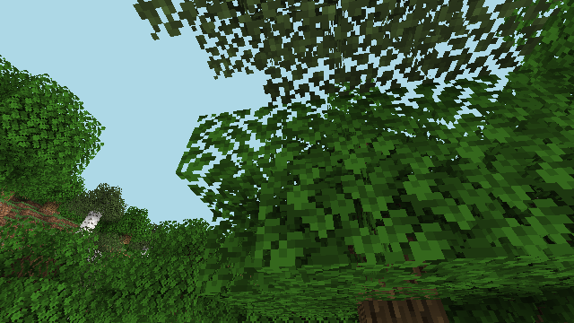
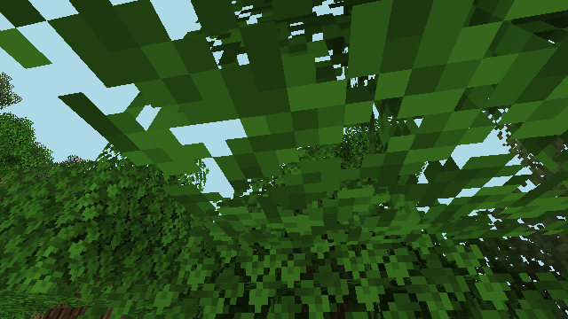
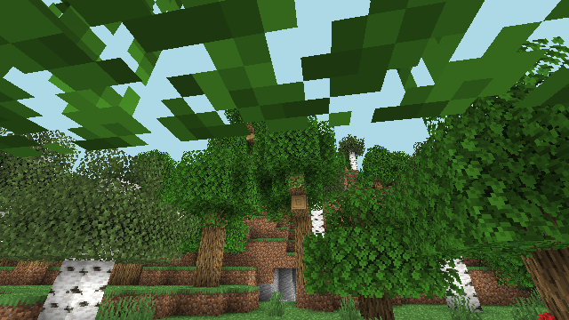
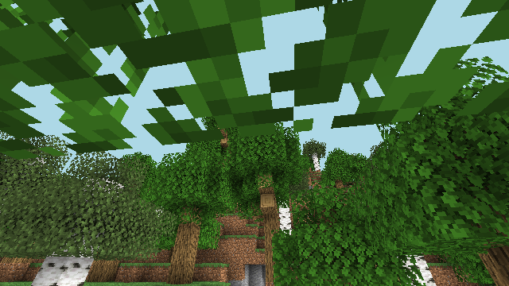
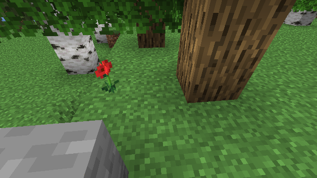
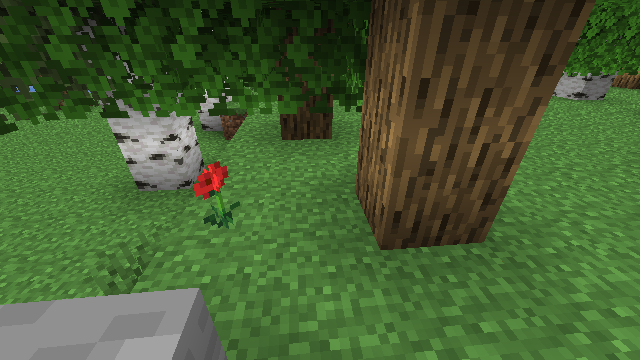

# 关键节点动作数据集示例

每个节点: **该节点截取的观测帧** + **此后执行的动作**(含起始 tick 与持续 tick)。

## 节点 0: move_forward

- 观测截取于 tick 95997
- 此后执行动作:
  - `F` (sustained) start=95997t dur=40t / 610ms

## 节点 1: jump

- 观测截取于 tick 96157
- 此后执行动作:
  - `jump` (sustained) start=96157t dur=20t / 422ms

## 节点 2: turn_camera

- 观测截取于 tick 96257
- 此后执行动作:
  - `cam(+90,-11)` (look) start=96257t dur=0t / 0ms

## 节点 3: craft_planks

- 观测截取于 tick 96437
- 此后执行动作:
  - `craft:oak_planks` (craft) start=96437t dur=20t / 28ms

## 节点 4: place_stone

- 观测截取于 tick 96557
- 此后执行动作:
  - `cam(+165,-74)` (look) start=96557t dur=40t / 227ms
  - `use` (place) start=96557t dur=40t / 251ms

## 节点 5: dig_stone

- 观测截取于 tick 96677
- 此后执行动作:
  - `cam(+0,+10)` (look) start=96677t dur=0t / 2ms
  - `attack` (dig) start=96677t dur=0t / 5ms

## 末帧观测

所有动作执行完毕后的最终视角。
