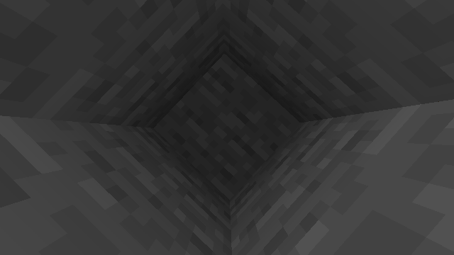
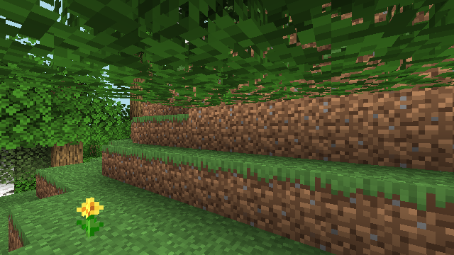
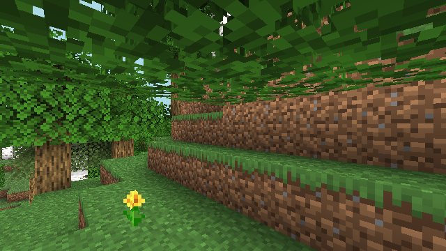
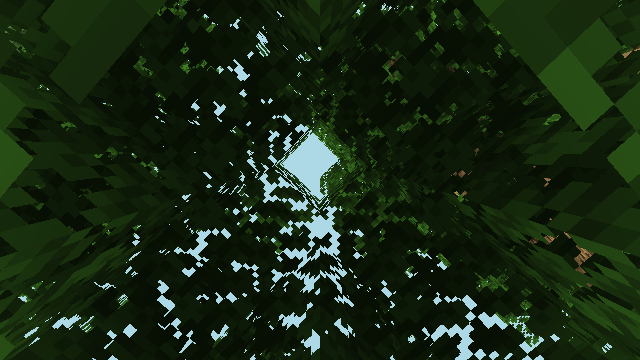
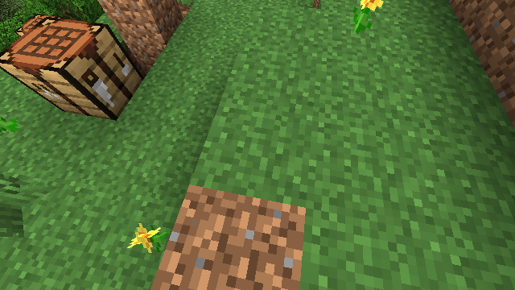
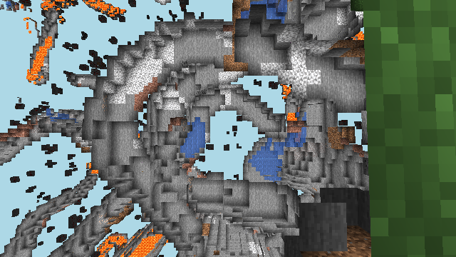
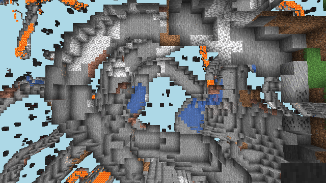
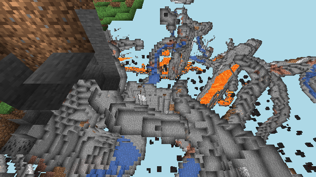
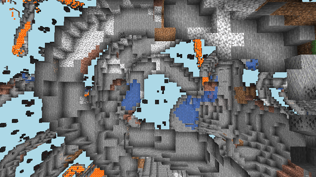
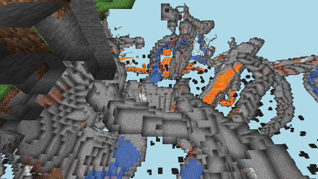

# 生存模式挖矿链 · 关键节点数据集

从零开始的完整链路: 走路 → 砍树 → 合成(木板/木棍/工作台) → 放工作台 → 合成木镐 → 用镐挖石头。
每个节点: **该节点观测帧** + **此后执行的动作**(含起始 tick 与持续 tick)。

## 节点 0: walk_to_tree (朝树移动)

- 观测截取于 tick 177356
- 此后执行动作:
  - `cam(-316,+81)` (look) start=177356t dur=0t / 252ms
  - `attack` (dig) start=177356t dur=180t / 7785ms [stone]
  - `cam(+0,+6)` (look) start=177536t dur=0t / 208ms
  - `jump` (sustained) start=177536t dur=20t / 84ms
  - `cam(+0,+0)` (look) start=177556t dur=0t / 183ms
  - `cam(+1,+0)` (look) start=177556t dur=0t / 118ms
  - `cam(+1,+0)` (look) start=177556t dur=0t / 58ms
  - `cam(+1,+0)` (look) start=177556t dur=0t / 7ms
  - `F` (sustained) start=177536t dur=20t / 537ms
  - `sprint` (sustained) start=177536t dur=20t / 335ms
  - `cam(+1,+0)` (look) start=177556t dur=0t / 20ms
  - `cam(+1,+0)` (look) start=177556t dur=0t / 13ms
  - `cam(+1,+0)` (look) start=177556t dur=0t / 6ms
  - `cam(-1,+41)` (look) start=177556t dur=0t / 26ms
  - `attack` (dig) start=177556t dur=20t / 779ms [dirt]
  - `cam(+0,-48)` (look) start=177576t dur=0t / 4ms
  - `attack` (dig) start=177576t dur=20t / 758ms [dirt]
  - `cam(+0,+7)` (look) start=177596t dur=0t / 163ms
  - `jump` (sustained) start=177596t dur=0t / 150ms
  - `cam(+0,+0)` (look) start=177596t dur=0t / 116ms
  - `cam(+0,+0)` (look) start=177596t dur=0t / 55ms
  - `cam(+0,+0)` (look) start=177596t dur=0t / 27ms
  - `cam(+0,+0)` (look) start=177596t dur=0t / 13ms
  - `F` (sustained) start=177596t dur=0t / 455ms
  - `sprint` (sustained) start=177596t dur=0t / 293ms
  - `cam(+0,+0)` (look) start=177596t dur=0t / 9ms
  - `cam(+0,+0)` (look) start=177596t dur=0t / 5ms
  - `cam(-1,+0)` (look) start=177596t dur=0t / 1ms
  - `cam(-89,+89)` (look) start=177596t dur=0t / 0ms
  - `attack` (dig) start=177596t dur=20t / 764ms [dirt]
  - `jump` (sustained) start=177616t dur=0t / 141ms
  - `cam(+0,+0)` (look) start=177616t dur=0t / 227ms
  - `cam(+0,+0)` (look) start=177616t dur=0t / 144ms
  - `cam(+0,+0)` (look) start=177616t dur=0t / 83ms
  - `cam(+0,+0)` (look) start=177616t dur=0t / 21ms
  - `cam(+89,-89)` (look) start=177616t dur=0t / 638ms
  - `cam(+0,+0)` (look) start=177616t dur=0t / 518ms
  - `cam(+0,+0)` (look) start=177616t dur=0t / 374ms
  - `cam(+0,+0)` (look) start=177616t dur=0t / 443ms
  - `jump` (sustained) start=177616t dur=20t / 61ms
  - `jump` (sustained) start=177636t dur=0t / 28ms
  - `jump` (sustained) start=177636t dur=0t / 1ms
  - `jump` (sustained) start=177636t dur=0t / 1ms
  - `cam(+77,+0)` (look) start=177616t dur=20t / 1604ms
  - `cam(+11,+0)` (look) start=177636t dur=0t / 1242ms
  - `cam(+8,+0)` (look) start=177636t dur=0t / 824ms
  - `cam(+7,+0)` (look) start=177636t dur=0t / 598ms
  - `jump` (sustained) start=177636t dur=20t / 275ms
  - `jump` (sustained) start=177656t dur=0t / 9ms
  - `F` (sustained) start=177616t dur=40t / 3505ms
  - `jump` (sustained) start=177656t dur=0t / 0ms
  - `sprint` (sustained) start=177616t dur=40t / 3242ms
  - `jump` (sustained) start=177656t dur=0t / 63ms
  - `cam(+2,+0)` (look) start=177636t dur=20t / 1798ms
  - `cam(-2,+0)` (look) start=177656t dur=0t / 1208ms
  - `cam(-3,+0)` (look) start=177656t dur=0t / 720ms
  - `cam(-2,+0)` (look) start=177656t dur=0t / 462ms
  - `jump` (sustained) start=177656t dur=20t / 219ms
  - `jump` (sustained) start=177676t dur=0t / 14ms
  - `jump` (sustained) start=177676t dur=0t / 2ms
  - `cam(-2,+0)` (look) start=177656t dur=20t / 782ms
  - `cam(-2,+0)` (look) start=177676t dur=0t / 387ms
  - `cam(-2,+0)` (look) start=177676t dur=0t / 193ms
  - `cam(-2,+0)` (look) start=177676t dur=0t / 17ms
  - `cam(-1,+0)` (look) start=177676t dur=0t / 9ms

## 节点 1: chop_log_1 (砍原木)

- 观测截取于 tick 178116
- 此后执行动作:
  - `use` (place) start=177916t dur=100t / 6053ms
  - `cam(+103,+135)` (look) start=178116t dur=0t / 0ms
  - `cam(+0,+0)` (look) start=178116t dur=0t / 1ms
  - `attack` (dig) start=178116t dur=80t / 3002ms [oak_log]

## 节点 2: chop_log_2 (砍原木)

- 观测截取于 tick 178476
- 此后执行动作:
  - `use` (place) start=178316t dur=120t / 5502ms
  - `cam(-212,+90)` (look) start=178476t dur=0t / 0ms
  - `cam(+0,+0)` (look) start=178476t dur=0t / 1ms
  - `attack` (dig) start=178476t dur=60t / 3002ms [oak_log]

## 节点 3: chop_log_3 (砍原木)

- 观测截取于 tick 178796
- 此后执行动作:
  - `cam(-180,+83)` (look) start=178796t dur=0t / 0ms
  - `cam(+0,+0)` (look) start=178796t dur=0t / 0ms
  - `attack` (dig) start=178796t dur=100t / 3001ms [oak_log]

## 节点 4: craft_planks (原木→木板)

- 观测截取于 tick 178936
- 此后执行动作:
  - `craft:oak_planks` (craft) start=178936t dur=0t / 24ms

## 节点 5: craft_stick (木板→木棍)

- 观测截取于 tick 178976
- 此后执行动作:
  - `craft:stick` (craft) start=178976t dur=20t / 22ms

## 节点 6: craft_table (木板→工作台)

- 观测截取于 tick 179016
- 此后执行动作:
  - `craft:crafting_table` (craft) start=179016t dur=20t / 70ms

## 节点 7: place_table (放置工作台)

- 观测截取于 tick 179076
- 此后执行动作:
  - `cam(+236,-136)` (look) start=179116t dur=0t / 0ms
  - `cam(+0,-9)` (look) start=179116t dur=0t / 27ms
  - `use` (place) start=179116t dur=0t / 42ms

## 节点 8: craft_pickaxe (合成木镐(靠工作台))

- 观测截取于 tick 179216
- 此后执行动作:
  - `cam(+0,+9)` (look) start=179216t dur=0t / 2ms
  - `craft:wooden_pickaxe` (craft) start=179216t dur=0t / 20ms

## 节点 9: mine_stone_1 (用木镐挖石头)

- 观测截取于 tick 179316
- 此后执行动作:
  - `cam(+0,-1)` (look) start=179316t dur=0t / 0ms
  - `cam(+0,+0)` (look) start=179316t dur=0t / 1ms
  - `attack` (dig) start=179316t dur=40t / 1151ms [stone]

## 节点 10: mine_stone_2 (用木镐挖石头)

- 观测截取于 tick 179476
- 此后执行动作:
  - `cam(+180,+37)` (look) start=179476t dur=0t / 0ms
  - `cam(+0,+0)` (look) start=179476t dur=0t / 0ms
  - `attack` (dig) start=179476t dur=40t / 1152ms [stone]

## 节点 11: mine_stone_3 (用木镐挖石头)

- 观测截取于 tick 179596
- 此后执行动作:
  - `cam(-180,-37)` (look) start=179596t dur=0t / 0ms
  - `cam(+0,+0)` (look) start=179596t dur=0t / 0ms
  - `attack` (dig) start=179596t dur=20t / 1151ms [stone]

## 节点 12: mine_stone_4 (用木镐挖石头)

- 观测截取于 tick 179696
- 此后执行动作:
  - `cam(+180,+37)` (look) start=179696t dur=0t / 0ms
  - `cam(+0,+0)` (look) start=179696t dur=0t / 0ms
  - `attack` (dig) start=179696t dur=20t / 1151ms [stone]

## 末帧

最终库存: dirtx8, wooden_pickaxex1, stickx2, oak_planksx3, cobblestonex4
