# MineStudio 轨迹训练题生成与审核

本目录保存从 MineStudio 真实轨迹生成动作训练题、审核题目和测试模型作答的代码。生成结果
写入调用方指定的 `runs/` 子目录。本目录只保存代码、题目契约和审核标准。

## 端到端测试流程

本项目把出题、解题和判题分成相互隔离的阶段。做题模型和视觉裁判都不能读取参考答案。

| 阶段 | 输入 | 执行者 | 输出 | 答案是否可见 |
|---|---|---|---|---|
| 轨迹读取 | MineStudio `image/action` LMDB | `generate_questions.py` | 对齐的 episode 与帧窗口 | 是，仅生成器内部 |
| 机器出题 | 对齐轨迹 | 出题器 | `questions.jsonl`、图片、隔离答案 | 题面与答案分文件 |
| 结构校验 | 题面和图片 | `review_questions.py` | `structure_reviews.jsonl` | 不需要答案 |
| 盲测导出 | 候选题 | `prepare_model_eval.py` | `blind/requests.jsonl` | 否 |
| SubAgent 解题 | 盲测请求和图片 | 独立做题 SubAgent | `blind/responses.jsonl` | 否 |
| 自动测试 | 模型回答和隔离参考 | `test_answers.py` | 格式、协议、参考相似度 | 仅测试器可见 |
| 视觉裁判 | 题面、图片、模型回答 | 独立裁判 SubAgent | `semantic_judgments.jsonl` | 否 |
| 汇总 | 自动测试和视觉裁判 | 报告流程 | 正确率、不可作答率、分题型指标 | 汇总阶段可见 |

流程顺序：

```text
MineStudio LMDB
      │
      ▼
episode 对齐与时间窗口采样
      │
      ├── questions.jsonl + images/ ──► blind/requests.jsonl ──► 做题 SubAgent
      │                                                            │
      └── answer_key.jsonl（隔离）                                  ▼
                    │                                      blind/responses.jsonl
                    │                                              │
                    ├────────────► 自动协议与参考相似度测试 ◄──────┤
                    │                                              │
                    └────────────► 独立视觉裁判只看题图和回答 ◄────┘
                                                   │
                                                   ▼
                                  格式通过率、语义正确率、不可作答率
```

### 出题流程

| 题型 | 图像输入 | 动作输入 | 目标 | 时间限制 |
|---|---|---|---|---|
| `demonstration_optimization` | `t、t+4、t+8、t+12` | 16 帧原始动作 | 清理噪声并保持演示意图 | 输出覆盖原 16 帧行为 |
| `image_sequence_to_action` | `t、t+1、t+2、t+3、t+4` | 无 | 反推产生视觉状态转移的 `[t,t+4)` 动作 | 允许看到动作结果 |
| `history_to_future_action` | `t-12、t-8、t-4、t` | 无 | 预测尚未发生的 `[t,t+4)` 动作 | 禁止使用 `t` 之后图片 |

出题器按以下顺序处理真实轨迹：

1. 按 episode 名对齐 `image` 和 `action`，不按 LMDB 分片号配对。
2. 按题型计算合法起始帧，保证图片和动作不越过 episode 末尾。
3. 从 MineStudio 逐 tick 动作生成命名 token，鼠标写成 `Mouse dx dy`。
4. 将题面写入 `questions.jsonl`，将人类参考轨迹写入独立的 `answer_key.jsonl`。
5. 所有候选题初始设置 `include_in_training=false`。
6. 结构校验检查图片存在、帧号顺序、动作协议和未来预测泄漏。

### SubAgent 解题流程

做题 SubAgent 只允许读取 `blind/README.md`、`blind/requests.jsonl` 和题目引用图片。它逐题：

1. 按数组顺序查看全部图片，不只看首尾帧。
2. 判断题型是演示优化、状态转移动作反推还是历史未来预测。
3. 在普通画面中把 `Mouse dx dy` 理解为相机相对移动，在 GUI 中理解为光标相对移动。
4. 只有按键与鼠标必须在同一 tick 同时执行时才混写。
5. 输出一个 JSON 动作块数组，chunk 数允许变化。
6. 保持请求中的 `id`，每道题恰好写一行 JSONL。

本轮做题 SubAgent 完成 30/30 道，题号唯一、无重复、无缺失，动作协议格式通过率为 100%。

### 测试与正确率

| 检查 | 判定方式 | 是否作为最终正确率 |
|---|---|---|
| JSONL 完整性 | 30 个唯一题号，无缺失和重复 | 是，基础门槛 |
| 动作协议 | action 标记、命名 Mouse token、至少一个变长 chunk | 是，基础门槛 |
| 参考相似度 | 按 chunk 比较按键集合和鼠标相对移动 | 否，仅诊断 |
| 视觉语义 | 回答是否能解释状态转移或构成合理未来行为 | 是 |
| 不可作答 | 极暗、严重遮挡、缺少可见变化 | 从可作答正确率分母排除 |

本轮结果：格式通过 `30/30`；视觉裁判正确 `26`、错误 `0`、不可作答 `4`；可作答题
正确率为 `26/26 = 100%`，全部题目端到端通过率为 `26/30 = 86.67%`。完整报告见
[`luna_eval/EVALUATION.md`](luna_eval/EVALUATION.md)。

## 真实盲测轨迹示例

以下三例来自实际 SubAgent 盲测。题目图片和模型回答在裁判完成之前均未与参考答案合并。

### 示例一：优化连续挖掘演示

题号：`demonstration_optimization_000001`

轨迹图片：

[帧 7793](luna_eval/images/demonstration_optimization_000001_00.jpg) ·
[帧 7797](luna_eval/images/demonstration_optimization_000001_01.jpg) ·
[帧 7801](luna_eval/images/demonstration_optimization_000001_02.jpg) ·
[帧 7805](luna_eval/images/demonstration_optimization_000001_03.jpg)

**图 1，帧 7793**

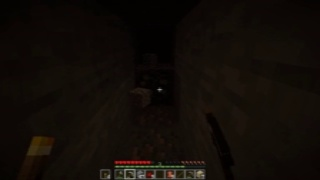

**图 2，帧 7797**

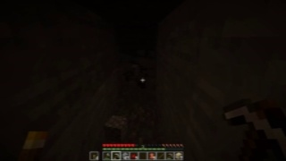

**图 3，帧 7801**

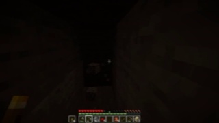

**图 4，帧 7805**

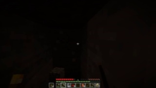

原始轨迹第一个 tick 含有孤立的小幅鼠标抖动：

```text
Mouse 2 -2 MouseLeft
```

SubAgent 输出将它清理为：

```text
MouseLeft
```

其余必要的 `W`、`MouseLeft` 和显著转向全部保留。完整回答的参考相似度为 `0.99975`。
视觉裁判判定 `correct`，置信度 `4/5`，理由是删除了孤立微小抖动，同时保持了前进、挖掘
和转向的因果顺序。

### 示例二：根据五帧 GUI 状态变化反推动作

题号：`image_sequence_to_action_000001`

连续图片：

[帧 8281](luna_eval/images/image_sequence_to_action_000001_00.jpg) ·
[帧 8282](luna_eval/images/image_sequence_to_action_000001_01.jpg) ·
[帧 8283](luna_eval/images/image_sequence_to_action_000001_02.jpg) ·
[帧 8284](luna_eval/images/image_sequence_to_action_000001_03.jpg) ·
[帧 8285](luna_eval/images/image_sequence_to_action_000001_04.jpg)

**图 1，帧 8281**

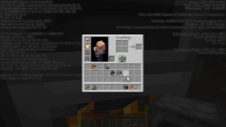

**图 2，帧 8282**


**图 3，帧 8283**

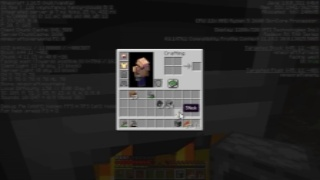

**图 4，帧 8284**

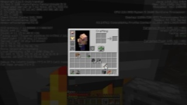

**图 5，帧 8285**


题面不提供动作，只提供五张连续 GUI 图像。SubAgent 回答：

```text
<|action_start|> ; MouseLeft ; MouseLeft ; MouseLeft ; MouseLeft <|action_end|>
```

人类参考轨迹包含两次小幅相对移动后点击：

```text
<|action_start|> ; Mouse 0 6 ; Mouse 0 2 ; MouseLeft ; MouseLeft <|action_end|>
```

两者参考相似度为 `0.598`，但视觉裁判判定 `correct`，置信度 `3/5`。原因是 GUI 槽位状态
发生变化；如果光标已经位于目标附近，连续 `MouseLeft` 能合理产生该变化，不要求唯一复现
人类的微小光标调整。

### 示例三：根据历史 GUI 预测未来动作

题号：`history_to_future_action_000000`

历史图片：

[帧 13790](luna_eval/images/history_to_future_action_000000_00.jpg) ·
[帧 13794](luna_eval/images/history_to_future_action_000000_01.jpg) ·
[帧 13798](luna_eval/images/history_to_future_action_000000_02.jpg) ·
[帧 13802](luna_eval/images/history_to_future_action_000000_03.jpg)

**图 1，帧 13790**

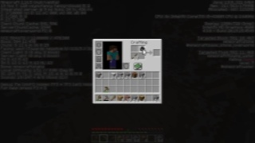

**图 2，帧 13794**

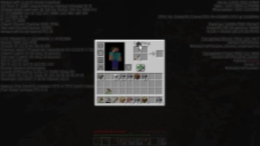

**图 3，帧 13798**

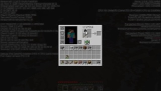

**图 4，帧 13802**

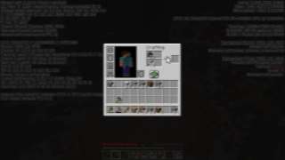

SubAgent 根据物品栏管理状态预测：

```text
<|action_start|> ; MouseLeft ; MouseLeft ; MouseLeft ; MouseLeft <|action_end|>
```

人类参考轨迹选择继续小幅移动光标：

```text
<|action_start|> ; Mouse 5 0 ; Mouse 4 0 ; Mouse 2 0 ; Mouse 1 1 <|action_end|>
```

参考相似度只有 `0.19675`。视觉裁判仍判定 `correct`，置信度 `3/5`：历史帧显示玩家正在
管理物品，如果光标已经接近目标位置，继续点击与继续移动都属于合理短期操作。这个案例说明
未来动作多解时，参考相似度不能代替视觉语义判定。

## 三类题目

| 标识 | 题目输入 | 模型任务 | 参考信息 |
|---|---|---|---|
| `demonstration_optimization` | 一段按时间排列的图像和原始动作序列 | 清理孤立控制噪声，保留可见意图与因果顺序，输出更适合作为动作演示的序列 | 同一段人类轨迹，作为参考而非自动认定的最优答案 |
| `image_sequence_to_action` | 五张覆盖 200 ms 状态转移的连续图像，不提供动作 | 根据已经发生的视觉变化反推出动作序列 | 产生该状态转移的人类动作示范 |
| `history_to_future_action` | 四张过去图像，按 `t-12、t-8、t-4、t` 排列，不提供动作 | 根据视觉历史推导未来 200 ms 的一种合理动作序列 | `t` 之后的人类动作示范 |

三类题都允许多个合理答案。参考动作来自真实人类轨迹，用于检查答案是否严重偏离数据分布，
不表示唯一正确动作。视觉序列反推允许看到动作前后的完整状态变化，但不提供任何动作标签；
历史预测只允许看到目标时刻及更早的图片，不能看到动作发生后的结果。

## 目录代码

| 文件 | 职责 |
|---|---|
| `question_schema.py` | 三类题目标识、提示词、输出契约和统一审核维度 |
| `generate_questions.py` | 从真实 `image/action` LMDB 机器采样并生成题面、图片和参考示范 |
| `review_questions.py` | 硬规则审计、AI 审核请求生成、人工与 AI 双审筛选 |
| `test_answers.py` | 测试模型作答格式，计算与人类示范的诊断相似度 |

## 生成流程

```text
MineStudio image/action LMDB
          │
          ▼
  generate_questions.py
          │
          ├── questions.jsonl       公开题面
          ├── answer_key.jsonl      隔离的人类参考示范
          ├── manifest.json         生成参数与版本
          ├── README.md             带图片、问题、参考轨迹和校验结果的浏览报告
          └── images/               题面图像
          │
          ▼
   review_questions.py
          │
          ├── structure_reviews.jsonl
          ├── ai_review_requests.jsonl
          ├── human_review_template.jsonl
          └── questions_approved.jsonl
          │
          ▼
     test_answers.py
          │
          └── answer_test_results.jsonl
```

出题器只读取 `action` 与 `image` 的共同 episode，并根据各模态最短长度确定合法范围。预测题
的图片最大帧号不超过目标动作起点，因此题面不会包含答案区间的未来画面。参考动作保存在独立
文件，不能交给做题模型。

## 第一步：生成题目

```bash
python -m datasets.minestudio_finetune.generate_questions \
  --dataset-dir runs/datasets/minestudio-data-10xx-v110 \
  --output-dir runs/trajectory_questions/minestudio-10xx \
  --samples-per-type 100
```

建议先生成每类 5 题进行检查：

```bash
python -m datasets.minestudio_finetune.generate_questions \
  --dataset-dir runs/datasets/minestudio-data-10xx-v110 \
  --output-dir runs/trajectory_questions/smoke \
  --samples-per-type 5
```

目标目录非空时命令会停止。确认需要替换该次生成结果后可以使用 `--overwrite`。清理范围仅限
明确给出的输出目录，并拒绝把 `runs`、`datasets` 或文件系统根目录作为清理目标。

### 题面字段

| 字段 | 含义 |
|---|---|
| `id` | 跨题面、答案和审核文件使用的稳定题号 |
| `task_type` | 三类题目之一 |
| `prompt` | 给做题模型的任务说明 |
| `images` | 相对于题目目录的图像路径，按时间升序 |
| `inputs` | 补充输入；优化题包含原始动作序列，预测题不含动作 |
| `output_contract` | JSON 数组和 Lumine 动作块协议 |
| `source` | 供审核使用的 episode 与图片帧号 |
| `target_interval` | 目标动作的半开帧区间 |
| `reference_is_unique` | 固定为 `false` |
| `review_status` | 初始为 `pending_human_and_ai_review` |
| `include_in_training` | 初始为 `false`，审核器通过后才改为 `true` |

优化题的原始序列和参考序列相同。它们代表需要被审查和优化的人类演示，不代表机器已经完成
优化。AI 或人工做题者可以移除孤立误触、异常视角跳变和与可见目标无关的片段。优化后的答案
仍需通过语义审核，避免清理过程删除必要的交互或改变演示意图。

## 第二步：审核题目

先执行结构审计并生成 AI 审核请求：

```bash
python -m datasets.minestudio_finetune.review_questions \
  --dataset-dir runs/trajectory_questions/minestudio-10xx
```

把 `ai_review_requests.jsonl` 逐条提交给能够读取图片的审核模型。模型返回内容保存为
`ai_reviews.jsonl`。人工审核填写生成的 `human_review_template.jsonl`，完成后另存为
`human_reviews.jsonl`。随后执行双审筛选：

```bash
python -m datasets.minestudio_finetune.review_questions \
  --dataset-dir runs/trajectory_questions/minestudio-10xx \
  --ai-reviews runs/trajectory_questions/minestudio-10xx/ai_reviews.jsonl \
  --human-reviews runs/trajectory_questions/minestudio-10xx/human_reviews.jsonl
```

### 审核维度

| 维度 | 通过标准 |
|---|---|
| `source_integrity` | 图片与动作来自同一 episode，帧号合法，图片严格按时间排列 |
| `no_temporal_leakage` | 预测题没有目标区间的未来图像、动作或元数据 |
| `visual_answerability` | 图像清晰，至少支持一种合理动作，不依赖题面外的隐藏信息 |
| `demonstration_quality` | 演示意图连贯，没有孤立误触、异常鼠标跳变或明显无效段 |
| `prompt_contract_match` | 输入、提示词和 JSON 动作输出格式一致 |
| `ambiguity_disclosed` | 将答案标为合理示范，不宣称动作唯一或全局最优 |
| `safety_and_privacy` | 没有账号、聊天、服务器地址等不应进入训练的信息 |

每个维度按 1 到 5 分评价：5 表示证据充分，4 表示可直接使用，3 表示满足最低训练标准，
2 表示需要修改，1 表示不可使用。任一维度低于 3 分时不得批准。

### 硬拒绝条件

以下问题由结构审计或审核人发现后直接拒绝：缺少或损坏图片、跨 episode 混合、帧号不递增、
预测题包含未来信息、动作块无法解析。语义审核还应直接拒绝明显与画面冲突的动作、不可辨认的
关键画面、包含隐私信息的画面，以及优化后改变原演示意图的答案。

### 双审准入规则

一条题目进入 `questions_approved.jsonl` 必须同时满足以下条件：

1. 确定性结构审计结果为 `pass`。
2. AI 审核决定为 `approve`，全部七个维度不低于 3 分。
3. 人工审核决定为 `approve`，全部七个维度不低于 3 分。
4. 题号在三份审核记录中一致。

审核记录格式如下：

```json
{
  "id": "image_sequence_to_action_000001",
  "reviewer_kind": "human",
  "decision": "approve",
  "scores": {
    "source_integrity": 5,
    "no_temporal_leakage": 5,
    "visual_answerability": 4,
    "demonstration_quality": 4,
    "prompt_contract_match": 5,
    "ambiguity_disclosed": 5,
    "safety_and_privacy": 5
  },
  "reasons": ["当前画面清晰，前进或轻微转向均属于合理动作。"],
  "suggested_revision": null
}
```

## 第三步：测试做题结果

做题模型输出 JSONL，每行包含题号和动作块数组：

```json
{"id":"image_sequence_to_action_000001","answer":["<|action_start|> ; Mouse 35 30 ; W ; Mouse 4 -2 W D <|action_end|>"]}
```

运行测试：

```bash
python -m datasets.minestudio_finetune.test_answers \
  --dataset-dir runs/trajectory_questions/minestudio-10xx \
  --responses runs/trajectory_questions/minestudio-10xx/model_responses.jsonl \
  --output runs/trajectory_questions/minestudio-10xx/answer_test_results.jsonl
```

只验证生成数据能否通过协议解析和评测链路时，可以使用隔离答案回放：

```bash
python -m datasets.minestudio_finetune.test_answers \
  --dataset-dir datasets/minestudio_finetune/examples \
  --reference-replay \
  --output datasets/minestudio_finetune/examples/answer_test_results.jsonl
```

测试器检查 JSON 数组、动作块数量、动作标记和至少一个动作 chunk。chunk 数允许变化；
MineStudio 参考窗口仍由四个 50 ms tick 构成。鼠标相对移动写在对应 tick 内，例如
`Mouse 35 30`。一般将鼠标移动单独写入；只有按键与鼠标需要在同一 tick 连续执行时才混写为
`Mouse 35 30 W D`。标准序列化把 Mouse 放在按键前，解析时两种顺序都接受。测试器还计算
与真实人类示范的按键集合和鼠标移动相似度。该分数用于
发现空答案、协议退化和大规模离群输出。最终语义质量仍由人工或视觉 AI 结合图片判断。

在普通游戏画面中，`Mouse dx dy` 表示相机相对移动；GUI 打开时，同一 token 表示光标
相对移动，再配合 `MouseLeft` 或 `MouseRight` 完成点击。GUI 题不要求绝对光标坐标。审核时
检查题面是否能看清当前光标或连续界面变化，以及相对移动和点击是否构成合理操作。

## 训练前检查

| 检查项 | 要求 |
|---|---|
| 文件隔离 | 训练输入不包含 `answer_key.jsonl` 和审核模型的隐藏推理内容 |
| 题目状态 | 只读取 `questions_approved.jsonl` |
| 图片存在 | 所有相对路径均能从题目目录解析 |
| 任务均衡 | 三类题按实验配方采样，记录每类实际数量 |
| 玩家隔离 | 正式训练与评估还应复用项目的玩家前缀划分，防止同一玩家泄漏 |
| 多解处理 | 相似度只作诊断，合理但不同于参考示范的答案可经语义审核保留 |

`questions.jsonl` 是机器生成的候选池，不能直接用于训练。`questions_approved.jsonl` 才是完成
结构、AI 和人工审核后的准入结果。

现有训练器可通过 `train/trajectory_question_dataset.py` 中的
`load_approved_question_conversations()` 将准入题转换为 Unsloth 风格的多图 `messages`。加载器
强制检查 `review_status == "approved"` 和 `include_in_training == true`。演示优化题还要求答案的
`reference_kind` 为 `reviewed_optimized_demonstration`，因此不能把未经优化的原始人类轨迹当作
监督目标。

这些约束说明数据已经具备接入训练代码的接口，但尚不能据此断言训练有效。有效性需要用固定
验证集比较基线与加入三类轨迹题后的动作协议通过率、视觉语义正确率和实际回放成功率。

## 真实生成案例

以下案例使用 MineStudio 10xx 真实轨迹生成，随机种子为 `20260730`。本轮每类生成 3 道，
共 9 道、39 张图片。9 道全部通过结构校验和参考动作协议回放；视觉语义审核批准 2 道、
要求修改 3 道、拒绝 4 道。审核批准仍需人工复核，当前批次没有写入
`questions_approved.jsonl`。

| 项目 | 结果 |
|---|---:|
| 候选题目 | 9 |
| 轨迹图片 | 39 |
| 结构与协议通过 | 9 |
| 视觉语义批准 | 2 |
| 要求修改 | 3 |
| 拒绝 | 4 |

完整生成文件位于 [`examples/`](examples/README.md)，逐题语义审核位于
[`examples/semantic_reviews.jsonl`](examples/semantic_reviews.jsonl)，协议测试结果位于
[`examples/answer_test_results.jsonl`](examples/answer_test_results.jsonl)。

### 待修改案例：GUI 间断点击

题号：`demonstration_optimization_000002`

轨迹图片按时间顺序：

[帧 554](examples/images/demonstration_optimization_000002_00.jpg) ·
[帧 558](examples/images/demonstration_optimization_000002_01.jpg) ·
[帧 562](examples/images/demonstration_optimization_000002_02.jpg) ·
[帧 566](examples/images/demonstration_optimization_000002_03.jpg)

**图 1，帧 554**

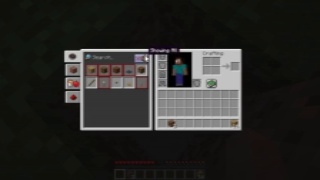

**图 2，帧 558**

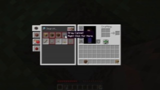

**图 3，帧 562**

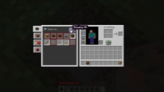

**图 4，帧 566**

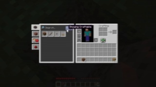

问题：优化物品栏配方 GUI 操作轨迹，保留相对光标移动和点击顺序，输出更清晰的动作演示。

参考答案轨迹：

```text
<|action_start|> ; Mouse -2 6 MouseLeft ; Mouse -2 6 ; Mouse -5 7 ; Mouse -20 12 <|action_end|>
<|action_start|> ; Mouse -12 6 ; Mouse 3 -7 ; Mouse 16 -18 ; Mouse 8 -5 <|action_end|>
<|action_start|> ; Mouse 2 -1 MouseLeft ; Mouse 1 -2 ;  ; Mouse -4 7 <|action_end|>
<|action_start|> ; Mouse -14 10 ; Mouse -23 10 ; Mouse -11 2 ; Mouse -18 -2 <|action_end|>
```

协议结论：GUI 内连续 held 状态已经归一化为按下沿脉冲。第一段首 tick 点击一次，第三段
首 tick 再点击一次，中间 tick 只保留相对光标移动。这比重复写四次 `MouseLeft` 更清楚地
表达“两次离散点击”。该答案仍是归一化后的原始轨迹，尚未成为审核后的优化答案，因此本题
状态为 `revise`，不能进入训练。

### 批准案例：连续图像反推挖掘动作

题号：`image_sequence_to_action_000001`

五张图片逐帧覆盖 `4606` 到 `4610`，展示动作造成的完整状态转移：

[帧 4606](examples/images/image_sequence_to_action_000001_00.jpg) ·
[帧 4607](examples/images/image_sequence_to_action_000001_01.jpg) ·
[帧 4608](examples/images/image_sequence_to_action_000001_02.jpg) ·
[帧 4609](examples/images/image_sequence_to_action_000001_03.jpg) ·
[帧 4610](examples/images/image_sequence_to_action_000001_04.jpg)

**图 1，帧 4606**

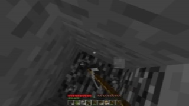

**图 2，帧 4607**


**图 3，帧 4608**

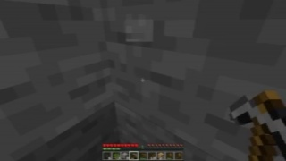

**图 4，帧 4609**

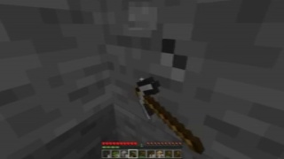

**图 5，帧 4610**

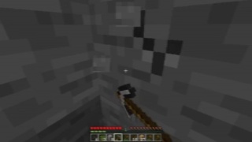

问题：五张图像是按时间排列的连续状态，不提供动作标签。根据镐击、裂纹变化和方块破坏，
反推出一种能够产生该状态转移的动作序列。

参考答案轨迹：

```text
<|action_start|> ; Mouse -438 -186 MouseLeft ; Mouse -242 -137 MouseLeft ; Mouse 0 -10 MouseLeft ; Mouse 2 -11 MouseLeft <|action_end|>
```

合格依据：状态变化清晰显示连续挖掘已经发生，因此持续 `MouseLeft` 和逐 tick 视角调整有
直接视觉证据。这是普通游戏中的持续按住，并非 GUI 多次点击。两个很大的初始鼠标位移会在
正式人工准入时再次检查，以排除采集设备离群值。

### 批准案例：历史图像预测继续挖掘

题号：`history_to_future_action_000001`

历史轨迹图片：

[帧 2334](examples/images/history_to_future_action_000001_00.jpg) ·
[帧 2338](examples/images/history_to_future_action_000001_01.jpg) ·
[帧 2342](examples/images/history_to_future_action_000001_02.jpg) ·
[帧 2346](examples/images/history_to_future_action_000001_03.jpg)

**图 1，帧 2334**

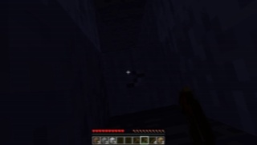

**图 2，帧 2338**


**图 3，帧 2342**

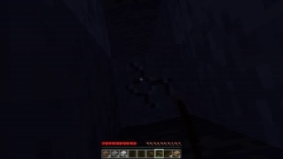

**图 4，帧 2346**

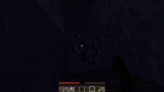

问题：四张图片是过去观测且不提供动作，根据裂纹加深和方块破坏过程，推导未来 200 ms 的
一种合理动作序列。

参考答案轨迹：

```text
<|action_start|> ; MouseLeft ; MouseLeft ; MouseLeft ; MouseLeft <|action_end|>
```

合格依据：历史图片清晰显示镐击、裂纹加深和方块破坏。未来继续按住 `MouseLeft` 与已经
形成的行为趋势一致。

### 其余案例的审核结论

| 题号 | 决定 | 原因 |
|---|---|---|
| `demonstration_optimization_000000` | 修改 | 挖掘意图清楚，但缺少审核后的优化答案 |
| `demonstration_optimization_000001` | 修改 | 战斗意图清楚，但缺少审核后的优化答案 |
| `image_sequence_to_action_000000` | 拒绝 | 视觉变化太小，无法区分前进、跳跃和冲刺组合 |
| `image_sequence_to_action_000002` | 拒绝 | GUI 发生合成变化，参考标签却只有光标移动而没有点击 |
| `history_to_future_action_000000` | 拒绝 | 调试信息覆盖过多 |
| `history_to_future_action_000002` | 拒绝 | 历史跨越物品栏与游戏画面，未来复合动作依据不足 |

## 5.6 Luna 盲测批次

已另外生成一批不与展示案例重复的评测题，位于 [`luna_eval/`](luna_eval/README.md)。批次使用
随机种子 `20260731`，每类 10 道，共 30 道、130 张图片。30 道全部通过结构校验和参考轨迹
协议回放。

交给模型的隔离包位于 [`luna_eval/blind/`](luna_eval/blind/README.md)：

| 文件 | 内容 |
|---|---|
| [`requests.jsonl`](luna_eval/blind/requests.jsonl) | 30 道题面、图片相对路径、输入和输出契约 |
| [`responses_template.jsonl`](luna_eval/blind/responses_template.jsonl) | 模型回答模板 |
| [`README.md`](luna_eval/blind/README.md) | 隔离要求和评测命令 |

盲测包不包含 `answer_key.jsonl`。独立 SubAgent 已完成 30 道回答，结果保存在
[`blind/responses.jsonl`](luna_eval/blind/responses.jsonl)，自动评分和独立视觉裁判均已完成。

```bash
python -m datasets.minestudio_finetune.test_answers \
  --dataset-dir datasets/minestudio_finetune/luna_eval \
  --responses datasets/minestudio_finetune/luna_eval/blind/responses.jsonl \
  --output datasets/minestudio_finetune/luna_eval/luna_results.jsonl
```

动作存在多解，因此正确率以独立视觉语义审核通过率为最终口径；动作协议格式通过率和人类
参考轨迹相似度作为诊断指标。完整报告见 [`luna_eval/EVALUATION.md`](luna_eval/EVALUATION.md)。

| 指标 | 结果 |
|---|---:|
| 格式通过率 | 30 / 30，100% |
| 可作答题语义正确率 | 26 / 26，100% |
| 全部题目通过率 | 26 / 30，86.67% |
| 不可作答题 | 4 |
| 平均参考相似度 | 0.7795 |

4 道不可作答题均因极暗画面或调试文字严重遮挡。它们反映出题筛选问题，不计入可作答题的
模型正确率。
