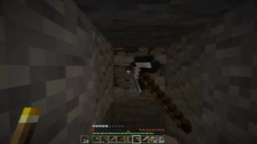
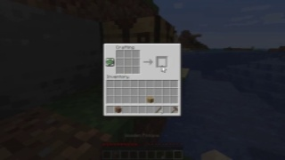

# MineStudio 轨迹训练题生成与审核

本目录保存从 MineStudio 真实轨迹生成动作训练题、审核题目和测试模型作答的代码。生成结果
写入调用方指定的 `runs/` 子目录。本目录只保存代码、题目契约和审核标准。

## 三类题目

| 标识 | 题目输入 | 模型任务 | 参考信息 |
|---|---|---|---|
| `demonstration_optimization` | 一段按时间排列的图像和原始动作序列 | 清理孤立控制噪声，保留可见意图与因果顺序，输出更适合作为动作演示的序列 | 同一段人类轨迹，作为参考而非自动认定的最优答案 |
| `image_to_action` | 一张当前图像，不提供历史动作或未来图像 | 根据当前场景提出未来 200 ms 的一种合理动作序列 | 当前帧之后的人类动作示范 |
| `history_to_future_action` | 四张过去图像，按 `t-12、t-8、t-4、t` 排列，不提供动作 | 根据视觉历史推导未来 200 ms 的一种合理动作序列 | `t` 之后的人类动作示范 |

三类题都允许多个合理答案。参考动作来自真实人类轨迹，用于检查答案是否严重偏离数据分布，
不表示唯一正确动作。尤其是单图动作推导，图像通常不能确定唯一目标，审核时应判断动作是否
合理、安全、符合画面，而不是要求逐 token 复现参考示范。

## 目录代码

| 文件 | 职责 |
|---|---|
| `question_schema.py` | 三类题目标识、提示词、输出契约和统一审核维度 |
| `generate_questions.py` | 从真实 `image/action` LMDB 机器采样并生成题面、图片和参考示范 |
| `review_questions.py` | 硬规则审计、AI 审核请求生成、人工与 AI 双审筛选 |
| `test_answers.py` | 测试模型作答格式，计算与人类示范的诊断相似度 |

## 生成流程

```text
MineStudio image/action LMDB
          │
          ▼
  generate_questions.py
          │
          ├── questions.jsonl       公开题面
          ├── answer_key.jsonl      隔离的人类参考示范
          ├── manifest.json         生成参数与版本
          ├── README.md             带图片、问题、参考轨迹和校验结果的浏览报告
          └── images/               题面图像
          │
          ▼
   review_questions.py
          │
          ├── structure_reviews.jsonl
          ├── ai_review_requests.jsonl
          ├── human_review_template.jsonl
          └── questions_approved.jsonl
          │
          ▼
     test_answers.py
          │
          └── answer_test_results.jsonl
```

出题器只读取 `action` 与 `image` 的共同 episode，并根据各模态最短长度确定合法范围。预测题
的图片最大帧号不超过目标动作起点，因此题面不会包含答案区间的未来画面。参考动作保存在独立
文件，不能交给做题模型。

## 第一步：生成题目

```bash
python -m datasets.minestudio_finetune.generate_questions \
  --dataset-dir runs/datasets/minestudio-data-10xx-v110 \
  --output-dir runs/trajectory_questions/minestudio-10xx \
  --samples-per-type 100
```

建议先生成每类 5 题进行检查：

```bash
python -m datasets.minestudio_finetune.generate_questions \
  --dataset-dir runs/datasets/minestudio-data-10xx-v110 \
  --output-dir runs/trajectory_questions/smoke \
  --samples-per-type 5
```

目标目录非空时命令会停止。确认需要替换该次生成结果后可以使用 `--overwrite`。清理范围仅限
明确给出的输出目录，并拒绝把 `runs`、`datasets` 或文件系统根目录作为清理目标。

### 题面字段

| 字段 | 含义 |
|---|---|
| `id` | 跨题面、答案和审核文件使用的稳定题号 |
| `task_type` | 三类题目之一 |
| `prompt` | 给做题模型的任务说明 |
| `images` | 相对于题目目录的图像路径，按时间升序 |
| `inputs` | 补充输入；优化题包含原始动作序列，预测题不含动作 |
| `output_contract` | JSON 数组和 Lumine 动作块协议 |
| `source` | 供审核使用的 episode 与图片帧号 |
| `target_interval` | 目标动作的半开帧区间 |
| `reference_is_unique` | 固定为 `false` |
| `review_status` | 初始为 `pending_human_and_ai_review` |
| `include_in_training` | 初始为 `false`，审核器通过后才改为 `true` |

优化题的原始序列和参考序列相同。它们代表需要被审查和优化的人类演示，不代表机器已经完成
优化。AI 或人工做题者可以移除孤立误触、异常视角跳变和与可见目标无关的片段。优化后的答案
仍需通过语义审核，避免清理过程删除必要的交互或改变演示意图。

## 第二步：审核题目

先执行结构审计并生成 AI 审核请求：

```bash
python -m datasets.minestudio_finetune.review_questions \
  --dataset-dir runs/trajectory_questions/minestudio-10xx
```

把 `ai_review_requests.jsonl` 逐条提交给能够读取图片的审核模型。模型返回内容保存为
`ai_reviews.jsonl`。人工审核填写生成的 `human_review_template.jsonl`，完成后另存为
`human_reviews.jsonl`。随后执行双审筛选：

```bash
python -m datasets.minestudio_finetune.review_questions \
  --dataset-dir runs/trajectory_questions/minestudio-10xx \
  --ai-reviews runs/trajectory_questions/minestudio-10xx/ai_reviews.jsonl \
  --human-reviews runs/trajectory_questions/minestudio-10xx/human_reviews.jsonl
```

### 审核维度

| 维度 | 通过标准 |
|---|---|
| `source_integrity` | 图片与动作来自同一 episode，帧号合法，图片严格按时间排列 |
| `no_temporal_leakage` | 预测题没有目标区间的未来图像、动作或元数据 |
| `visual_answerability` | 图像清晰，至少支持一种合理动作，不依赖题面外的隐藏信息 |
| `demonstration_quality` | 演示意图连贯，没有孤立误触、异常鼠标跳变或明显无效段 |
| `prompt_contract_match` | 输入、提示词和 JSON 动作输出格式一致 |
| `ambiguity_disclosed` | 将答案标为合理示范，不宣称动作唯一或全局最优 |
| `safety_and_privacy` | 没有账号、聊天、服务器地址等不应进入训练的信息 |

每个维度按 1 到 5 分评价：5 表示证据充分，4 表示可直接使用，3 表示满足最低训练标准，
2 表示需要修改，1 表示不可使用。任一维度低于 3 分时不得批准。

### 硬拒绝条件

以下问题由结构审计或审核人发现后直接拒绝：缺少或损坏图片、跨 episode 混合、帧号不递增、
预测题包含未来信息、动作块无法解析。语义审核还应直接拒绝明显与画面冲突的动作、不可辨认的
关键画面、包含隐私信息的画面，以及优化后改变原演示意图的答案。

### 双审准入规则

一条题目进入 `questions_approved.jsonl` 必须同时满足以下条件：

1. 确定性结构审计结果为 `pass`。
2. AI 审核决定为 `approve`，全部七个维度不低于 3 分。
3. 人工审核决定为 `approve`，全部七个维度不低于 3 分。
4. 题号在三份审核记录中一致。

审核记录格式如下：

```json
{
  "id": "image_to_action_000001",
  "reviewer_kind": "human",
  "decision": "approve",
  "scores": {
    "source_integrity": 5,
    "no_temporal_leakage": 5,
    "visual_answerability": 4,
    "demonstration_quality": 4,
    "prompt_contract_match": 5,
    "ambiguity_disclosed": 5,
    "safety_and_privacy": 5
  },
  "reasons": ["当前画面清晰，前进或轻微转向均属于合理动作。"],
  "suggested_revision": null
}
```

## 第三步：测试做题结果

做题模型输出 JSONL，每行包含题号和动作块数组：

```json
{"id":"image_to_action_000001","answer":["<|action_start|> ; Mouse 35 30 ; W ; Mouse 4 -2 W D <|action_end|>"]}
```

运行测试：

```bash
python -m datasets.minestudio_finetune.test_answers \
  --dataset-dir runs/trajectory_questions/minestudio-10xx \
  --responses runs/trajectory_questions/minestudio-10xx/model_responses.jsonl \
  --output runs/trajectory_questions/minestudio-10xx/answer_test_results.jsonl
```

只验证生成数据能否通过协议解析和评测链路时，可以使用隔离答案回放：

```bash
python -m datasets.minestudio_finetune.test_answers \
  --dataset-dir datasets/minestudio_finetune/examples \
  --reference-replay \
  --output datasets/minestudio_finetune/examples/answer_test_results.jsonl
```

测试器检查 JSON 数组、动作块数量、动作标记和至少一个动作 chunk。chunk 数允许变化；
MineStudio 参考窗口仍由四个 50 ms tick 构成。鼠标相对移动写在对应 tick 内，例如
`Mouse 35 30`。一般将鼠标移动单独写入；只有按键与鼠标需要在同一 tick 连续执行时才混写为
`Mouse 35 30 W D`。标准序列化把 Mouse 放在按键前，解析时两种顺序都接受。测试器还计算
与真实人类示范的按键集合和鼠标移动相似度。该分数用于
发现空答案、协议退化和大规模离群输出。最终语义质量仍由人工或视觉 AI 结合图片判断。

在普通游戏画面中，`Mouse dx dy` 表示相机相对移动；GUI 打开时，同一 token 表示光标
相对移动，再配合 `MouseLeft` 或 `MouseRight` 完成点击。GUI 题不要求绝对光标坐标。审核时
检查题面是否能看清当前光标或连续界面变化，以及相对移动和点击是否构成合理操作。

## 训练前检查

| 检查项 | 要求 |
|---|---|
| 文件隔离 | 训练输入不包含 `answer_key.jsonl` 和审核模型的隐藏推理内容 |
| 题目状态 | 只读取 `questions_approved.jsonl` |
| 图片存在 | 所有相对路径均能从题目目录解析 |
| 任务均衡 | 三类题按实验配方采样，记录每类实际数量 |
| 玩家隔离 | 正式训练与评估还应复用项目的玩家前缀划分，防止同一玩家泄漏 |
| 多解处理 | 相似度只作诊断，合理但不同于参考示范的答案可经语义审核保留 |

`questions.jsonl` 是机器生成的候选池，不能直接用于训练。`questions_approved.jsonl` 才是完成
结构、AI 和人工审核后的准入结果。

## 真实生成案例

以下案例使用 MineStudio 10xx 真实轨迹生成，随机种子为 `20260730`。本轮每类生成 3 道，
共 9 道。9 道全部通过结构校验和动作协议回放测试，其中 5 道通过视觉语义审核。这里的
“合格”表示可以进入人工复核队列，不表示已经完成最终人工准入。

| 项目 | 结果 |
|---|---:|
| 候选题目 | 9 |
| 轨迹图片 | 27 |
| 结构校验通过 | 9 |
| 动作协议回放通过 | 9 |
| 视觉语义审核通过 | 5 |
| 视觉语义审核拒绝 | 4 |

完整生成文件位于 [`examples/`](examples/README.md)，逐题语义审核位于
[`examples/semantic_reviews.jsonl`](examples/semantic_reviews.jsonl)，协议测试结果位于
[`examples/answer_test_results.jsonl`](examples/answer_test_results.jsonl)。

### 合格案例一：连续移动演示优化

题号：`demonstration_optimization_000001`

轨迹图片按时间顺序：

[帧 4165](examples/images/demonstration_optimization_000001_00.jpg) ·
[帧 4169](examples/images/demonstration_optimization_000001_01.jpg) ·
[帧 4173](examples/images/demonstration_optimization_000001_02.jpg) ·
[帧 4177](examples/images/demonstration_optimization_000001_03.jpg)


问题：根据按时间排列的图像和原始动作块，清理动作序列中的孤立噪声，同时保留连续前进、
冲刺、跳跃和转向的可见意图，输出变长动作块数组。

参考答案轨迹：

```text
<|action_start|> ; W ctrl ; Mouse -3 -2 W ctrl ; Mouse 22 21 W ctrl ; Mouse 0 1 W ctrl <|action_end|>
<|action_start|> ; Mouse -1 0 W space ctrl ; Mouse -8 -6 W space ctrl ; Mouse 0 1 W ctrl ; Mouse -11 0 W ctrl <|action_end|>
<|action_start|> ; Mouse -21 12 W ctrl ; Mouse -52 13 W space ctrl ; Mouse -36 6 W space ctrl ; Mouse -10 3 W ctrl <|action_end|>
<|action_start|> ; W space ctrl ; Mouse 0 1 W space ctrl ; W space ctrl ; W space ctrl <|action_end|>
```

合格依据：矿道、火把和移动方向清晰。鼠标与 `W`、`space`、`ctrl` 在同一 tick 混写，
符合需要连续移动和转向的场景。

### 合格案例二：GUI 演示优化

题号：`demonstration_optimization_000002`

轨迹图片按时间顺序：

[帧 2764](examples/images/demonstration_optimization_000002_00.jpg) ·
[帧 2768](examples/images/demonstration_optimization_000002_01.jpg) ·
[帧 2772](examples/images/demonstration_optimization_000002_02.jpg) ·
[帧 2776](examples/images/demonstration_optimization_000002_03.jpg)


问题：优化工作台 GUI 操作轨迹，保留相对光标移动、shift 状态和点击顺序，输出更清晰的
动作演示。

参考答案轨迹：

```text
<|action_start|> ; Mouse 8 -2 ; Mouse 15 -8 ; Mouse 8 -8 ; Mouse 5 -7 shift <|action_end|>
<|action_start|> ; Mouse 2 -8 shift ; Mouse 0 -8 shift ; Mouse 0 -2 shift ; shift <|action_end|>
<|action_start|> ; Mouse 0 -1 shift ; shift MouseLeft ; shift MouseLeft ; shift MouseLeft <|action_end|>
<|action_start|> ; shift ; shift ; shift ; shift <|action_end|>
```

合格依据：配方格、输出格和物品变化清晰。`Mouse dx dy` 表达 GUI 内的相对光标移动，
`MouseLeft` 表达点击，协议足以描述该轨迹。

### 合格案例三：单图挖掘动作

题号：`image_to_action_000000`

[使用图片：帧 18433](examples/images/image_to_action_000000_00.jpg)



问题：仅根据当前 Minecraft 图像，提出未来 200 ms 的一种合理动作序列。

参考答案轨迹：

```text
<|action_start|> ; MouseLeft ; Mouse 0 12 MouseLeft ; Mouse -9 49 MouseLeft ; Mouse -10 40 MouseLeft <|action_end|>
```

合格依据：画面清晰显示玩家正对矿洞方块挥镐。继续点击并逐 tick 调整视角是一种直接、
可解释的未来动作。参考轨迹不是唯一答案。

### 合格案例四：单图 GUI 动作

题号：`image_to_action_000002`

[使用图片：帧 972](examples/images/image_to_action_000002_00.jpg)



问题：仅根据当前工作台界面，提出未来 200 ms 的一种合理 GUI 动作序列。

参考答案轨迹：

```text
<|action_start|> ; shift MouseLeft ; shift ; shift ; shift <|action_end|>
```

合格依据：工作台 GUI、配方内容和输出格均可辨认。`shift MouseLeft` 可以表达快速点击，
不需要绝对光标坐标。

### 合格案例五：历史图像预测继续挖掘

题号：`history_to_future_action_000002`

历史轨迹图片：

[帧 16410](examples/images/history_to_future_action_000002_00.jpg) ·
[帧 16414](examples/images/history_to_future_action_000002_01.jpg) ·
[帧 16418](examples/images/history_to_future_action_000002_02.jpg) ·
[帧 16422](examples/images/history_to_future_action_000002_03.jpg)


问题：四张图片是过去观测且不提供动作，根据裂纹加深和方块破坏过程，推导未来 200 ms 的
一种合理动作序列。

参考答案轨迹：

```text
<|action_start|> ; MouseLeft ; MouseLeft ; MouseLeft ; MouseLeft <|action_end|>
```

合格依据：历史图片清晰显示镐击、裂纹加深和方块破坏。未来继续按住 `MouseLeft` 与已经
形成的行为趋势一致。

### 被拒绝的案例

| 题号 | 拒绝原因 |
|---|---|
| `demonstration_optimization_000000` | 四张矿洞图片整体过暗，无法可靠判断优化是否保留原意 |
| `image_to_action_000001` | 单图接近全黑，参考攻击动作缺少足够视觉依据 |
| `history_to_future_action_000000` | 调试信息覆盖大部分画面，场景目标不够清晰 |
| `history_to_future_action_000001` | 四张历史图均过暗，无法可靠判断持续攻击对象 |
