# MineStudio 轨迹训练题生成报告

> 本报告由出题流程自动生成。图片与参考动作来自真实 MineStudio 轨迹。
> 参考轨迹是一种人类示范，不是唯一正确答案。`answer_key.jsonl` 不应交给做题模型。

## 汇总

| 项目 | 数量 |
|---|---:|
| 候选题目 | 30 |
| 结构审核完成 | 30 |
| 结构审核通过 | 30 |

## demonstration_optimization_000000

| 字段 | 内容 |
|---|---|
| 题型 | `demonstration_optimization` |
| 来源 episode | `cheeky-cornflower-setter-4cf439b98bb9-20220417-114931` |
| 图片帧 | `[4591, 4595, 4599, 4603]` |
| 目标动作区间 | `[4591, 4607]` |
| 初始训练准入 | `False` |
| 结构审核 | `pass` |

### 图片

**图 1，帧 4591**


**图 2，帧 4595**


**图 3，帧 4599**

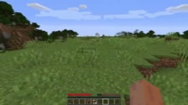

**图 4，帧 4603**


### 问题

The images and raw action blocks form one chronological Minecraft demonstration. Rewrite the action sequence into a cleaner demonstration while preserving the visible intent and causal order. Remove isolated control noise, keep necessary movement and interaction, and return only a JSON array of valid action blocks.

### 待优化的原始动作序列

动作块 1：

```text
<|action_start|> ; W ctrl ; W ctrl ; W ctrl ; W ctrl <|action_end|>
```

动作块 2：

```text
<|action_start|> ; W ctrl ; W ctrl ; W ctrl ; W ctrl <|action_end|>
```

动作块 3：

```text
<|action_start|> ; W ctrl ; W space ctrl ; W space ctrl ; W space <|action_end|>
```

动作块 4：

```text
<|action_start|> ; W space ; W space ; W space ; W space <|action_end|>
```

### 参考答案轨迹

参考类型：真实人类演示；该轨迹不是唯一合理答案。

动作块 1：

```text
<|action_start|> ; W ctrl ; W ctrl ; W ctrl ; W ctrl <|action_end|>
```

动作块 2：

```text
<|action_start|> ; W ctrl ; W ctrl ; W ctrl ; W ctrl <|action_end|>
```

动作块 3：

```text
<|action_start|> ; W ctrl ; W space ctrl ; W space ctrl ; W space <|action_end|>
```

动作块 4：

```text
<|action_start|> ; W space ; W space ; W space ; W space <|action_end|>
```

### 结构校验结果

```json
{
  "id": "demonstration_optimization_000000",
  "reviewer": "deterministic_structure_audit_v1",
  "decision": "pass",
  "hard_rejection": false,
  "reasons": []
}
```

## demonstration_optimization_000001

| 字段 | 内容 |
|---|---|
| 题型 | `demonstration_optimization` |
| 来源 episode | `sleepy-sangria-bat-f153ac423f61-20220419-184021` |
| 图片帧 | `[7793, 7797, 7801, 7805]` |
| 目标动作区间 | `[7793, 7809]` |
| 初始训练准入 | `False` |
| 结构审核 | `pass` |

### 图片

**图 1，帧 7793**


**图 2，帧 7797**


**图 3，帧 7801**


**图 4，帧 7805**


### 问题

The images and raw action blocks form one chronological Minecraft demonstration. Rewrite the action sequence into a cleaner demonstration while preserving the visible intent and causal order. Remove isolated control noise, keep necessary movement and interaction, and return only a JSON array of valid action blocks.

### 待优化的原始动作序列

动作块 1：

```text
<|action_start|> ; Mouse 2 -2 MouseLeft ; W MouseLeft ; W MouseLeft ; W MouseLeft <|action_end|>
```

动作块 2：

```text
<|action_start|> ; W MouseLeft ; W MouseLeft ; Mouse 0 -7 W MouseLeft ; Mouse 23 -38 W MouseLeft <|action_end|>
```

动作块 3：

```text
<|action_start|> ; Mouse 5 -12 W MouseLeft ; Mouse 8 -11 W MouseLeft ; Mouse -2 -15 W MouseLeft ; Mouse -8 -11 W MouseLeft <|action_end|>
```

动作块 4：

```text
<|action_start|> ; Mouse -14 -10 W MouseLeft ; Mouse -11 -8 W MouseLeft ; Mouse -11 -7 MouseLeft ; Mouse -6 -2 MouseLeft <|action_end|>
```

### 参考答案轨迹

参考类型：真实人类演示；该轨迹不是唯一合理答案。

动作块 1：

```text
<|action_start|> ; Mouse 2 -2 MouseLeft ; W MouseLeft ; W MouseLeft ; W MouseLeft <|action_end|>
```

动作块 2：

```text
<|action_start|> ; W MouseLeft ; W MouseLeft ; Mouse 0 -7 W MouseLeft ; Mouse 23 -38 W MouseLeft <|action_end|>
```

动作块 3：

```text
<|action_start|> ; Mouse 5 -12 W MouseLeft ; Mouse 8 -11 W MouseLeft ; Mouse -2 -15 W MouseLeft ; Mouse -8 -11 W MouseLeft <|action_end|>
```

动作块 4：

```text
<|action_start|> ; Mouse -14 -10 W MouseLeft ; Mouse -11 -8 W MouseLeft ; Mouse -11 -7 MouseLeft ; Mouse -6 -2 MouseLeft <|action_end|>
```

### 结构校验结果

```json
{
  "id": "demonstration_optimization_000001",
  "reviewer": "deterministic_structure_audit_v1",
  "decision": "pass",
  "hard_rejection": false,
  "reasons": []
}
```

## demonstration_optimization_000002

| 字段 | 内容 |
|---|---|
| 题型 | `demonstration_optimization` |
| 来源 episode | `shabby-viridian-beaver-453655248a79-20220417-191752` |
| 图片帧 | `[8053, 8057, 8061, 8065]` |
| 目标动作区间 | `[8053, 8069]` |
| 初始训练准入 | `False` |
| 结构审核 | `pass` |

### 图片

**图 1，帧 8053**

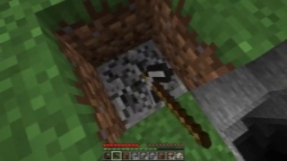

**图 2，帧 8057**

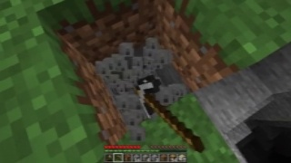

**图 3，帧 8061**

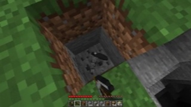

**图 4，帧 8065**

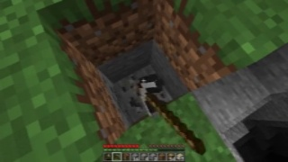

### 问题

The images and raw action blocks form one chronological Minecraft demonstration. Rewrite the action sequence into a cleaner demonstration while preserving the visible intent and causal order. Remove isolated control noise, keep necessary movement and interaction, and return only a JSON array of valid action blocks.

### 待优化的原始动作序列

动作块 1：

```text
<|action_start|> ; Mouse 0 1 MouseLeft ; MouseLeft ; Mouse -1 -1 MouseLeft ; Mouse -3 1 MouseLeft <|action_end|>
```

动作块 2：

```text
<|action_start|> ; Mouse -2 0 MouseLeft ; MouseLeft ; MouseLeft ; Mouse -1 0 MouseLeft <|action_end|>
```

动作块 3：

```text
<|action_start|> ; MouseLeft ; MouseLeft ; Mouse 0 1 MouseLeft ; MouseLeft <|action_end|>
```

动作块 4：

```text
<|action_start|> ; MouseLeft ; MouseLeft ; MouseLeft ; MouseLeft <|action_end|>
```

### 参考答案轨迹

参考类型：真实人类演示；该轨迹不是唯一合理答案。

动作块 1：

```text
<|action_start|> ; Mouse 0 1 MouseLeft ; MouseLeft ; Mouse -1 -1 MouseLeft ; Mouse -3 1 MouseLeft <|action_end|>
```

动作块 2：

```text
<|action_start|> ; Mouse -2 0 MouseLeft ; MouseLeft ; MouseLeft ; Mouse -1 0 MouseLeft <|action_end|>
```

动作块 3：

```text
<|action_start|> ; MouseLeft ; MouseLeft ; Mouse 0 1 MouseLeft ; MouseLeft <|action_end|>
```

动作块 4：

```text
<|action_start|> ; MouseLeft ; MouseLeft ; MouseLeft ; MouseLeft <|action_end|>
```

### 结构校验结果

```json
{
  "id": "demonstration_optimization_000002",
  "reviewer": "deterministic_structure_audit_v1",
  "decision": "pass",
  "hard_rejection": false,
  "reasons": []
}
```

## demonstration_optimization_000003

| 字段 | 内容 |
|---|---|
| 题型 | `demonstration_optimization` |
| 来源 episode | `cheeky-cornflower-setter-f153ac423f61-20220417-212046` |
| 图片帧 | `[7720, 7724, 7728, 7732]` |
| 目标动作区间 | `[7720, 7736]` |
| 初始训练准入 | `False` |
| 结构审核 | `pass` |

### 图片

**图 1，帧 7720**

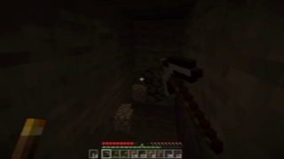

**图 2，帧 7724**

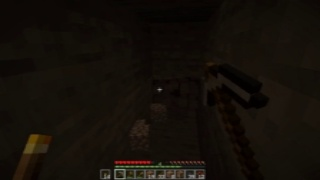

**图 3，帧 7728**


**图 4，帧 7732**

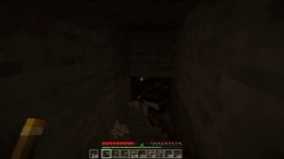

### 问题

The images and raw action blocks form one chronological Minecraft demonstration. Rewrite the action sequence into a cleaner demonstration while preserving the visible intent and causal order. Remove isolated control noise, keep necessary movement and interaction, and return only a JSON array of valid action blocks.

### 待优化的原始动作序列

动作块 1：

```text
<|action_start|> ; MouseLeft ; MouseLeft ; MouseLeft ; MouseLeft <|action_end|>
```

动作块 2：

```text
<|action_start|> ; Mouse 0 2 MouseLeft ; Mouse 14 -25 MouseLeft ; Mouse 3 -8 MouseLeft ; MouseLeft <|action_end|>
```

动作块 3：

```text
<|action_start|> ; MouseLeft ; MouseLeft ; MouseLeft ; MouseLeft <|action_end|>
```

动作块 4：

```text
<|action_start|> ; MouseLeft ; MouseLeft ; MouseLeft ; MouseLeft <|action_end|>
```

### 参考答案轨迹

参考类型：真实人类演示；该轨迹不是唯一合理答案。

动作块 1：

```text
<|action_start|> ; MouseLeft ; MouseLeft ; MouseLeft ; MouseLeft <|action_end|>
```

动作块 2：

```text
<|action_start|> ; Mouse 0 2 MouseLeft ; Mouse 14 -25 MouseLeft ; Mouse 3 -8 MouseLeft ; MouseLeft <|action_end|>
```

动作块 3：

```text
<|action_start|> ; MouseLeft ; MouseLeft ; MouseLeft ; MouseLeft <|action_end|>
```

动作块 4：

```text
<|action_start|> ; MouseLeft ; MouseLeft ; MouseLeft ; MouseLeft <|action_end|>
```

### 结构校验结果

```json
{
  "id": "demonstration_optimization_000003",
  "reviewer": "deterministic_structure_audit_v1",
  "decision": "pass",
  "hard_rejection": false,
  "reasons": []
}
```

## demonstration_optimization_000004

| 字段 | 内容 |
|---|---|
| 题型 | `demonstration_optimization` |
| 来源 episode | `woozy-ruby-ostrich-d5ec6014f0b8-20220420-023447` |
| 图片帧 | `[631, 635, 639, 643]` |
| 目标动作区间 | `[631, 647]` |
| 初始训练准入 | `False` |
| 结构审核 | `pass` |

### 图片

**图 1，帧 631**

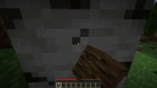

**图 2，帧 635**

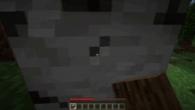

**图 3，帧 639**

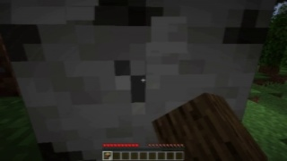

**图 4，帧 643**

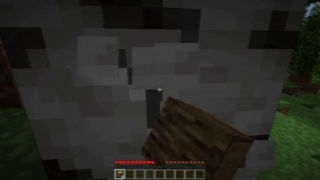

### 问题

The images and raw action blocks form one chronological Minecraft demonstration. Rewrite the action sequence into a cleaner demonstration while preserving the visible intent and causal order. Remove isolated control noise, keep necessary movement and interaction, and return only a JSON array of valid action blocks.

### 待优化的原始动作序列

动作块 1：

```text
<|action_start|> ; MouseLeft ; MouseLeft ; Mouse 1 -2 MouseLeft ; MouseLeft <|action_end|>
```

动作块 2：

```text
<|action_start|> ; MouseLeft ; Mouse 1 -1 MouseLeft ; Mouse 1 -13 MouseLeft ; Mouse 1 -9 MouseLeft <|action_end|>
```

动作块 3：

```text
<|action_start|> ; MouseLeft ; MouseLeft ; MouseLeft ; MouseLeft <|action_end|>
```

动作块 4：

```text
<|action_start|> ; MouseLeft ; MouseLeft ; MouseLeft ; MouseLeft <|action_end|>
```

### 参考答案轨迹

参考类型：真实人类演示；该轨迹不是唯一合理答案。

动作块 1：

```text
<|action_start|> ; MouseLeft ; MouseLeft ; Mouse 1 -2 MouseLeft ; MouseLeft <|action_end|>
```

动作块 2：

```text
<|action_start|> ; MouseLeft ; Mouse 1 -1 MouseLeft ; Mouse 1 -13 MouseLeft ; Mouse 1 -9 MouseLeft <|action_end|>
```

动作块 3：

```text
<|action_start|> ; MouseLeft ; MouseLeft ; MouseLeft ; MouseLeft <|action_end|>
```

动作块 4：

```text
<|action_start|> ; MouseLeft ; MouseLeft ; MouseLeft ; MouseLeft <|action_end|>
```

### 结构校验结果

```json
{
  "id": "demonstration_optimization_000004",
  "reviewer": "deterministic_structure_audit_v1",
  "decision": "pass",
  "hard_rejection": false,
  "reasons": []
}
```

## demonstration_optimization_000005

| 字段 | 内容 |
|---|---|
| 题型 | `demonstration_optimization` |
| 来源 episode | `lovely-persimmon-angora-98fb1d3cb54d-20220422-221722` |
| 图片帧 | `[8715, 8719, 8723, 8727]` |
| 目标动作区间 | `[8715, 8731]` |
| 初始训练准入 | `False` |
| 结构审核 | `pass` |

### 图片

**图 1，帧 8715**

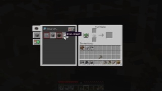

**图 2，帧 8719**

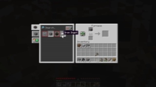

**图 3，帧 8723**

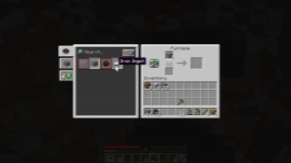

**图 4，帧 8727**

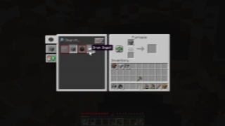

### 问题

The images and raw action blocks form one chronological Minecraft demonstration. Rewrite the action sequence into a cleaner demonstration while preserving the visible intent and causal order. Remove isolated control noise, keep necessary movement and interaction, and return only a JSON array of valid action blocks.

### 待优化的原始动作序列

动作块 1：

```text
<|action_start|> ; MouseLeft ; MouseLeft ; MouseLeft ; MouseLeft <|action_end|>
```

动作块 2：

```text
<|action_start|> ; MouseLeft ; MouseLeft ; MouseLeft ; MouseLeft <|action_end|>
```

动作块 3：

```text
<|action_start|> ; MouseLeft ; MouseLeft ; MouseLeft ; Mouse 0 2 <|action_end|>
```

动作块 4：

```text
<|action_start|> ; Mouse 2 15 ; Mouse 6 30 ; Mouse 18 34 ; Mouse 11 17 <|action_end|>
```

### 参考答案轨迹

参考类型：真实人类演示；该轨迹不是唯一合理答案。

动作块 1：

```text
<|action_start|> ; MouseLeft ; MouseLeft ; MouseLeft ; MouseLeft <|action_end|>
```

动作块 2：

```text
<|action_start|> ; MouseLeft ; MouseLeft ; MouseLeft ; MouseLeft <|action_end|>
```

动作块 3：

```text
<|action_start|> ; MouseLeft ; MouseLeft ; MouseLeft ; Mouse 0 2 <|action_end|>
```

动作块 4：

```text
<|action_start|> ; Mouse 2 15 ; Mouse 6 30 ; Mouse 18 34 ; Mouse 11 17 <|action_end|>
```

### 结构校验结果

```json
{
  "id": "demonstration_optimization_000005",
  "reviewer": "deterministic_structure_audit_v1",
  "decision": "pass",
  "hard_rejection": false,
  "reasons": []
}
```

## demonstration_optimization_000006

| 字段 | 内容 |
|---|---|
| 题型 | `demonstration_optimization` |
| 来源 episode | `trippy-red-llama-02630dd4ef35-20220422-163101` |
| 图片帧 | `[262, 266, 270, 274]` |
| 目标动作区间 | `[262, 278]` |
| 初始训练准入 | `False` |
| 结构审核 | `pass` |

### 图片

**图 1，帧 262**

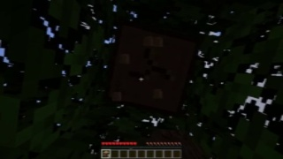

**图 2，帧 266**

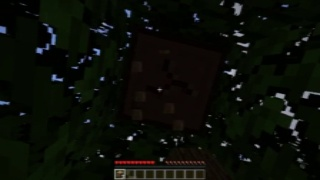

**图 3，帧 270**

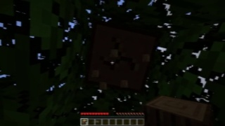

**图 4，帧 274**

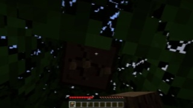

### 问题

The images and raw action blocks form one chronological Minecraft demonstration. Rewrite the action sequence into a cleaner demonstration while preserving the visible intent and causal order. Remove isolated control noise, keep necessary movement and interaction, and return only a JSON array of valid action blocks.

### 待优化的原始动作序列

动作块 1：

```text
<|action_start|> ; Mouse 4 -8 MouseLeft ; MouseLeft ; Mouse -2 11 S MouseLeft ; Mouse -5 15 MouseLeft <|action_end|>
```

动作块 2：

```text
<|action_start|> ; Mouse -6 20 MouseLeft ; Mouse -2 2 MouseLeft ; MouseLeft ; Mouse -1 1 MouseLeft <|action_end|>
```

动作块 3：

```text
<|action_start|> ; S D MouseLeft ; S D MouseLeft ; MouseLeft ; MouseLeft <|action_end|>
```

动作块 4：

```text
<|action_start|> ; Mouse -5 6 MouseLeft ; MouseLeft ; MouseLeft ; MouseLeft <|action_end|>
```

### 参考答案轨迹

参考类型：真实人类演示；该轨迹不是唯一合理答案。

动作块 1：

```text
<|action_start|> ; Mouse 4 -8 MouseLeft ; MouseLeft ; Mouse -2 11 S MouseLeft ; Mouse -5 15 MouseLeft <|action_end|>
```

动作块 2：

```text
<|action_start|> ; Mouse -6 20 MouseLeft ; Mouse -2 2 MouseLeft ; MouseLeft ; Mouse -1 1 MouseLeft <|action_end|>
```

动作块 3：

```text
<|action_start|> ; S D MouseLeft ; S D MouseLeft ; MouseLeft ; MouseLeft <|action_end|>
```

动作块 4：

```text
<|action_start|> ; Mouse -5 6 MouseLeft ; MouseLeft ; MouseLeft ; MouseLeft <|action_end|>
```

### 结构校验结果

```json
{
  "id": "demonstration_optimization_000006",
  "reviewer": "deterministic_structure_audit_v1",
  "decision": "pass",
  "hard_rejection": false,
  "reasons": []
}
```

## demonstration_optimization_000007

| 字段 | 内容 |
|---|---|
| 题型 | `demonstration_optimization` |
| 来源 episode | `sleepy-sangria-bat-14ad8f0512d2-20220423-105149` |
| 图片帧 | `[6219, 6223, 6227, 6231]` |
| 目标动作区间 | `[6219, 6235]` |
| 初始训练准入 | `False` |
| 结构审核 | `pass` |

### 图片

**图 1，帧 6219**

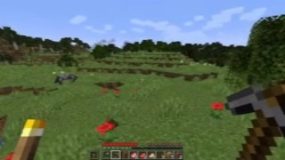

**图 2，帧 6223**

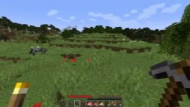

**图 3，帧 6227**

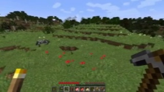

**图 4，帧 6231**

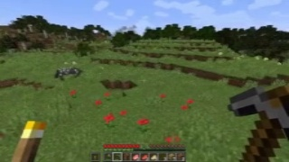

### 问题

The images and raw action blocks form one chronological Minecraft demonstration. Rewrite the action sequence into a cleaner demonstration while preserving the visible intent and causal order. Remove isolated control noise, keep necessary movement and interaction, and return only a JSON array of valid action blocks.

### 待优化的原始动作序列

动作块 1：

```text
<|action_start|> ; Mouse -2 0 W space ctrl ; W space ctrl ; W space ctrl ; Mouse -2 0 W space ctrl <|action_end|>
```

动作块 2：

```text
<|action_start|> ; Mouse -8 0 W space ctrl ; Mouse -19 13 W space ctrl ; Mouse -19 9 W space ctrl ; Mouse -18 14 W space ctrl <|action_end|>
```

动作块 3：

```text
<|action_start|> ; Mouse -11 8 W space ctrl ; Mouse -1 0 W space ctrl ; W space ctrl ; Mouse 6 1 W space ctrl <|action_end|>
```

动作块 4：

```text
<|action_start|> ; Mouse 130 -24 W space ctrl ; Mouse 132 -15 W space ctrl MouseRight ; Mouse 22 -4 W space ctrl MouseRight ; Mouse 16 -4 W space ctrl MouseRight <|action_end|>
```

### 参考答案轨迹

参考类型：真实人类演示；该轨迹不是唯一合理答案。

动作块 1：

```text
<|action_start|> ; Mouse -2 0 W space ctrl ; W space ctrl ; W space ctrl ; Mouse -2 0 W space ctrl <|action_end|>
```

动作块 2：

```text
<|action_start|> ; Mouse -8 0 W space ctrl ; Mouse -19 13 W space ctrl ; Mouse -19 9 W space ctrl ; Mouse -18 14 W space ctrl <|action_end|>
```

动作块 3：

```text
<|action_start|> ; Mouse -11 8 W space ctrl ; Mouse -1 0 W space ctrl ; W space ctrl ; Mouse 6 1 W space ctrl <|action_end|>
```

动作块 4：

```text
<|action_start|> ; Mouse 130 -24 W space ctrl ; Mouse 132 -15 W space ctrl MouseRight ; Mouse 22 -4 W space ctrl MouseRight ; Mouse 16 -4 W space ctrl MouseRight <|action_end|>
```

### 结构校验结果

```json
{
  "id": "demonstration_optimization_000007",
  "reviewer": "deterministic_structure_audit_v1",
  "decision": "pass",
  "hard_rejection": false,
  "reasons": []
}
```

## demonstration_optimization_000008

| 字段 | 内容 |
|---|---|
| 题型 | `demonstration_optimization` |
| 来源 episode | `shabby-pink-molly-f153ac423f61-20220414-080018` |
| 图片帧 | `[1992, 1996, 2000, 2004]` |
| 目标动作区间 | `[1992, 2008]` |
| 初始训练准入 | `False` |
| 结构审核 | `pass` |

### 图片

**图 1，帧 1992**

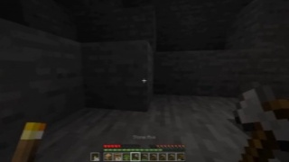

**图 2，帧 1996**

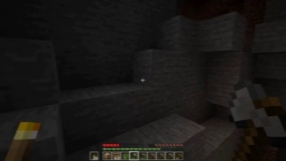

**图 3，帧 2000**

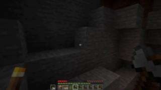

**图 4，帧 2004**

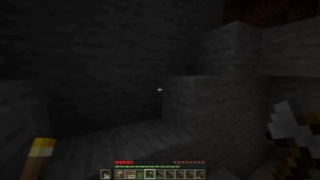

### 问题

The images and raw action blocks form one chronological Minecraft demonstration. Rewrite the action sequence into a cleaner demonstration while preserving the visible intent and causal order. Remove isolated control noise, keep necessary movement and interaction, and return only a JSON array of valid action blocks.

### 待优化的原始动作序列

动作块 1：

```text
<|action_start|> ; Mouse 42 13 W space ctrl ; Mouse 91 16 W space ctrl ; Mouse 113 -3 W space ctrl ; Mouse 53 -11 W space ctrl <|action_end|>
```

动作块 2：

```text
<|action_start|> ; Mouse 3 -2 W space ; W space ; W space ; W space <|action_end|>
```

动作块 3：

```text
<|action_start|> ; W space ; Mouse -14 0 W space ; Mouse -14 0 W space ; Mouse -17 0 W space ctrl <|action_end|>
```

动作块 4：

```text
<|action_start|> ; Mouse -30 0 W space ctrl ; Mouse -62 -5 W space ctrl ; Mouse -130 -29 W space ; Mouse -160 -17 W space <|action_end|>
```

### 参考答案轨迹

参考类型：真实人类演示；该轨迹不是唯一合理答案。

动作块 1：

```text
<|action_start|> ; Mouse 42 13 W space ctrl ; Mouse 91 16 W space ctrl ; Mouse 113 -3 W space ctrl ; Mouse 53 -11 W space ctrl <|action_end|>
```

动作块 2：

```text
<|action_start|> ; Mouse 3 -2 W space ; W space ; W space ; W space <|action_end|>
```

动作块 3：

```text
<|action_start|> ; W space ; Mouse -14 0 W space ; Mouse -14 0 W space ; Mouse -17 0 W space ctrl <|action_end|>
```

动作块 4：

```text
<|action_start|> ; Mouse -30 0 W space ctrl ; Mouse -62 -5 W space ctrl ; Mouse -130 -29 W space ; Mouse -160 -17 W space <|action_end|>
```

### 结构校验结果

```json
{
  "id": "demonstration_optimization_000008",
  "reviewer": "deterministic_structure_audit_v1",
  "decision": "pass",
  "hard_rejection": false,
  "reasons": []
}
```

## demonstration_optimization_000009

| 字段 | 内容 |
|---|---|
| 题型 | `demonstration_optimization` |
| 来源 episode | `shabby-viridian-beaver-b064d8e1dc68-20220417-011815` |
| 图片帧 | `[2881, 2885, 2889, 2893]` |
| 目标动作区间 | `[2881, 2897]` |
| 初始训练准入 | `False` |
| 结构审核 | `pass` |

### 图片

**图 1，帧 2881**

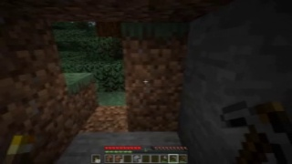

**图 2，帧 2885**

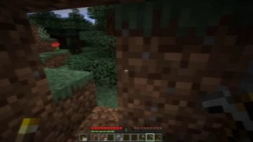

**图 3，帧 2889**

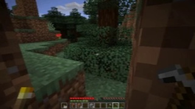

**图 4，帧 2893**

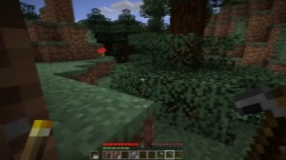

### 问题

The images and raw action blocks form one chronological Minecraft demonstration. Rewrite the action sequence into a cleaner demonstration while preserving the visible intent and causal order. Remove isolated control noise, keep necessary movement and interaction, and return only a JSON array of valid action blocks.

### 待优化的原始动作序列

动作块 1：

```text
<|action_start|> ; W ctrl ; W ctrl ; Mouse -32 -6 W ctrl ; Mouse -66 -1 W ctrl <|action_end|>
```

动作块 2：

```text
<|action_start|> ; Mouse -31 -3 W ctrl ; Mouse -9 -2 W ctrl ; Mouse -13 -1 W ctrl ; Mouse -23 -4 W ctrl <|action_end|>
```

动作块 3：

```text
<|action_start|> ; Mouse -21 -4 W ctrl ; Mouse -2 0 W ctrl ; Mouse -2 -1 W ctrl ; Mouse -27 -2 W ctrl <|action_end|>
```

动作块 4：

```text
<|action_start|> ; Mouse -50 0 W ctrl ; Mouse -56 0 W space ctrl ; Mouse -17 0 W space ctrl ; Mouse -37 -6 W space ctrl <|action_end|>
```

### 参考答案轨迹

参考类型：真实人类演示；该轨迹不是唯一合理答案。

动作块 1：

```text
<|action_start|> ; W ctrl ; W ctrl ; Mouse -32 -6 W ctrl ; Mouse -66 -1 W ctrl <|action_end|>
```

动作块 2：

```text
<|action_start|> ; Mouse -31 -3 W ctrl ; Mouse -9 -2 W ctrl ; Mouse -13 -1 W ctrl ; Mouse -23 -4 W ctrl <|action_end|>
```

动作块 3：

```text
<|action_start|> ; Mouse -21 -4 W ctrl ; Mouse -2 0 W ctrl ; Mouse -2 -1 W ctrl ; Mouse -27 -2 W ctrl <|action_end|>
```

动作块 4：

```text
<|action_start|> ; Mouse -50 0 W ctrl ; Mouse -56 0 W space ctrl ; Mouse -17 0 W space ctrl ; Mouse -37 -6 W space ctrl <|action_end|>
```

### 结构校验结果

```json
{
  "id": "demonstration_optimization_000009",
  "reviewer": "deterministic_structure_audit_v1",
  "decision": "pass",
  "hard_rejection": false,
  "reasons": []
}
```

## image_sequence_to_action_000000

| 字段 | 内容 |
|---|---|
| 题型 | `image_sequence_to_action` |
| 来源 episode | `cheeky-cornflower-setter-dd1ece57dcad-20220418-125652` |
| 图片帧 | `[657, 658, 659, 660, 661]` |
| 目标动作区间 | `[657, 661]` |
| 初始训练准入 | `False` |
| 结构审核 | `pass` |

### 图片

**图 1，帧 657**

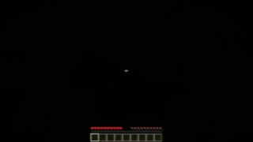

**图 2，帧 658**

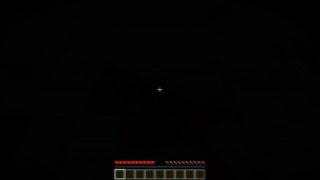

**图 3，帧 659**

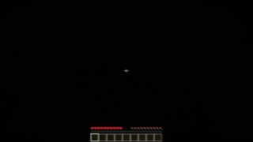

**图 4，帧 660**

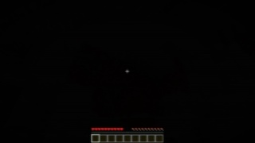

**图 5，帧 661**

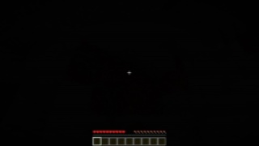

### 问题

The five images are consecutive Minecraft observations in chronological order across 200 ms. No action labels are provided. Infer one reasonable action sequence that could have produced the observed transition. Return only a JSON array containing one valid action block.

### 参考答案轨迹

参考类型：真实人类演示；该轨迹不是唯一合理答案。

动作块 1：

```text
<|action_start|> ; MouseLeft ; Mouse 0 6 MouseLeft ; Mouse 9 15 MouseLeft ; Mouse 8 11 MouseLeft <|action_end|>
```

### 结构校验结果

```json
{
  "id": "image_sequence_to_action_000000",
  "reviewer": "deterministic_structure_audit_v1",
  "decision": "pass",
  "hard_rejection": false,
  "reasons": []
}
```

## image_sequence_to_action_000001

| 字段 | 内容 |
|---|---|
| 题型 | `image_sequence_to_action` |
| 来源 episode | `squeaky-magnolia-ocelot-2812d6574782-20220420-103125` |
| 图片帧 | `[8281, 8282, 8283, 8284, 8285]` |
| 目标动作区间 | `[8281, 8285]` |
| 初始训练准入 | `False` |
| 结构审核 | `pass` |

### 图片

**图 1，帧 8281**


**图 2，帧 8282**


**图 3，帧 8283**


**图 4，帧 8284**


**图 5，帧 8285**


### 问题

The five images are consecutive Minecraft observations in chronological order across 200 ms. No action labels are provided. Infer one reasonable action sequence that could have produced the observed transition. Return only a JSON array containing one valid action block.

### 参考答案轨迹

参考类型：真实人类演示；该轨迹不是唯一合理答案。

动作块 1：

```text
<|action_start|> ; Mouse 0 6 ; Mouse 0 2 ; MouseLeft ; MouseLeft <|action_end|>
```

### 结构校验结果

```json
{
  "id": "image_sequence_to_action_000001",
  "reviewer": "deterministic_structure_audit_v1",
  "decision": "pass",
  "hard_rejection": false,
  "reasons": []
}
```

## image_sequence_to_action_000002

| 字段 | 内容 |
|---|---|
| 题型 | `image_sequence_to_action` |
| 来源 episode | `lovely-persimmon-angora-f153ac423f61-20220421-205302` |
| 图片帧 | `[996, 997, 998, 999, 1000]` |
| 目标动作区间 | `[996, 1000]` |
| 初始训练准入 | `False` |
| 结构审核 | `pass` |

### 图片

**图 1，帧 996**

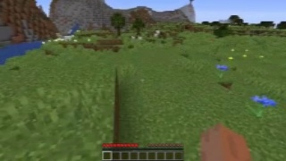

**图 2，帧 997**

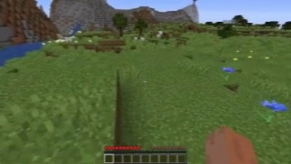

**图 3，帧 998**

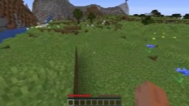

**图 4，帧 999**

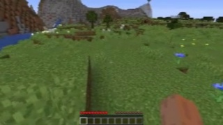

**图 5，帧 1000**

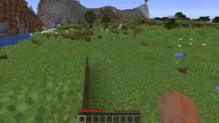

### 问题

The five images are consecutive Minecraft observations in chronological order across 200 ms. No action labels are provided. Infer one reasonable action sequence that could have produced the observed transition. Return only a JSON array containing one valid action block.

### 参考答案轨迹

参考类型：真实人类演示；该轨迹不是唯一合理答案。

动作块 1：

```text
<|action_start|> ; W ; W ; W ; Mouse 0 -1 W <|action_end|>
```

### 结构校验结果

```json
{
  "id": "image_sequence_to_action_000002",
  "reviewer": "deterministic_structure_audit_v1",
  "decision": "pass",
  "hard_rejection": false,
  "reasons": []
}
```

## image_sequence_to_action_000003

| 字段 | 内容 |
|---|---|
| 题型 | `image_sequence_to_action` |
| 来源 episode | `shabby-viridian-beaver-5a514507e621-20220423-171326` |
| 图片帧 | `[5852, 5853, 5854, 5855, 5856]` |
| 目标动作区间 | `[5852, 5856]` |
| 初始训练准入 | `False` |
| 结构审核 | `pass` |

### 图片

**图 1，帧 5852**

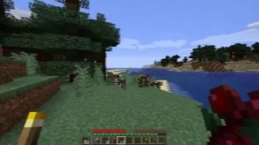

**图 2，帧 5853**

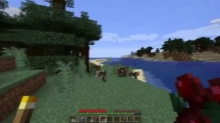

**图 3，帧 5854**


**图 4，帧 5855**

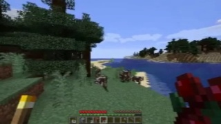

**图 5，帧 5856**

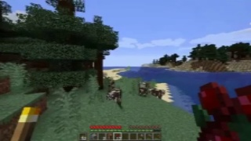

### 问题

The five images are consecutive Minecraft observations in chronological order across 200 ms. No action labels are provided. Infer one reasonable action sequence that could have produced the observed transition. Return only a JSON array containing one valid action block.

### 参考答案轨迹

参考类型：真实人类演示；该轨迹不是唯一合理答案。

动作块 1：

```text
<|action_start|> ; W space ctrl ; Mouse -4 0 W space ctrl ; Mouse -5 0 W space ctrl ; Mouse -4 0 W space ctrl <|action_end|>
```

### 结构校验结果

```json
{
  "id": "image_sequence_to_action_000003",
  "reviewer": "deterministic_structure_audit_v1",
  "decision": "pass",
  "hard_rejection": false,
  "reasons": []
}
```

## image_sequence_to_action_000004

| 字段 | 内容 |
|---|---|
| 题型 | `image_sequence_to_action` |
| 来源 episode | `lovely-persimmon-angora-140a4190c27f-20220420-001111` |
| 图片帧 | `[3424, 3425, 3426, 3427, 3428]` |
| 目标动作区间 | `[3424, 3428]` |
| 初始训练准入 | `False` |
| 结构审核 | `pass` |

### 图片

**图 1，帧 3424**

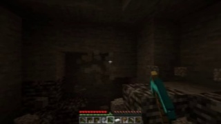

**图 2，帧 3425**

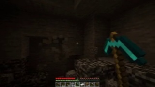

**图 3，帧 3426**

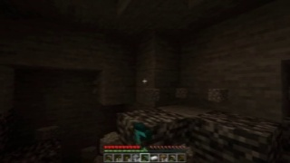

**图 4，帧 3427**

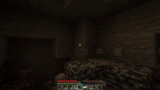

**图 5，帧 3428**


### 问题

The five images are consecutive Minecraft observations in chronological order across 200 ms. No action labels are provided. Infer one reasonable action sequence that could have produced the observed transition. Return only a JSON array containing one valid action block.

### 参考答案轨迹

参考类型：真实人类演示；该轨迹不是唯一合理答案。

动作块 1：

```text
<|action_start|> ; Mouse 71 -5 MouseLeft ; Mouse 70 -1 MouseLeft ; Mouse 2 0 MouseLeft ; MouseLeft <|action_end|>
```

### 结构校验结果

```json
{
  "id": "image_sequence_to_action_000004",
  "reviewer": "deterministic_structure_audit_v1",
  "decision": "pass",
  "hard_rejection": false,
  "reasons": []
}
```

## image_sequence_to_action_000005

| 字段 | 内容 |
|---|---|
| 题型 | `image_sequence_to_action` |
| 来源 episode | `cheeky-cornflower-setter-4a5cd44ff498-20220419-153826` |
| 图片帧 | `[2190, 2191, 2192, 2193, 2194]` |
| 目标动作区间 | `[2190, 2194]` |
| 初始训练准入 | `False` |
| 结构审核 | `pass` |

### 图片

**图 1，帧 2190**


**图 2，帧 2191**


**图 3，帧 2192**


**图 4，帧 2193**


**图 5，帧 2194**


### 问题

The five images are consecutive Minecraft observations in chronological order across 200 ms. No action labels are provided. Infer one reasonable action sequence that could have produced the observed transition. Return only a JSON array containing one valid action block.

### 参考答案轨迹

参考类型：真实人类演示；该轨迹不是唯一合理答案。

动作块 1：

```text
<|action_start|> ; Mouse 85 30 ; Mouse 70 27 ; Mouse 55 20 ; Mouse 32 13 <|action_end|>
```

### 结构校验结果

```json
{
  "id": "image_sequence_to_action_000005",
  "reviewer": "deterministic_structure_audit_v1",
  "decision": "pass",
  "hard_rejection": false,
  "reasons": []
}
```

## image_sequence_to_action_000006

| 字段 | 内容 |
|---|---|
| 题型 | `image_sequence_to_action` |
| 来源 episode | `cheeky-cornflower-setter-f15c95480f3d-20220422-202607` |
| 图片帧 | `[5315, 5316, 5317, 5318, 5319]` |
| 目标动作区间 | `[5315, 5319]` |
| 初始训练准入 | `False` |
| 结构审核 | `pass` |

### 图片

**图 1，帧 5315**


**图 2，帧 5316**


**图 3，帧 5317**


**图 4，帧 5318**


**图 5，帧 5319**


### 问题

The five images are consecutive Minecraft observations in chronological order across 200 ms. No action labels are provided. Infer one reasonable action sequence that could have produced the observed transition. Return only a JSON array containing one valid action block.

### 参考答案轨迹

参考类型：真实人类演示；该轨迹不是唯一合理答案。

动作块 1：

```text
<|action_start|> ; MouseLeft ; MouseLeft ; MouseLeft ; MouseLeft <|action_end|>
```

### 结构校验结果

```json
{
  "id": "image_sequence_to_action_000006",
  "reviewer": "deterministic_structure_audit_v1",
  "decision": "pass",
  "hard_rejection": false,
  "reasons": []
}
```

## image_sequence_to_action_000007

| 字段 | 内容 |
|---|---|
| 题型 | `image_sequence_to_action` |
| 来源 episode | `shabby-viridian-beaver-0c5f77442a8d-20220421-134922` |
| 图片帧 | `[15352, 15353, 15354, 15355, 15356]` |
| 目标动作区间 | `[15352, 15356]` |
| 初始训练准入 | `False` |
| 结构审核 | `pass` |

### 图片

**图 1，帧 15352**


**图 2，帧 15353**


**图 3，帧 15354**


**图 4，帧 15355**


**图 5，帧 15356**


### 问题

The five images are consecutive Minecraft observations in chronological order across 200 ms. No action labels are provided. Infer one reasonable action sequence that could have produced the observed transition. Return only a JSON array containing one valid action block.

### 参考答案轨迹

参考类型：真实人类演示；该轨迹不是唯一合理答案。

动作块 1：

```text
<|action_start|> ; MouseLeft ; MouseLeft ; MouseLeft ; MouseLeft <|action_end|>
```

### 结构校验结果

```json
{
  "id": "image_sequence_to_action_000007",
  "reviewer": "deterministic_structure_audit_v1",
  "decision": "pass",
  "hard_rejection": false,
  "reasons": []
}
```

## image_sequence_to_action_000008

| 字段 | 内容 |
|---|---|
| 题型 | `image_sequence_to_action` |
| 来源 episode | `shabby-viridian-beaver-70748cfc0d0b-20220419-234316` |
| 图片帧 | `[4277, 4278, 4279, 4280, 4281]` |
| 目标动作区间 | `[4277, 4281]` |
| 初始训练准入 | `False` |
| 结构审核 | `pass` |

### 图片

**图 1，帧 4277**


**图 2，帧 4278**


**图 3，帧 4279**


**图 4，帧 4280**


**图 5，帧 4281**


### 问题

The five images are consecutive Minecraft observations in chronological order across 200 ms. No action labels are provided. Infer one reasonable action sequence that could have produced the observed transition. Return only a JSON array containing one valid action block.

### 参考答案轨迹

参考类型：真实人类演示；该轨迹不是唯一合理答案。

动作块 1：

```text
<|action_start|> ; Mouse -35 6 W D MouseLeft ; Mouse -37 -6 MouseLeft ; Mouse -29 -14 MouseLeft ; Mouse -13 -15 MouseLeft <|action_end|>
```

### 结构校验结果

```json
{
  "id": "image_sequence_to_action_000008",
  "reviewer": "deterministic_structure_audit_v1",
  "decision": "pass",
  "hard_rejection": false,
  "reasons": []
}
```

## image_sequence_to_action_000009

| 字段 | 内容 |
|---|---|
| 题型 | `image_sequence_to_action` |
| 来源 episode | `shabby-viridian-beaver-97c2e1ab4d7c-20220417-164751` |
| 图片帧 | `[233, 234, 235, 236, 237]` |
| 目标动作区间 | `[233, 237]` |
| 初始训练准入 | `False` |
| 结构审核 | `pass` |

### 图片

**图 1，帧 233**


**图 2，帧 234**


**图 3，帧 235**


**图 4，帧 236**


**图 5，帧 237**


### 问题

The five images are consecutive Minecraft observations in chronological order across 200 ms. No action labels are provided. Infer one reasonable action sequence that could have produced the observed transition. Return only a JSON array containing one valid action block.

### 参考答案轨迹

参考类型：真实人类演示；该轨迹不是唯一合理答案。

动作块 1：

```text
<|action_start|> ; W ; Mouse 0 3 W ; Mouse -15 30 W ; Mouse -63 94 <|action_end|>
```

### 结构校验结果

```json
{
  "id": "image_sequence_to_action_000009",
  "reviewer": "deterministic_structure_audit_v1",
  "decision": "pass",
  "hard_rejection": false,
  "reasons": []
}
```

## history_to_future_action_000000

| 字段 | 内容 |
|---|---|
| 题型 | `history_to_future_action` |
| 来源 episode | `cheeky-cornflower-setter-f153ac423f61-20220418-110024` |
| 图片帧 | `[13790, 13794, 13798, 13802]` |
| 目标动作区间 | `[13802, 13806]` |
| 初始训练准入 | `False` |
| 结构审核 | `pass` |

### 图片

**图 1，帧 13790**


**图 2，帧 13794**


**图 3，帧 13798**


**图 4，帧 13802**


### 问题

The images are past observations in chronological order and contain no action labels. Infer one reasonable action sequence for the next 200 ms. Return only a JSON array containing one valid action block.

### 参考答案轨迹

参考类型：真实人类演示；该轨迹不是唯一合理答案。

动作块 1：

```text
<|action_start|> ; Mouse 5 0 ; Mouse 4 0 ; Mouse 2 0 ; Mouse 1 1 <|action_end|>
```

### 结构校验结果

```json
{
  "id": "history_to_future_action_000000",
  "reviewer": "deterministic_structure_audit_v1",
  "decision": "pass",
  "hard_rejection": false,
  "reasons": []
}
```

## history_to_future_action_000001

| 字段 | 内容 |
|---|---|
| 题型 | `history_to_future_action` |
| 来源 episode | `cheeky-cornflower-setter-82f9b652399f-20220416-220352` |
| 图片帧 | `[5808, 5812, 5816, 5820]` |
| 目标动作区间 | `[5820, 5824]` |
| 初始训练准入 | `False` |
| 结构审核 | `pass` |

### 图片

**图 1，帧 5808**


**图 2，帧 5812**


**图 3，帧 5816**


**图 4，帧 5820**


### 问题

The images are past observations in chronological order and contain no action labels. Infer one reasonable action sequence for the next 200 ms. Return only a JSON array containing one valid action block.

### 参考答案轨迹

参考类型：真实人类演示；该轨迹不是唯一合理答案。

动作块 1：

```text
<|action_start|> ; MouseLeft ; MouseLeft ; MouseLeft ; MouseLeft <|action_end|>
```

### 结构校验结果

```json
{
  "id": "history_to_future_action_000001",
  "reviewer": "deterministic_structure_audit_v1",
  "decision": "pass",
  "hard_rejection": false,
  "reasons": []
}
```

## history_to_future_action_000002

| 字段 | 内容 |
|---|---|
| 题型 | `history_to_future_action` |
| 来源 episode | `squeaky-magnolia-ocelot-f153ac423f61-20220419-105215` |
| 图片帧 | `[8357, 8361, 8365, 8369]` |
| 目标动作区间 | `[8369, 8373]` |
| 初始训练准入 | `False` |
| 结构审核 | `pass` |

### 图片

**图 1，帧 8357**


**图 2，帧 8361**


**图 3，帧 8365**


**图 4，帧 8369**


### 问题

The images are past observations in chronological order and contain no action labels. Infer one reasonable action sequence for the next 200 ms. Return only a JSON array containing one valid action block.

### 参考答案轨迹

参考类型：真实人类演示；该轨迹不是唯一合理答案。

动作块 1：

```text
<|action_start|> ; W D ; Mouse -8 21 W D ; Mouse -25 44 W D ; Mouse -72 74 W D <|action_end|>
```

### 结构校验结果

```json
{
  "id": "history_to_future_action_000002",
  "reviewer": "deterministic_structure_audit_v1",
  "decision": "pass",
  "hard_rejection": false,
  "reasons": []
}
```

## history_to_future_action_000003

| 字段 | 内容 |
|---|---|
| 题型 | `history_to_future_action` |
| 来源 episode | `lovely-persimmon-angora-1fb702eb3fd8-20220417-001006` |
| 图片帧 | `[4153, 4157, 4161, 4165]` |
| 目标动作区间 | `[4165, 4169]` |
| 初始训练准入 | `False` |
| 结构审核 | `pass` |

### 图片

**图 1，帧 4153**


**图 2，帧 4157**


**图 3，帧 4161**


**图 4，帧 4165**


### 问题

The images are past observations in chronological order and contain no action labels. Infer one reasonable action sequence for the next 200 ms. Return only a JSON array containing one valid action block.

### 参考答案轨迹

参考类型：真实人类演示；该轨迹不是唯一合理答案。

动作块 1：

```text
<|action_start|> ; Mouse 2 1 shift MouseLeft ; Mouse 2 3 shift MouseLeft ; shift MouseLeft ; Mouse 2 2 shift MouseLeft <|action_end|>
```

### 结构校验结果

```json
{
  "id": "history_to_future_action_000003",
  "reviewer": "deterministic_structure_audit_v1",
  "decision": "pass",
  "hard_rejection": false,
  "reasons": []
}
```

## history_to_future_action_000004

| 字段 | 内容 |
|---|---|
| 题型 | `history_to_future_action` |
| 来源 episode | `lovely-persimmon-angora-336494bc7dce-20220414-060158` |
| 图片帧 | `[1196, 1200, 1204, 1208]` |
| 目标动作区间 | `[1208, 1212]` |
| 初始训练准入 | `False` |
| 结构审核 | `pass` |

### 图片

**图 1，帧 1196**


**图 2，帧 1200**


**图 3，帧 1204**


**图 4，帧 1208**


### 问题

The images are past observations in chronological order and contain no action labels. Infer one reasonable action sequence for the next 200 ms. Return only a JSON array containing one valid action block.

### 参考答案轨迹

参考类型：真实人类演示；该轨迹不是唯一合理答案。

动作块 1：

```text
<|action_start|> ; MouseLeft ; MouseLeft ; MouseLeft ; MouseLeft <|action_end|>
```

### 结构校验结果

```json
{
  "id": "history_to_future_action_000004",
  "reviewer": "deterministic_structure_audit_v1",
  "decision": "pass",
  "hard_rejection": false,
  "reasons": []
}
```

## history_to_future_action_000005

| 字段 | 内容 |
|---|---|
| 题型 | `history_to_future_action` |
| 来源 episode | `woozy-ruby-ostrich-f153ac423f61-20220414-232816` |
| 图片帧 | `[5504, 5508, 5512, 5516]` |
| 目标动作区间 | `[5516, 5520]` |
| 初始训练准入 | `False` |
| 结构审核 | `pass` |

### 图片

**图 1，帧 5504**


**图 2，帧 5508**


**图 3，帧 5512**


**图 4，帧 5516**


### 问题

The images are past observations in chronological order and contain no action labels. Infer one reasonable action sequence for the next 200 ms. Return only a JSON array containing one valid action block.

### 参考答案轨迹

参考类型：真实人类演示；该轨迹不是唯一合理答案。

动作块 1：

```text
<|action_start|> ; W ctrl ; Mouse -5 1 W ctrl ; Mouse -45 14 W ctrl ; Mouse -36 12 W ctrl <|action_end|>
```

### 结构校验结果

```json
{
  "id": "history_to_future_action_000005",
  "reviewer": "deterministic_structure_audit_v1",
  "decision": "pass",
  "hard_rejection": false,
  "reasons": []
}
```

## history_to_future_action_000006

| 字段 | 内容 |
|---|---|
| 题型 | `history_to_future_action` |
| 来源 episode | `cheeky-cornflower-setter-c4d6b5fb4546-20220422-172623` |
| 图片帧 | `[9419, 9423, 9427, 9431]` |
| 目标动作区间 | `[9431, 9435]` |
| 初始训练准入 | `False` |
| 结构审核 | `pass` |

### 图片

**图 1，帧 9419**


**图 2，帧 9423**


**图 3，帧 9427**


**图 4，帧 9431**


### 问题

The images are past observations in chronological order and contain no action labels. Infer one reasonable action sequence for the next 200 ms. Return only a JSON array containing one valid action block.

### 参考答案轨迹

参考类型：真实人类演示；该轨迹不是唯一合理答案。

动作块 1：

```text
<|action_start|> ; Mouse 79 28 W A ; Mouse 94 29 W A ; Mouse 31 10 W ; Mouse 30 6 <|action_end|>
```

### 结构校验结果

```json
{
  "id": "history_to_future_action_000006",
  "reviewer": "deterministic_structure_audit_v1",
  "decision": "pass",
  "hard_rejection": false,
  "reasons": []
}
```

## history_to_future_action_000007

| 字段 | 内容 |
|---|---|
| 题型 | `history_to_future_action` |
| 来源 episode | `thirsty-lavender-koala-81c80338521d-20220421-154425` |
| 图片帧 | `[5224, 5228, 5232, 5236]` |
| 目标动作区间 | `[5236, 5240]` |
| 初始训练准入 | `False` |
| 结构审核 | `pass` |

### 图片

**图 1，帧 5224**


**图 2，帧 5228**


**图 3，帧 5232**


**图 4，帧 5236**


### 问题

The images are past observations in chronological order and contain no action labels. Infer one reasonable action sequence for the next 200 ms. Return only a JSON array containing one valid action block.

### 参考答案轨迹

参考类型：真实人类演示；该轨迹不是唯一合理答案。

动作块 1：

```text
<|action_start|> ; MouseLeft ; MouseLeft ; MouseLeft ; MouseLeft <|action_end|>
```

### 结构校验结果

```json
{
  "id": "history_to_future_action_000007",
  "reviewer": "deterministic_structure_audit_v1",
  "decision": "pass",
  "hard_rejection": false,
  "reasons": []
}
```

## history_to_future_action_000008

| 字段 | 内容 |
|---|---|
| 题型 | `history_to_future_action` |
| 来源 episode | `squeaky-magnolia-ocelot-f153ac423f61-20220419-105215` |
| 图片帧 | `[2372, 2376, 2380, 2384]` |
| 目标动作区间 | `[2384, 2388]` |
| 初始训练准入 | `False` |
| 结构审核 | `pass` |

### 图片

**图 1，帧 2372**


**图 2，帧 2376**


**图 3，帧 2380**


**图 4，帧 2384**


### 问题

The images are past observations in chronological order and contain no action labels. Infer one reasonable action sequence for the next 200 ms. Return only a JSON array containing one valid action block.

### 参考答案轨迹

参考类型：真实人类演示；该轨迹不是唯一合理答案。

动作块 1：

```text
<|action_start|> ; Mouse 18 -8 W A ; Mouse 6 -2 W A ; Mouse -3 -17 W A ; Mouse -2 -26 W A <|action_end|>
```

### 结构校验结果

```json
{
  "id": "history_to_future_action_000008",
  "reviewer": "deterministic_structure_audit_v1",
  "decision": "pass",
  "hard_rejection": false,
  "reasons": []
}
```

## history_to_future_action_000009

| 字段 | 内容 |
|---|---|
| 题型 | `history_to_future_action` |
| 来源 episode | `woozy-ruby-ostrich-f153ac423f61-20220415-043451` |
| 图片帧 | `[605, 609, 613, 617]` |
| 目标动作区间 | `[617, 621]` |
| 初始训练准入 | `False` |
| 结构审核 | `pass` |

### 图片

**图 1，帧 605**


**图 2，帧 609**


**图 3，帧 613**


**图 4，帧 617**


### 问题

The images are past observations in chronological order and contain no action labels. Infer one reasonable action sequence for the next 200 ms. Return only a JSON array containing one valid action block.

### 参考答案轨迹

参考类型：真实人类演示；该轨迹不是唯一合理答案。

动作块 1：

```text
<|action_start|> ; MouseLeft ; MouseLeft ; MouseLeft ; MouseLeft <|action_end|>
```

### 结构校验结果

```json
{
  "id": "history_to_future_action_000009",
  "reviewer": "deterministic_structure_audit_v1",
  "decision": "pass",
  "hard_rejection": false,
  "reasons": []
}
```

