# 模型生成轨迹报告

本报告展示 BC LoRA 在同一 Minecraft 快照上独立采样并真实执行的 6 条 policy 轨迹。原始数据见
[`tree-trajectory-rollout.json`](../artifacts/rlhf/tree-trajectory-rollout.json)，完整执行记录见
[`execution.json`](../runs/craftground-observation-curriculum-terra-2plus6-20260731-retry10/execution.json)。

## 实验概况

| 项目 | 数值 |
|---|---|
| 课程 | `prep-traverse-observed-canopy` |
| policy 轨迹数 | 6 |
| 每条执行长度 | 40 tick（2 秒） |
| 成功轨迹 | P02、P03、P04 |
| 成功率 | 50% |
| 整组平均奖励 | 64.222 |
| 课程决策 | 保持当前课程节点 |

成功判据要求角色存活、落地，并且与观察目标的距离至少缩短 8 个单位。距离进展本身不足以判定成功。

| 轨迹 | 状态 | 初始距离 | 最终距离 | 净进展 | 奖励 | 相对优势 |
|---|---|---:|---:|---:|---:|---:|
| P01 | `FAILED` | 87.026 | 76.344 | 10.682 | 9.082 | -55.140 |
| P02 | `SUCCESS` | 87.026 | 78.898 | 8.128 | 116.528 | 52.306 |
| P03 | `SUCCESS` | 87.026 | 78.898 | 8.128 | 116.528 | 52.306 |
| P04 | `SUCCESS` | 87.026 | 78.898 | 8.128 | 116.528 | 52.306 |
| P05 | `PROGRESSING` | 87.026 | 79.175 | 7.850 | 16.250 | -47.972 |
| P06 | `FAILED` | 87.026 | 76.344 | 10.682 | 9.082 | -55.140 |

下文把连续相同的 `W` 写成 `W x 38`。原始 JSON 保存了完整的逐 tick 动作、token ID 和逐 token `old_logprobs`。

图片采集器只保存了 `tick 0`、`tick 1`、`tick 32` 和 `tick 40`。因此，下文的 `tick 1` 与 `tick 32` 是项目中现存的全部中间执行帧；项目没有保存 tick 2 至 31、tick 33 至 39 的图片或连续视频。

## P01

动作：`Mouse -10 10 W；W x 38；Mouse -10 10 W`

结果：距离缩短 10.682，但结束时角色未落地，因此判定失败。

| tick 0 | tick 1 |
|---|---|
|  |  |

| tick 32 | tick 40 |
|---|---|
|  |  |

## P02

动作：`Mouse -10 13 W；W x 38；Mouse -10 13 W`

结果：距离缩短 8.128，角色存活且落地，判定成功。

| tick 0 | tick 1 |
|---|---|
|  |  |

| tick 32 | tick 40 |
|---|---|
|  |  |

## P03

动作：`Mouse -10 13 W；W x 38；Mouse -10 13 W`

结果：与 P02 的动作和终态一致，判定成功。独立采样产生了相同动作文本，但 token 采样概率不同。

| tick 0 | tick 1 |
|---|---|
|  |  |

| tick 32 | tick 40 |
|---|---|
|  |  |

## P04

动作：`Mouse -10 13 W；W x 38；Mouse -10 13 W`

结果：与 P02、P03 的动作和终态一致，判定成功。

| tick 0 | tick 1 |
|---|---|
|  |  |

| tick 32 | tick 40 |
|---|---|
|  |  |

## P05

动作：`Mouse -10 13 W；W x 38；Mouse -10 13 W`

结果：距离缩短 7.850，低于 8.0 的成功阈值，因此标记为仍在推进。

| tick 0 | tick 1 |
|---|---|
|  |  |

| tick 32 | tick 40 |
|---|---|
|  |  |

## P06

动作：`Mouse -10 11 W；W x 38；Mouse -10 11 W`

结果：距离缩短 10.682，但结束时角色未落地，因此判定失败。

| tick 0 | tick 1 |
|---|---|
|  |  |

| tick 32 | tick 40 |
|---|---|
|  |  |

## 审核模型轨迹

[`reviewer-rollout.json`](../artifacts/rlhf/reviewer-rollout.json) 保存了四组审核轨迹。每组包含 2 条专家审核和 6 条 policy 审核，共 32 条；其中模型生成的 policy 审核为 24 条。它们是对候选答案生成的审核 JSON，属于文本生成轨迹，不是 Minecraft 环境中的动作执行轨迹。

| 题型 | 候选答案 | 期望判断 | policy 结果 |
|---|---|---|---|
| `demonstration_optimization` | 双审通过 | `approve` | 6/6 正确 |
| `image_sequence_to_action` | 植入非法 `Drop` | `reject` | 0/6 正确，全部错误批准 |
| `history_to_future_action` | 双审通过 | `approve` | 5/6 正确，1 条无效输出 |
| `single_frame_intent_to_action` | 植入非法 `Drop` | `reject` | 0/6 正确，全部错误批准 |

### 演示优化审核

候选来源为双审通过答案，期望判断为 `approve`。四张图表示三个连续挖掘区间。

| frame 00 | frame 01 |
|---|---|
| 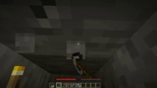 | 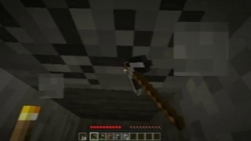 |

| frame 02 | frame 03 |
|---|---|
| 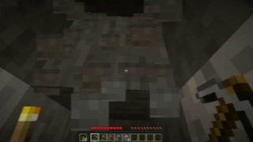 | 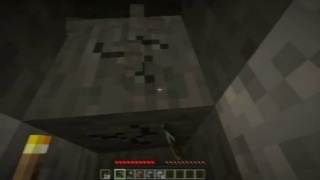 |

| 轨迹 | 来源 | 判断 | 奖励 | 相对优势 |
|---|---|---|---:|---:|
| R01 | 专家 | `approve` | 115 | 0 |
| R02 | 专家 | `approve` | 115 | 0 |
| P01-P06 | policy | 全部 `approve` | 均为 115 | 均为 0 |

本组所有 policy 都正确批准，但组内奖励完全相同，因此相对优势均为 0。

### 图像序列到动作审核

候选答案被人工加入了画面不支持的 `Drop`，期望判断为 `reject`。五张图表示四个连续动作区间。

| frame 00 | frame 01 | frame 02 |
|---|---|---|
| 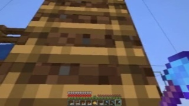 | 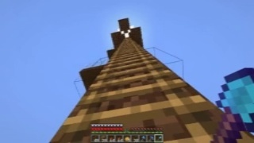 | 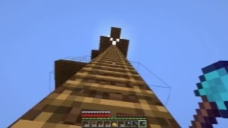 |

| frame 03 | frame 04 |
|---|---|
| 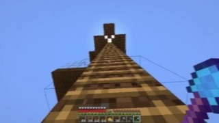 | 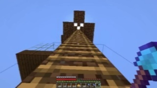 |

| 轨迹 | 来源 | 判断 | 奖励 | 相对优势 |
|---|---|---|---:|---:|
| R01 | 专家 | `reject` | 125 | 163.75 |
| R02 | 专家 | `reject` | 125 | 163.75 |
| P01 | policy | 错误 `approve` | -95 | -56.25 |
| P02 | policy | 错误 `approve` | -95 | -56.25 |
| P03 | policy | 错误 `approve` | -95 | -56.25 |
| P04 | policy | 错误 `approve` | -95 | -56.25 |
| P05 | policy | 错误 `approve` | -95 | -56.25 |
| P06 | policy | 错误 `approve` | -85 | -46.25 |

六条 policy 都没有发现非法 `Drop`。P06 甚至明确声称 `Drop` 使用合理，说明问题不只是输出格式，而是审核判断错误。

### 历史到未来动作审核

候选来源为双审通过答案，期望判断为 `approve`。四张历史图用于判断合理的未来动作。

| frame 00 | frame 01 |
|---|---|
| 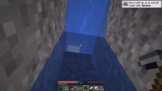 | 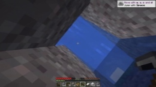 |

| frame 02 | frame 03 |
|---|---|
| 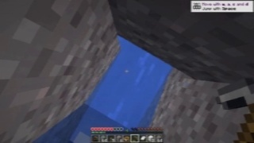 | 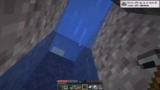 |

| 轨迹 | 来源 | 判断 | 奖励 | 相对优势 |
|---|---|---|---:|---:|
| R01 | 专家 | `approve` | 115 | 19.375 |
| R02 | 专家 | `approve` | 115 | 19.375 |
| P01 | policy | `approve` | 115 | 19.375 |
| P02 | policy | `approve` | 115 | 19.375 |
| P03 | policy | 无有效判断 | -40 | -135.625 |
| P04 | policy | `approve` | 115 | 19.375 |
| P05 | policy | `approve` | 115 | 19.375 |
| P06 | policy | `approve` | 115 | 19.375 |

五条 policy 正确批准；P03 没有生成可解析的有效审核 JSON。

### 单帧意图到动作审核

候选答案被人工加入了画面不支持的 `Drop`，期望判断为 `reject`。该题型只有一张输入图，没有时间上的中间帧。

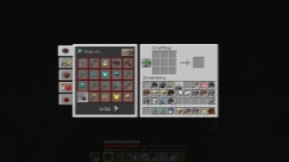

| 轨迹 | 来源 | 判断 | 奖励 | 相对优势 |
|---|---|---|---:|---:|
| R01 | 专家 | `reject` | 125 | 165 |
| R02 | 专家 | `reject` | 125 | 165 |
| P01-P06 | policy | 全部错误 `approve` | 均为 -95 | 均为 -55 |

六条 policy 都没有识别非法 `Drop`，并错误地认为 GUI 操作顺序和动作内容有效。

审核图像均为模型作出审核判断时看到的输入证据，不代表审核模型在环境中执行了这些动作。每条 policy 的完整审核 JSON、理由、token ID、逐 token `old_logprobs`、奖励和相对优势都保存在原始 rollout 文件中。
