# Terra × CraftGround 正式动作协议闭环实验

## 结论

本报告只统计项目正式 Lumine 命名 token 协议产生的轨迹。旧的 CraftGround V2 JSON
实验已经标记为无效协议实验。T4 在第 9 次模型指令、tick 25 打开 Chest GUI。

## 协议

```text
["<|action_start|> ; Mouse -35 0 W ; W ; MouseRight <|action_end|>"]
Reason: visual evidence and duration choice
```

每个分号是一个 50 ms tick。服务端调用 `decode_lumine_action()`，逐 chunk 转换成内部
CraftGround V2 动作，并为每个 tick 保存一张 RGB。

## 汇总

| 轨迹 | 成功 | 模型指令 | tick | 模拟秒 | CraftGround墙钟 | 分数 | 相对优势 |
|---|---:|---:|---:|---:|---:|---:|---:|
| T1 | 否 | 10 | 19 | 0.95 | 1142.15 ms | 17 | -22.00 |
| T2 | 否 | 10 | 40 | 2.00 | 2208.24 ms | 38 | -1.00 |
| T3 | 否 | 10 | 12 | 0.60 | 601.70 ms | 10 | -29.00 |
| T4 | 是 | 9 | 25 | 1.25 | 1391.60 ms | 91 | +52.00 |

## Prompt

正式 Prompt 原文：[`policy_prompt.md`](../runs/craftground-lumine-terra-batch4/policy_prompt.md)。
代码来源：`datasets/minestudio_finetune/sft_protocol.py` 的 `history_to_future_action`。

## 共同起点

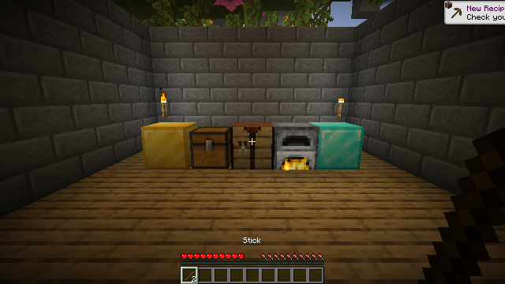

## T1 动作与逐 tick 图像

| 轮次 | tick范围 | 正式动作块 | CraftGround执行 |
|---:|---|---|---:|
| 1 | 0–1 | `<\|action_start\|> ; Mouse 80 0 <\|action_end\|>` | 61.94 ms |
| 2 | 1–11 | `<\|action_start\|> ; W ; W ; W ; W ; W ; W ; W ; W ; W ; W <\|action_end\|>` | 586.72 ms |
| 3 | 11–12 | `<\|action_start\|> ; Mouse -145 25 <\|action_end\|>` | 59.82 ms |
| 4 | 12–13 | `<\|action_start\|> ; Mouse 200 0 <\|action_end\|>` | 79.02 ms |
| 5 | 13–14 | `<\|action_start\|> ; Mouse 80 0 <\|action_end\|>` | 56.84 ms |
| 6 | 14–15 | `<\|action_start\|> ; Mouse -80 0 <\|action_end\|>` | 52.43 ms |
| 7 | 15–16 | `<\|action_start\|> ; Mouse 200 0 <\|action_end\|>` | 55.98 ms |
| 8 | 16–17 | `<\|action_start\|> ; Mouse 650 0 <\|action_end\|>` | 87.39 ms |
| 9 | 17–18 | `<\|action_start\|> ; Mouse -650 0 <\|action_end\|>` | 43.77 ms |
| 10 | 18–19 | `<\|action_start\|> ; Mouse 650 0 <\|action_end\|>` | 58.25 ms |

上表的“正式动作块”是从模型 JSON 数组中抽取后交给执行器的 `action_text`，不是模型原始回复。
下面逐轮同时展示原始回复、抽取结果和解码结果。

### T1 第 1 轮模型输出与执行载荷

当轮 Prompt 摘要：

```text
The images are past Minecraft observations in chronological order. Infer one reasonable future action block. Choose a suitable number of 50 ms ticks from the visible action type and required duration instead of waiting for a supplied target length. Keep brief actions short; sustained movement, mining, attacking, drawing, eating, or continuous use may last up to 60 ticks. Omit unsupported 1-2 pixel camera jitter and do not invent GUI clicks or auxiliary keys without visual evidence. Action format example for a 3-tick block: "<|action_start|> ; W ; Mouse 4 -2 W ; W <|action_end|>". Each JSON array item must be one string action block; do not return nested tick arrays. Output the complete executable JSON action array first. Then start a new line with "Reason:" and briefly explain the visual evidence, intent, and duration choice.
```

Terra 原始输出：

```text
["<|action_start|> ; Mouse 80 0 <|action_end|>"]
Reason: The previous leftward correction leaves the chest visibly to the left of center. A single opposite horizontal correction is the smallest evidence-based adjustment before attempting use.
```

从 JSON 数组抽取并提交给执行器的 `action_text`：

```text
<|action_start|> ; Mouse 80 0 <|action_end|>
```

`decode_lumine_action()` 解析后的逐 tick chunks：

```json
[
  {
    "keys": [],
    "mouse": [
      80,
      0
    ],
    "scroll": 0
  }
]
```

### T1 第 2 轮模型输出与执行载荷

当轮 Prompt 摘要：

```text
The images are past Minecraft observations in chronological order. Infer one reasonable future action block. Choose a suitable number of 50 ms ticks from the visible action type and required duration instead of waiting for a supplied target length. Keep brief actions short; sustained movement, mining, attacking, drawing, eating, or continuous use may last up to 60 ticks. Omit unsupported 1-2 pixel camera jitter and do not invent GUI clicks or auxiliary keys without visual evidence. Action format example for a 3-tick block: "<|action_start|> ; W ; Mouse 4 -2 W ; W <|action_end|>". Each JSON array item must be one string action block; do not return nested tick arrays. Output the complete executable JSON action array first. Then start a new line with "Reason:" and briefly explain the visual evidence, intent, and duration choice.
```

Terra 原始输出：

```text
["<|action_start|> ; W ; W ; W ; W ; W ; W ; W ; W ; W ; W <|action_end|>"]
Reason: The chest is visible ahead but is still beyond reliable interaction range. Advance straight for a short sustained interval while keeping the current view.
```

从 JSON 数组抽取并提交给执行器的 `action_text`：

```text
<|action_start|> ; W ; W ; W ; W ; W ; W ; W ; W ; W ; W <|action_end|>
```

`decode_lumine_action()` 解析后的逐 tick chunks：

```json
[
  {
    "keys": [
      "W"
    ],
    "mouse": [
      0,
      0
    ],
    "scroll": 0
  },
  {
    "keys": [
      "W"
    ],
    "mouse": [
      0,
      0
    ],
    "scroll": 0
  },
  {
    "keys": [
      "W"
    ],
    "mouse": [
      0,
      0
    ],
    "scroll": 0
  },
  {
    "keys": [
      "W"
    ],
    "mouse": [
      0,
      0
    ],
    "scroll": 0
  },
  {
    "keys": [
      "W"
    ],
    "mouse": [
      0,
      0
    ],
    "scroll": 0
  },
  {
    "keys": [
      "W"
    ],
    "mouse": [
      0,
      0
    ],
    "scroll": 0
  },
  {
    "keys": [
      "W"
    ],
    "mouse": [
      0,
      0
    ],
    "scroll": 0
  },
  {
    "keys": [
      "W"
    ],
    "mouse": [
      0,
      0
    ],
    "scroll": 0
  },
  {
    "keys": [
      "W"
    ],
    "mouse": [
      0,
      0
    ],
    "scroll": 0
  },
  {
    "keys": [
      "W"
    ],
    "mouse": [
      0,
      0
    ],
    "scroll": 0
  }
]
```

### T1 第 3 轮模型输出与执行载荷

当轮 Prompt 摘要：

```text
The images are past Minecraft observations in chronological order. Infer one reasonable future action block. Choose a suitable number of 50 ms ticks from the visible action type and required duration instead of waiting for a supplied target length. Keep brief actions short; sustained movement, mining, attacking, drawing, eating, or continuous use may last up to 60 ticks. Omit unsupported 1-2 pixel camera jitter and do not invent GUI clicks or auxiliary keys without visual evidence. Action format example for a 3-tick block: "<|action_start|> ; W ; Mouse 4 -2 W ; W <|action_end|>". Each JSON array item must be one string action block; do not return nested tick arrays. Output the complete executable JSON action array first. Then start a new line with "Reason:" and briefly explain the visual evidence, intent, and duration choice.
```

Terra 原始输出：

```text
["<|action_start|> ; Mouse -145 25 <|action_end|>"]
Reason: The close chest is left and below the center point after the prior rightward view change. A single substantial left-and-down correction should align its front face for interaction.
```

从 JSON 数组抽取并提交给执行器的 `action_text`：

```text
<|action_start|> ; Mouse -145 25 <|action_end|>
```

`decode_lumine_action()` 解析后的逐 tick chunks：

```json
[
  {
    "keys": [],
    "mouse": [
      -145,
      25
    ],
    "scroll": 0
  }
]
```

### T1 第 4 轮模型输出与执行载荷

当轮 Prompt 摘要：

```text
The images are past Minecraft observations in chronological order. Infer one reasonable future action block. Choose a suitable number of 50 ms ticks from the visible action type and required duration instead of waiting for a supplied target length. Keep brief actions short; sustained movement, mining, attacking, drawing, eating, or continuous use may last up to 60 ticks. Omit unsupported 1-2 pixel camera jitter and do not invent GUI clicks or auxiliary keys without visual evidence. Action format example for a 3-tick block: "<|action_start|> ; W ; Mouse 4 -2 W ; W <|action_end|>". Each JSON array item must be one string action block; do not return nested tick arrays. Output the complete executable JSON action array first. Then start a new line with "Reason:" and briefly explain the visual evidence, intent, and duration choice.
```

Terra 原始输出：

```text
["<|action_start|> ; Mouse 200 0 <|action_end|>"]
Reason: The latest observation shows the chest shifted farther left following the negative horizontal input. A single positive horizontal correction brings the nearby chest toward the center without adding unsupported keys.
```

从 JSON 数组抽取并提交给执行器的 `action_text`：

```text
<|action_start|> ; Mouse 200 0 <|action_end|>
```

`decode_lumine_action()` 解析后的逐 tick chunks：

```json
[
  {
    "keys": [],
    "mouse": [
      200,
      0
    ],
    "scroll": 0
  }
]
```

### T1 第 5 轮模型输出与执行载荷

当轮 Prompt 摘要：

```text
The images are past Minecraft observations in chronological order. Infer one reasonable future action block. Choose a suitable number of 50 ms ticks from the visible action type and required duration instead of waiting for a supplied target length. Keep brief actions short; sustained movement, mining, attacking, drawing, eating, or continuous use may last up to 60 ticks. Omit unsupported 1-2 pixel camera jitter and do not invent GUI clicks or auxiliary keys without visual evidence. Action format example for a 3-tick block: "<|action_start|> ; W ; Mouse 4 -2 W ; W <|action_end|>". Each JSON array item must be one string action block; do not return nested tick arrays. Output the complete executable JSON action array first. Then start a new line with "Reason:" and briefly explain the visual evidence, intent, and duration choice.
```

Terra 原始输出：

```text
["<|action_start|> ; Mouse 80 0 <|action_end|>"]
Reason: The chest is now near the center after the correction, but its latch remains visibly left of the use point. A brief positive horizontal adjustment aligns the chest before interacting.
```

从 JSON 数组抽取并提交给执行器的 `action_text`：

```text
<|action_start|> ; Mouse 80 0 <|action_end|>
```

`decode_lumine_action()` 解析后的逐 tick chunks：

```json
[
  {
    "keys": [],
    "mouse": [
      80,
      0
    ],
    "scroll": 0
  }
]
```

### T1 第 6 轮模型输出与执行载荷

当轮 Prompt 摘要：

```text
The images are past Minecraft observations in chronological order. Infer one reasonable future action block. Choose a suitable number of 50 ms ticks from the visible action type and required duration instead of waiting for a supplied target length. Keep brief actions short; sustained movement, mining, attacking, drawing, eating, or continuous use may last up to 60 ticks. Omit unsupported 1-2 pixel camera jitter and do not invent GUI clicks or auxiliary keys without visual evidence. Action format example for a 3-tick block: "<|action_start|> ; W ; Mouse 4 -2 W ; W <|action_end|>". Each JSON array item must be one string action block; do not return nested tick arrays. Output the complete executable JSON action array first. Then start a new line with "Reason:" and briefly explain the visual evidence, intent, and duration choice.
```

Terra 原始输出：

```text
["<|action_start|> ; Mouse -80 0 <|action_end|>"]
Reason: The chest has moved to the far left edge after the latest horizontal turn. Use the equal and opposite brief correction to restore it toward the use point.
```

从 JSON 数组抽取并提交给执行器的 `action_text`：

```text
<|action_start|> ; Mouse -80 0 <|action_end|>
```

`decode_lumine_action()` 解析后的逐 tick chunks：

```json
[
  {
    "keys": [],
    "mouse": [
      -80,
      0
    ],
    "scroll": 0
  }
]
```

### T1 第 7 轮模型输出与执行载荷

当轮 Prompt 摘要：

```text
The images are past Minecraft observations in chronological order. Infer one reasonable future action block. Choose a suitable number of 50 ms ticks from the visible action type and required duration instead of waiting for a supplied target length. Keep brief actions short; sustained movement, mining, attacking, drawing, eating, or continuous use may last up to 60 ticks. Omit unsupported 1-2 pixel camera jitter and do not invent GUI clicks or auxiliary keys without visual evidence. Action format example for a 3-tick block: "<|action_start|> ; W ; Mouse 4 -2 W ; W <|action_end|>". Each JSON array item must be one string action block; do not return nested tick arrays. Output the complete executable JSON action array first. Then start a new line with "Reason:" and briefly explain the visual evidence, intent, and duration choice.
```

Terra 原始输出：

```text
["<|action_start|> ; Mouse 200 0 <|action_end|>"]
Reason: The latest frame faces the right side of the room and the chest is no longer visible, while earlier positive correction moved the target back into view. Make one larger positive correction to reacquire it.
```

从 JSON 数组抽取并提交给执行器的 `action_text`：

```text
<|action_start|> ; Mouse 200 0 <|action_end|>
```

`decode_lumine_action()` 解析后的逐 tick chunks：

```json
[
  {
    "keys": [],
    "mouse": [
      200,
      0
    ],
    "scroll": 0
  }
]
```

### T1 第 8 轮模型输出与执行载荷

当轮 Prompt 摘要：

```text
The images are past Minecraft observations in chronological order. Infer one reasonable future action block. Choose a suitable number of 50 ms ticks from the visible action type and required duration instead of waiting for a supplied target length. Keep brief actions short; sustained movement, mining, attacking, drawing, eating, or continuous use may last up to 60 ticks. Omit unsupported 1-2 pixel camera jitter and do not invent GUI clicks or auxiliary keys without visual evidence. Action format example for a 3-tick block: "<|action_start|> ; W ; Mouse 4 -2 W ; W <|action_end|>". Each JSON array item must be one string action block; do not return nested tick arrays. Output the complete executable JSON action array first. Then start a new line with "Reason:" and briefly explain the visual evidence, intent, and duration choice.
```

Terra 原始输出：

```text
["<|action_start|> ; Mouse 650 0 <|action_end|>"]
Reason: The chest is reacquired at the left edge. The immediately preceding positive correction moved it right by a small amount, so a single larger positive horizontal adjustment is needed to place its front face at the central use point.
```

从 JSON 数组抽取并提交给执行器的 `action_text`：

```text
<|action_start|> ; Mouse 650 0 <|action_end|>
```

`decode_lumine_action()` 解析后的逐 tick chunks：

```json
[
  {
    "keys": [],
    "mouse": [
      650,
      0
    ],
    "scroll": 0
  }
]
```

### T1 第 9 轮模型输出与执行载荷

当轮 Prompt 摘要：

```text
The images are past Minecraft observations in chronological order. Infer one reasonable future action block. Choose a suitable number of 50 ms ticks from the visible action type and required duration instead of waiting for a supplied target length. Keep brief actions short; sustained movement, mining, attacking, drawing, eating, or continuous use may last up to 60 ticks. Omit unsupported 1-2 pixel camera jitter and do not invent GUI clicks or auxiliary keys without visual evidence. Action format example for a 3-tick block: "<|action_start|> ; W ; Mouse 4 -2 W ; W <|action_end|>". Each JSON array item must be one string action block; do not return nested tick arrays. Output the complete executable JSON action array first. Then start a new line with "Reason:" and briefly explain the visual evidence, intent, and duration choice.
```

Terra 原始输出：

```text
["<|action_start|> ; Mouse -650 0 <|action_end|>"]
Reason: The large positive correction overshot and placed the chest left of the view. The matching negative correction restores the prior horizontal orientation before the final interaction attempt.
```

从 JSON 数组抽取并提交给执行器的 `action_text`：

```text
<|action_start|> ; Mouse -650 0 <|action_end|>
```

`decode_lumine_action()` 解析后的逐 tick chunks：

```json
[
  {
    "keys": [],
    "mouse": [
      -650,
      0
    ],
    "scroll": 0
  }
]
```

### T1 第 10 轮模型输出与执行载荷

当轮 Prompt 摘要：

```text
The images are past Minecraft observations in chronological order. Infer one reasonable future action block. Choose a suitable number of 50 ms ticks from the visible action type and required duration instead of waiting for a supplied target length. Keep brief actions short; sustained movement, mining, attacking, drawing, eating, or continuous use may last up to 60 ticks. Omit unsupported 1-2 pixel camera jitter and do not invent GUI clicks or auxiliary keys without visual evidence. Action format example for a 3-tick block: "<|action_start|> ; W ; Mouse 4 -2 W ; W <|action_end|>". Each JSON array item must be one string action block; do not return nested tick arrays. Output the complete executable JSON action array first. Then start a new line with "Reason:" and briefly explain the visual evidence, intent, and duration choice.
```

Terra 原始输出：

```text
["<|action_start|> ; Mouse 650 0 <|action_end|>"]
Reason: The chest is absent from the latest frame after the prior turn. Restore the matching positive horizontal orientation to reacquire the visible task object; no use click is justified without it.
```

从 JSON 数组抽取并提交给执行器的 `action_text`：

```text
<|action_start|> ; Mouse 650 0 <|action_end|>
```

`decode_lumine_action()` 解析后的逐 tick chunks：

```json
[
  {
    "keys": [],
    "mouse": [
      650,
      0
    ],
    "scroll": 0
  }
]
```

完整机器日志：[`T1/trajectory.json`](../runs/craftground-lumine-terra-batch4/T1/trajectory.json)。

### T1 frame_0000


### T1 frame_0001

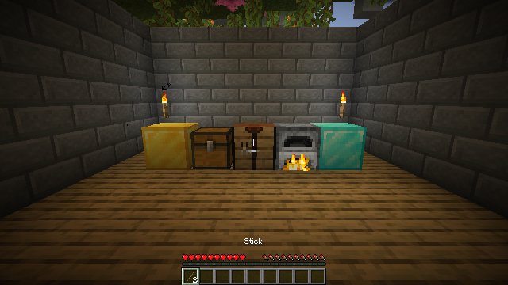

### T1 frame_0002

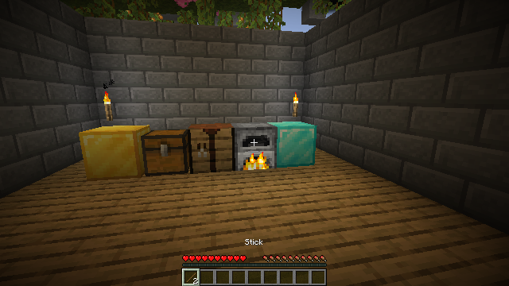

### T1 frame_0003

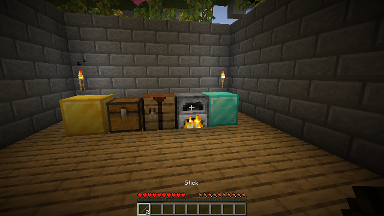

### T1 frame_0004

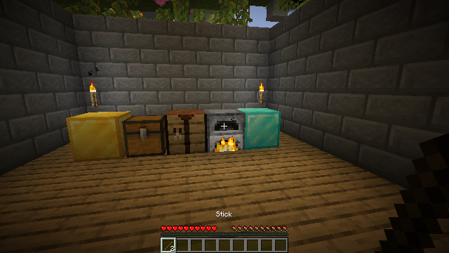

### T1 frame_0005

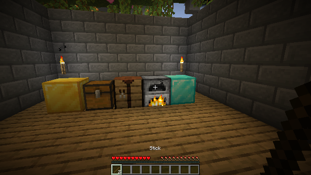

### T1 frame_0006

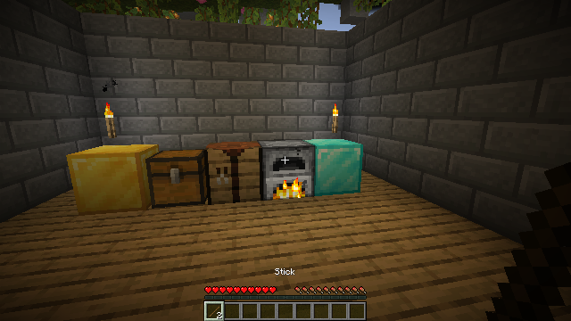

### T1 frame_0007

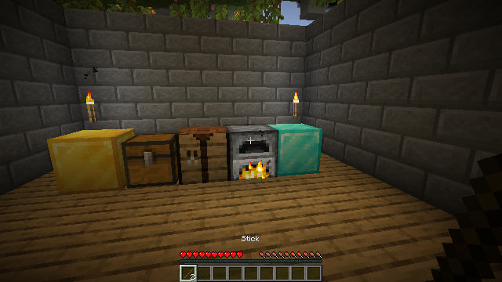

### T1 frame_0008

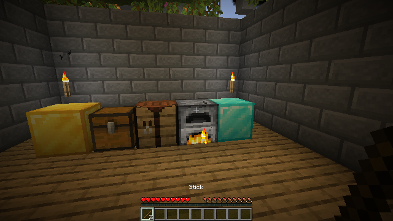

### T1 frame_0009

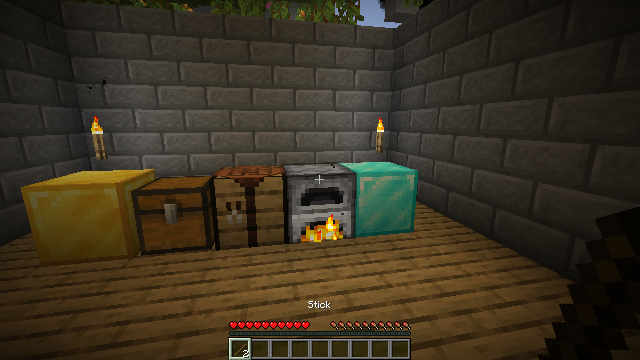

### T1 frame_0010

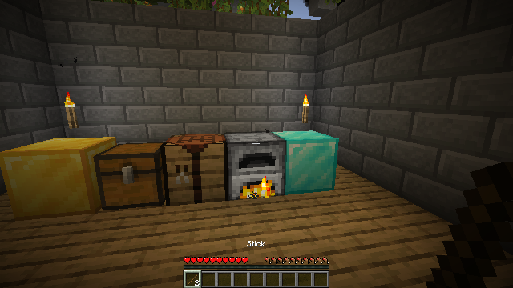

### T1 frame_0011

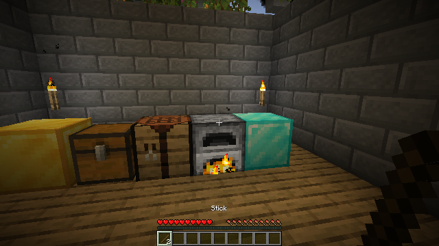

### T1 frame_0012

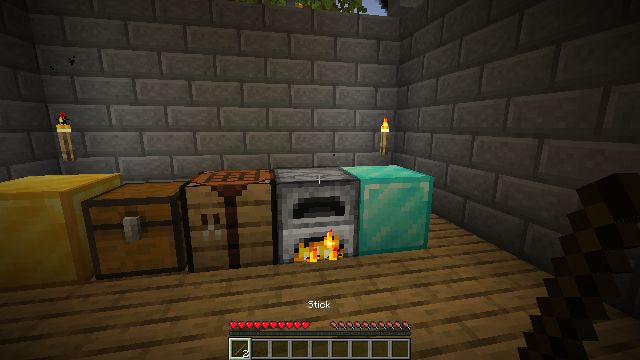

### T1 frame_0013

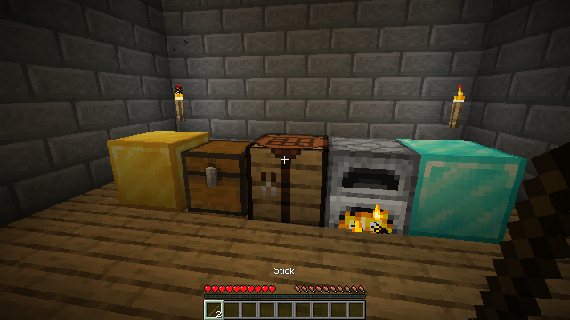

### T1 frame_0014

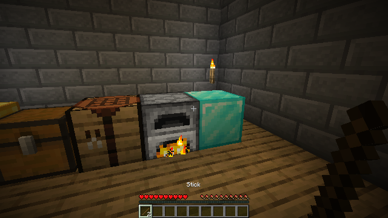

### T1 frame_0015

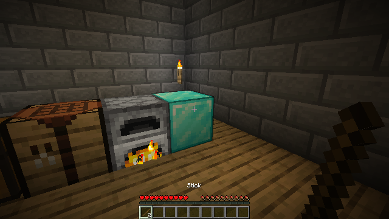

### T1 frame_0016

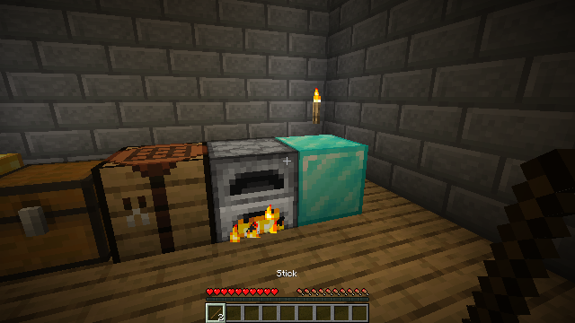

### T1 frame_0017

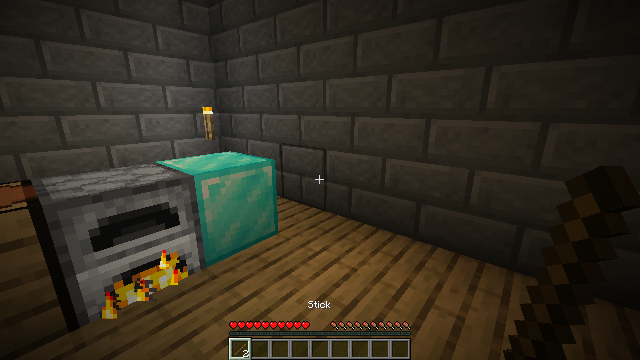

### T1 frame_0018

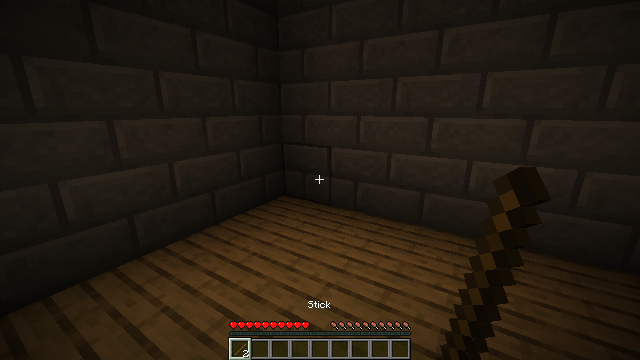

### T1 frame_0019

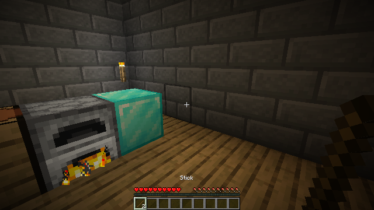

## T2 动作与逐 tick 图像

| 轮次 | tick范围 | 正式动作块 | CraftGround执行 |
|---:|---|---|---:|
| 1 | 0–1 | `<\|action_start\|> ; Mouse -50 0 <\|action_end\|>` | 58.15 ms |
| 2 | 1–9 | `<\|action_start\|> ; A ; A ; A ; A ; A ; A ; A ; A <\|action_end\|>` | 477.80 ms |
| 3 | 9–12 | `<\|action_start\|> ; D ; D ; D <\|action_end\|>` | 157.85 ms |
| 4 | 12–17 | `<\|action_start\|> ; A ; A ; A ; A ; A <\|action_end\|>` | 277.54 ms |
| 5 | 17–27 | `<\|action_start\|> ; D ; D ; D ; D ; D ; D ; D ; D ; D ; D <\|action_end\|>` | 531.31 ms |
| 6 | 27–28 | `<\|action_start\|> ; MouseRight <\|action_end\|>` | 59.17 ms |
| 7 | 28–36 | `<\|action_start\|> ; W ; W ; W ; W ; W ; W ; W ; W <\|action_end\|>` | 416.41 ms |
| 8 | 36–38 | `<\|action_start\|> ; A ; A <\|action_end\|>` | 108.02 ms |
| 9 | 38–39 | `<\|action_start\|> ; MouseRight <\|action_end\|>` | 59.55 ms |
| 10 | 39–40 | `<\|action_start\|> ; D MouseRight <\|action_end\|>` | 62.45 ms |

上表的“正式动作块”是从模型 JSON 数组中抽取后交给执行器的 `action_text`，不是模型原始回复。
下面逐轮同时展示原始回复、抽取结果和解码结果。

### T2 第 1 轮模型输出与执行载荷

当轮 Prompt 摘要：

```text
The images are past Minecraft observations in chronological order. Infer one reasonable future action block. Choose a suitable number of 50 ms ticks from the visible action type and required duration instead of waiting for a supplied target length. Keep brief actions short; sustained movement, mining, attacking, drawing, eating, or continuous use may last up to 60 ticks. Omit unsupported 1-2 pixel camera jitter and do not invent GUI clicks or auxiliary keys without visual evidence.
Action format example for a 3-tick block: "<|action_start|> ; W ; Mouse 4 -2 W ; W <|action_end|>". Each JSON array item must be one string action block; do not return nested tick arrays.
Output the complete executable JSON action array first. Then start a new line with "Reason:" and briefly explain the visual evidence, intent, and duration choice. The action array must remain independently parseable because generation may stop after it.
```

Terra 原始输出：

```text
["<|action_start|> ; Mouse -50 0 <|action_end|>"]
Reason: ????????,????????,?????????
```

从 JSON 数组抽取并提交给执行器的 `action_text`：

```text
<|action_start|> ; Mouse -50 0 <|action_end|>
```

`decode_lumine_action()` 解析后的逐 tick chunks：

```json
[
  {
    "keys": [],
    "mouse": [
      -50,
      0
    ],
    "scroll": 0
  }
]
```

### T2 第 2 轮模型输出与执行载荷

当轮 Prompt 摘要：

```text
The images are past Minecraft observations in chronological order. Infer one reasonable future action block. Choose a suitable number of 50 ms ticks from the visible action type and required duration instead of waiting for a supplied target length. Keep brief actions short; sustained movement, mining, attacking, drawing, eating, or continuous use may last up to 60 ticks. Omit unsupported 1-2 pixel camera jitter and do not invent GUI clicks or auxiliary keys without visual evidence.
Action format example for a 3-tick block: "<|action_start|> ; W ; Mouse 4 -2 W ; W <|action_end|>". Each JSON array item must be one string action block; do not return nested tick arrays.
Output the complete executable JSON action array first. Then start a new line with "Reason:" and briefly explain the visual evidence, intent, and duration choice. The action array must remain independently parseable because generation may stop after it.
```

Terra 原始输出：

```text
["<|action_start|> ; A ; A ; A ; A ; A ; A ; A ; A <|action_end|>"]
Reason: ?????????????????,????????????????;???? tick ??????
```

从 JSON 数组抽取并提交给执行器的 `action_text`：

```text
<|action_start|> ; A ; A ; A ; A ; A ; A ; A ; A <|action_end|>
```

`decode_lumine_action()` 解析后的逐 tick chunks：

```json
[
  {
    "keys": [
      "A"
    ],
    "mouse": [
      0,
      0
    ],
    "scroll": 0
  },
  {
    "keys": [
      "A"
    ],
    "mouse": [
      0,
      0
    ],
    "scroll": 0
  },
  {
    "keys": [
      "A"
    ],
    "mouse": [
      0,
      0
    ],
    "scroll": 0
  },
  {
    "keys": [
      "A"
    ],
    "mouse": [
      0,
      0
    ],
    "scroll": 0
  },
  {
    "keys": [
      "A"
    ],
    "mouse": [
      0,
      0
    ],
    "scroll": 0
  },
  {
    "keys": [
      "A"
    ],
    "mouse": [
      0,
      0
    ],
    "scroll": 0
  },
  {
    "keys": [
      "A"
    ],
    "mouse": [
      0,
      0
    ],
    "scroll": 0
  },
  {
    "keys": [
      "A"
    ],
    "mouse": [
      0,
      0
    ],
    "scroll": 0
  }
]
```

### T2 第 3 轮模型输出与执行载荷

当轮 Prompt 摘要：

```text
The images are past Minecraft observations in chronological order. Infer one reasonable future action block. Choose a suitable number of 50 ms ticks from the visible action type and required duration instead of waiting for a supplied target length. Keep brief actions short; sustained movement, mining, attacking, drawing, eating, or continuous use may last up to 60 ticks. Omit unsupported 1-2 pixel camera jitter and do not invent GUI clicks or auxiliary keys without visual evidence.
Action format example for a 3-tick block: "<|action_start|> ; W ; Mouse 4 -2 W ; W <|action_end|>". Each JSON array item must be one string action block; do not return nested tick arrays.
Output the complete executable JSON action array first. Then start a new line with "Reason:" and briefly explain the visual evidence, intent, and duration choice. The action array must remain independently parseable because generation may stop after it.
```

Terra 原始输出：

```text
["<|action_start|> ; D ; D ; D <|action_end|>"]
Reason: ??????????????????? tick ??????????,???????
```

从 JSON 数组抽取并提交给执行器的 `action_text`：

```text
<|action_start|> ; D ; D ; D <|action_end|>
```

`decode_lumine_action()` 解析后的逐 tick chunks：

```json
[
  {
    "keys": [
      "D"
    ],
    "mouse": [
      0,
      0
    ],
    "scroll": 0
  },
  {
    "keys": [
      "D"
    ],
    "mouse": [
      0,
      0
    ],
    "scroll": 0
  },
  {
    "keys": [
      "D"
    ],
    "mouse": [
      0,
      0
    ],
    "scroll": 0
  }
]
```

### T2 第 4 轮模型输出与执行载荷

当轮 Prompt 摘要：

```text
The images are past Minecraft observations in chronological order. Infer one reasonable future action block. Choose a suitable number of 50 ms ticks from the visible action type and required duration instead of waiting for a supplied target length. Keep brief actions short; sustained movement, mining, attacking, drawing, eating, or continuous use may last up to 60 ticks. Omit unsupported 1-2 pixel camera jitter and do not invent GUI clicks or auxiliary keys without visual evidence.
Action format example for a 3-tick block: "<|action_start|> ; W ; Mouse 4 -2 W ; W <|action_end|>". Each JSON array item must be one string action block; do not return nested tick arrays.
Output the complete executable JSON action array first. Then start a new line with "Reason:" and briefly explain the visual evidence, intent, and duration choice. The action array must remain independently parseable because generation may stop after it.
```

Terra 原始输出：

```text
["<|action_start|> ; A ; A ; A ; A ; A <|action_end|>"]
Reason: ??????????????????? tick ???????????,???????
```

从 JSON 数组抽取并提交给执行器的 `action_text`：

```text
<|action_start|> ; A ; A ; A ; A ; A <|action_end|>
```

`decode_lumine_action()` 解析后的逐 tick chunks：

```json
[
  {
    "keys": [
      "A"
    ],
    "mouse": [
      0,
      0
    ],
    "scroll": 0
  },
  {
    "keys": [
      "A"
    ],
    "mouse": [
      0,
      0
    ],
    "scroll": 0
  },
  {
    "keys": [
      "A"
    ],
    "mouse": [
      0,
      0
    ],
    "scroll": 0
  },
  {
    "keys": [
      "A"
    ],
    "mouse": [
      0,
      0
    ],
    "scroll": 0
  },
  {
    "keys": [
      "A"
    ],
    "mouse": [
      0,
      0
    ],
    "scroll": 0
  }
]
```

### T2 第 5 轮模型输出与执行载荷

当轮 Prompt 摘要：

```text
The images are past Minecraft observations in chronological order. Infer one reasonable future action block. Choose a suitable number of 50 ms ticks from the visible action type and required duration instead of waiting for a supplied target length. Keep brief actions short; sustained movement, mining, attacking, drawing, eating, or continuous use may last up to 60 ticks. Omit unsupported 1-2 pixel camera jitter and do not invent GUI clicks or auxiliary keys without visual evidence.
Action format example for a 3-tick block: "<|action_start|> ; W ; Mouse 4 -2 W ; W <|action_end|>". Each JSON array item must be one string action block; do not return nested tick arrays.
Output the complete executable JSON action array first. Then start a new line with "Reason:" and briefly explain the visual evidence, intent, and duration choice. The action array must remain independently parseable because generation may stop after it.
```

Terra 原始输出：

```text
["<|action_start|> ; D ; D ; D ; D ; D ; D ; D ; D ; D ; D <|action_end|>"]
Reason: ????????????,???????????????????? tick ???????????????
```

从 JSON 数组抽取并提交给执行器的 `action_text`：

```text
<|action_start|> ; D ; D ; D ; D ; D ; D ; D ; D ; D ; D <|action_end|>
```

`decode_lumine_action()` 解析后的逐 tick chunks：

```json
[
  {
    "keys": [
      "D"
    ],
    "mouse": [
      0,
      0
    ],
    "scroll": 0
  },
  {
    "keys": [
      "D"
    ],
    "mouse": [
      0,
      0
    ],
    "scroll": 0
  },
  {
    "keys": [
      "D"
    ],
    "mouse": [
      0,
      0
    ],
    "scroll": 0
  },
  {
    "keys": [
      "D"
    ],
    "mouse": [
      0,
      0
    ],
    "scroll": 0
  },
  {
    "keys": [
      "D"
    ],
    "mouse": [
      0,
      0
    ],
    "scroll": 0
  },
  {
    "keys": [
      "D"
    ],
    "mouse": [
      0,
      0
    ],
    "scroll": 0
  },
  {
    "keys": [
      "D"
    ],
    "mouse": [
      0,
      0
    ],
    "scroll": 0
  },
  {
    "keys": [
      "D"
    ],
    "mouse": [
      0,
      0
    ],
    "scroll": 0
  },
  {
    "keys": [
      "D"
    ],
    "mouse": [
      0,
      0
    ],
    "scroll": 0
  },
  {
    "keys": [
      "D"
    ],
    "mouse": [
      0,
      0
    ],
    "scroll": 0
  }
]
```

### T2 第 6 轮模型输出与执行载荷

当轮 Prompt 摘要：

```text
The images are past Minecraft observations in chronological order. Infer one reasonable future action block. Choose a suitable number of 50 ms ticks from the visible action type and required duration instead of waiting for a supplied target length. Keep brief actions short; sustained movement, mining, attacking, drawing, eating, or continuous use may last up to 60 ticks. Omit unsupported 1-2 pixel camera jitter and do not invent GUI clicks or auxiliary keys without visual evidence.
Action format example for a 3-tick block: "<|action_start|> ; W ; Mouse 4 -2 W ; W <|action_end|>". Each JSON array item must be one string action block; do not return nested tick arrays.
Output the complete executable JSON action array first. Then start a new line with "Reason:" and briefly explain the visual evidence, intent, and duration choice. The action array must remain independently parseable because generation may stop after it.
```

Terra 原始输出：

```text
["<|action_start|> ; MouseRight <|action_end|>"]
Reason: ?????????????????????????????,???? tick ????? GUI?
```

从 JSON 数组抽取并提交给执行器的 `action_text`：

```text
<|action_start|> ; MouseRight <|action_end|>
```

`decode_lumine_action()` 解析后的逐 tick chunks：

```json
[
  {
    "keys": [
      "MouseRight"
    ],
    "mouse": [
      0,
      0
    ],
    "scroll": 0
  }
]
```

### T2 第 7 轮模型输出与执行载荷

当轮 Prompt 摘要：

```text
The images are past Minecraft observations in chronological order. Infer one reasonable future action block. Choose a suitable number of 50 ms ticks from the visible action type and required duration instead of waiting for a supplied target length. Keep brief actions short; sustained movement, mining, attacking, drawing, eating, or continuous use may last up to 60 ticks. Omit unsupported 1-2 pixel camera jitter and do not invent GUI clicks or auxiliary keys without visual evidence.
Action format example for a 3-tick block: "<|action_start|> ; W ; Mouse 4 -2 W ; W <|action_end|>". Each JSON array item must be one string action block; do not return nested tick arrays.
Output the complete executable JSON action array first. Then start a new line with "Reason:" and briefly explain the visual evidence, intent, and duration choice. The action array must remain independently parseable because generation may stop after it.
```

Terra 原始输出：

```text
["<|action_start|> ; W ; W ; W ; W ; W ; W ; W ; W <|action_end|>"]
Reason: ?????? GUI,??????????????????????????,?? tick ??????
```

从 JSON 数组抽取并提交给执行器的 `action_text`：

```text
<|action_start|> ; W ; W ; W ; W ; W ; W ; W ; W <|action_end|>
```

`decode_lumine_action()` 解析后的逐 tick chunks：

```json
[
  {
    "keys": [
      "W"
    ],
    "mouse": [
      0,
      0
    ],
    "scroll": 0
  },
  {
    "keys": [
      "W"
    ],
    "mouse": [
      0,
      0
    ],
    "scroll": 0
  },
  {
    "keys": [
      "W"
    ],
    "mouse": [
      0,
      0
    ],
    "scroll": 0
  },
  {
    "keys": [
      "W"
    ],
    "mouse": [
      0,
      0
    ],
    "scroll": 0
  },
  {
    "keys": [
      "W"
    ],
    "mouse": [
      0,
      0
    ],
    "scroll": 0
  },
  {
    "keys": [
      "W"
    ],
    "mouse": [
      0,
      0
    ],
    "scroll": 0
  },
  {
    "keys": [
      "W"
    ],
    "mouse": [
      0,
      0
    ],
    "scroll": 0
  },
  {
    "keys": [
      "W"
    ],
    "mouse": [
      0,
      0
    ],
    "scroll": 0
  }
]
```

### T2 第 8 轮模型输出与执行载荷

当轮 Prompt 摘要：

```text
The images are past Minecraft observations in chronological order. Infer one reasonable future action block. Choose a suitable number of 50 ms ticks from the visible action type and required duration instead of waiting for a supplied target length. Keep brief actions short; sustained movement, mining, attacking, drawing, eating, or continuous use may last up to 60 ticks. Omit unsupported 1-2 pixel camera jitter and do not invent GUI clicks or auxiliary keys without visual evidence.
Action format example for a 3-tick block: "<|action_start|> ; W ; Mouse 4 -2 W ; W <|action_end|>". Each JSON array item must be one string action block; do not return nested tick arrays.
Output the complete executable JSON action array first. Then start a new line with "Reason:" and briefly explain the visual evidence, intent, and duration choice. The action array must remain independently parseable because generation may stop after it.
```

Terra 原始输出：

```text
["<|action_start|> ; A ; A <|action_end|>"]
Reason: ???????????,??????????????? tick ??????????,???????
```

从 JSON 数组抽取并提交给执行器的 `action_text`：

```text
<|action_start|> ; A ; A <|action_end|>
```

`decode_lumine_action()` 解析后的逐 tick chunks：

```json
[
  {
    "keys": [
      "A"
    ],
    "mouse": [
      0,
      0
    ],
    "scroll": 0
  },
  {
    "keys": [
      "A"
    ],
    "mouse": [
      0,
      0
    ],
    "scroll": 0
  }
]
```

### T2 第 9 轮模型输出与执行载荷

当轮 Prompt 摘要：

```text
The images are past Minecraft observations in chronological order. Infer one reasonable future action block. Choose a suitable number of 50 ms ticks from the visible action type and required duration instead of waiting for a supplied target length. Keep brief actions short; sustained movement, mining, attacking, drawing, eating, or continuous use may last up to 60 ticks. Omit unsupported 1-2 pixel camera jitter and do not invent GUI clicks or auxiliary keys without visual evidence.
Action format example for a 3-tick block: "<|action_start|> ; W ; Mouse 4 -2 W ; W <|action_end|>". Each JSON array item must be one string action block; do not return nested tick arrays.
Output the complete executable JSON action array first. Then start a new line with "Reason:" and briefly explain the visual evidence, intent, and duration choice. The action array must remain independently parseable because generation may stop after it.
```

Terra 原始输出：

```text
["<|action_start|> ; MouseRight <|action_end|>"]
Reason: ??????,????????????????? tick ????????? GUI ?????
```

从 JSON 数组抽取并提交给执行器的 `action_text`：

```text
<|action_start|> ; MouseRight <|action_end|>
```

`decode_lumine_action()` 解析后的逐 tick chunks：

```json
[
  {
    "keys": [
      "MouseRight"
    ],
    "mouse": [
      0,
      0
    ],
    "scroll": 0
  }
]
```

### T2 第 10 轮模型输出与执行载荷

当轮 Prompt 摘要：

```text
The images are past Minecraft observations in chronological order. Infer one reasonable future action block. Choose a suitable number of 50 ms ticks from the visible action type and required duration instead of waiting for a supplied target length. Keep brief actions short; sustained movement, mining, attacking, drawing, eating, or continuous use may last up to 60 ticks. Omit unsupported 1-2 pixel camera jitter and do not invent GUI clicks or auxiliary keys without visual evidence.
Action format example for a 3-tick block: "<|action_start|> ; W ; Mouse 4 -2 W ; W <|action_end|>". Each JSON array item must be one string action block; do not return nested tick arrays.
Output the complete executable JSON action array first. Then start a new line with "Reason:" and briefly explain the visual evidence, intent, and duration choice. The action array must remain independently parseable because generation may stop after it.
```

Terra 原始输出：

```text
["<|action_start|> ; D MouseRight <|action_end|>"]
Reason: ??????????,?????????????;? tick ????????????
```

从 JSON 数组抽取并提交给执行器的 `action_text`：

```text
<|action_start|> ; D MouseRight <|action_end|>
```

`decode_lumine_action()` 解析后的逐 tick chunks：

```json
[
  {
    "keys": [
      "D",
      "MouseRight"
    ],
    "mouse": [
      0,
      0
    ],
    "scroll": 0
  }
]
```

完整机器日志：[`T2/trajectory.json`](../runs/craftground-lumine-terra-batch4/T2/trajectory.json)。

### T2 frame_0000


### T2 frame_0001

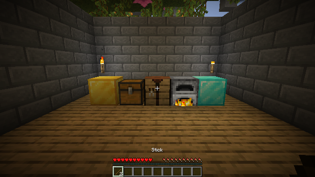

### T2 frame_0002

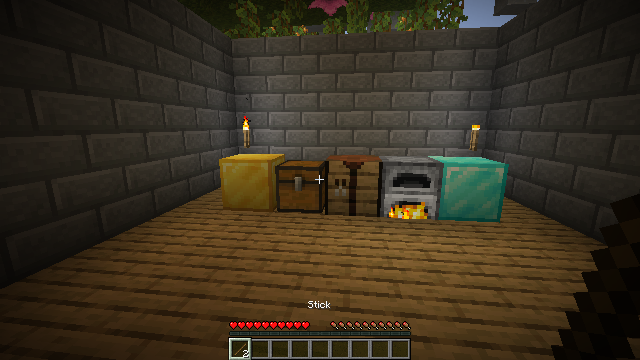

### T2 frame_0003

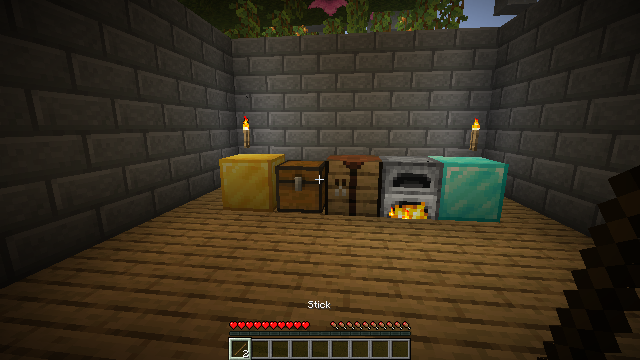

### T2 frame_0004

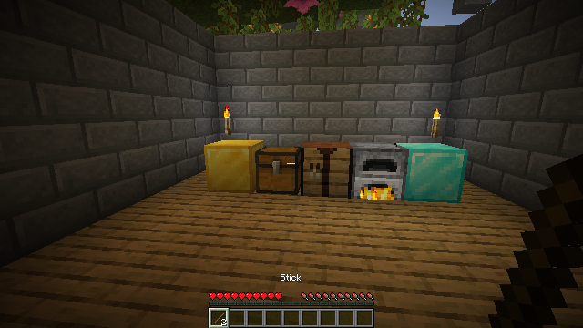

### T2 frame_0005

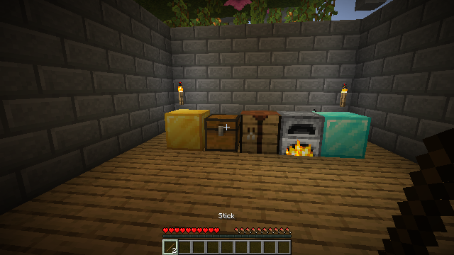

### T2 frame_0006

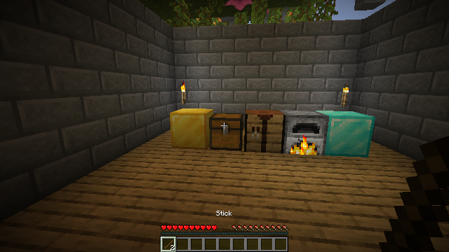

### T2 frame_0007

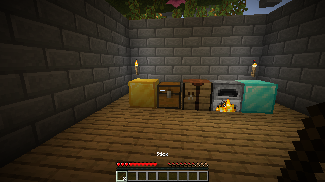

### T2 frame_0008

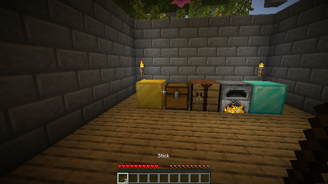

### T2 frame_0009

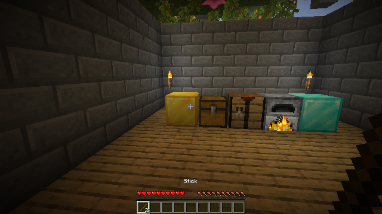

### T2 frame_0010


### T2 frame_0011

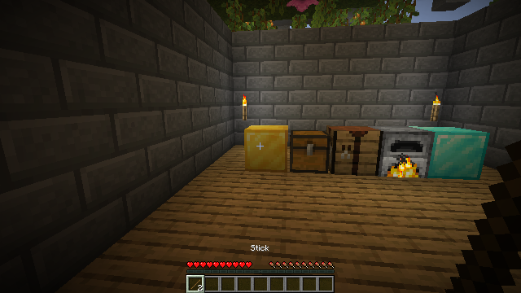

### T2 frame_0012


### T2 frame_0013

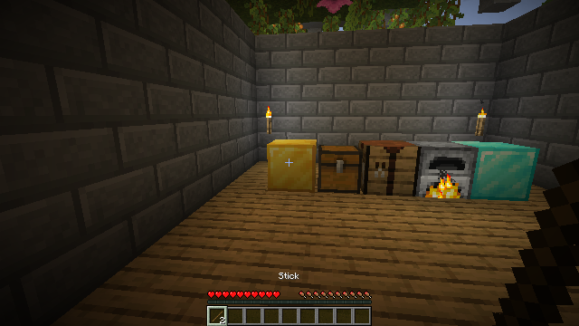

### T2 frame_0014

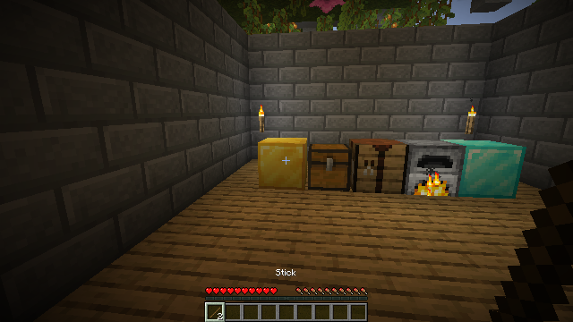

### T2 frame_0015

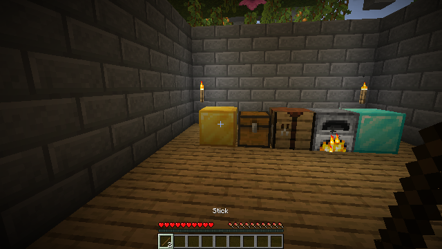

### T2 frame_0016

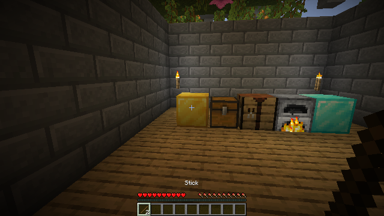

### T2 frame_0017


### T2 frame_0018


### T2 frame_0019

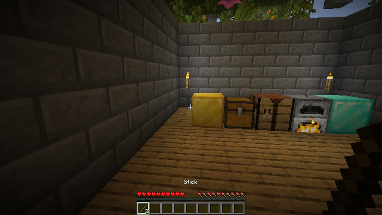

### T2 frame_0020


### T2 frame_0021

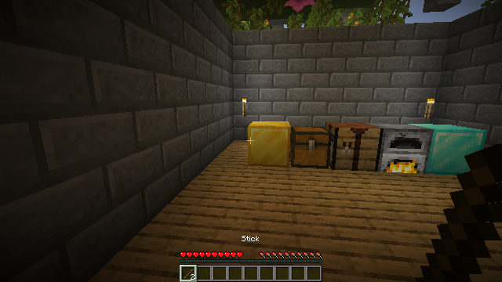

### T2 frame_0022

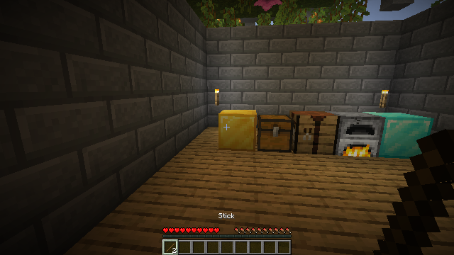

### T2 frame_0023

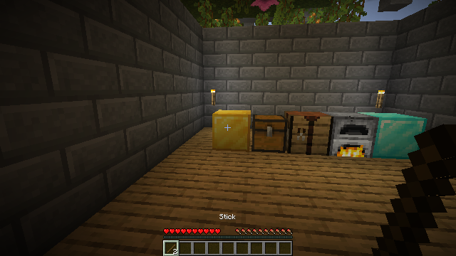

### T2 frame_0024

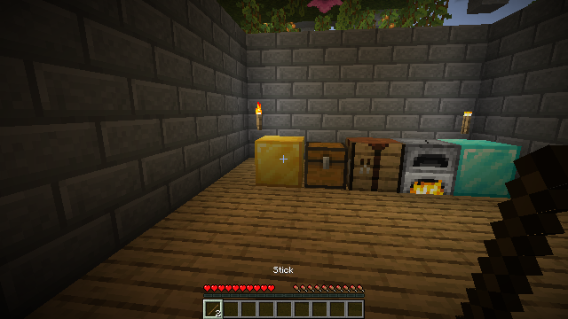

### T2 frame_0025

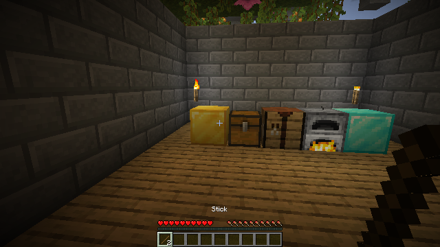

### T2 frame_0026

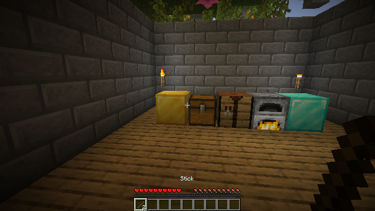

### T2 frame_0027

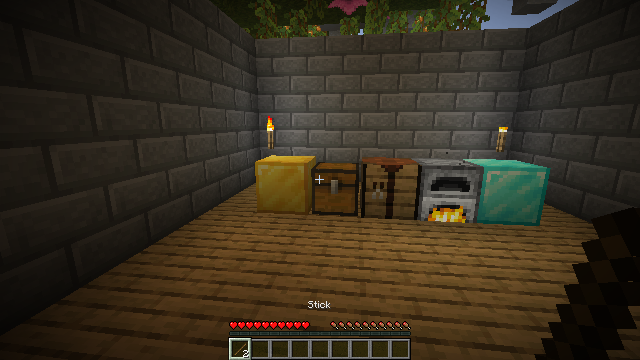

### T2 frame_0028

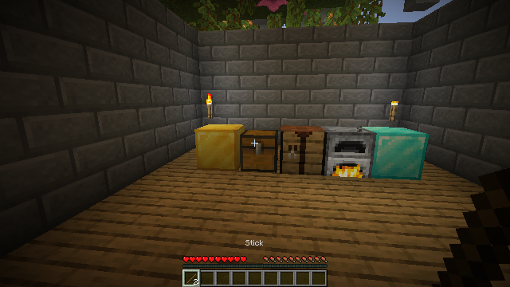

### T2 frame_0029

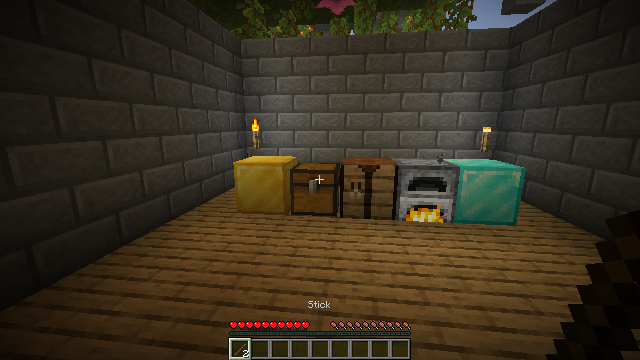

### T2 frame_0030

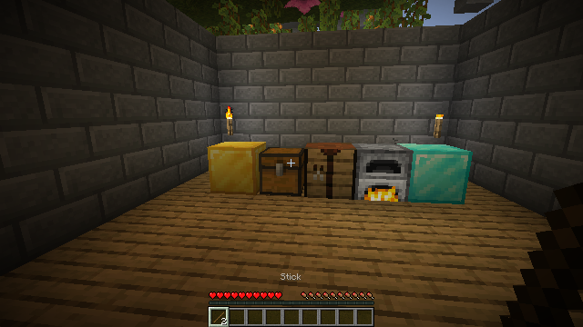

### T2 frame_0031

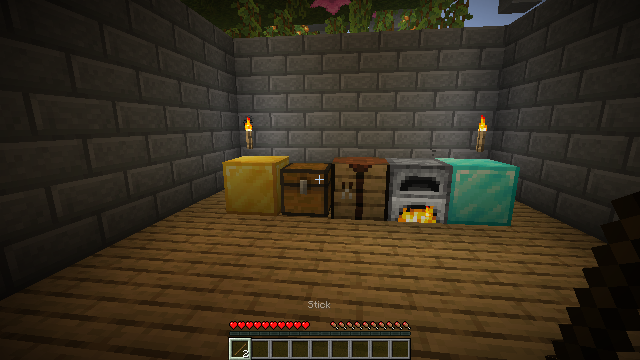

### T2 frame_0032

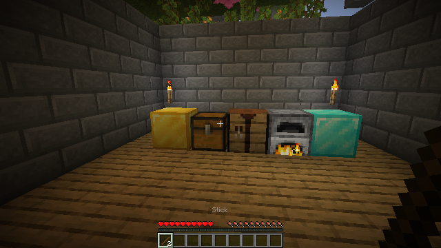

### T2 frame_0033

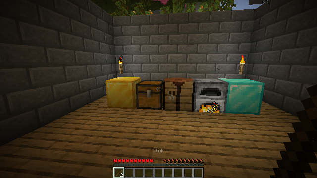

### T2 frame_0034

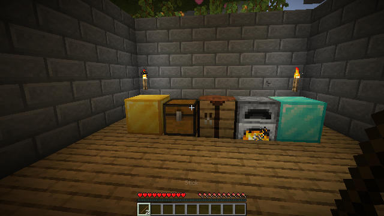

### T2 frame_0035

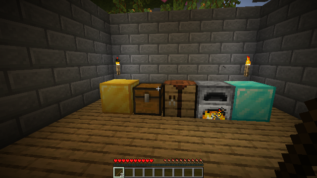

### T2 frame_0036

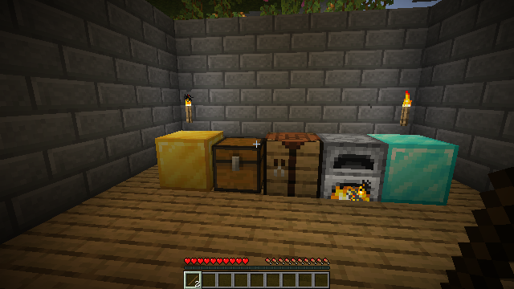

### T2 frame_0037

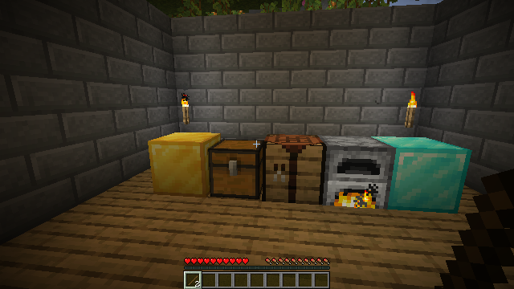

### T2 frame_0038

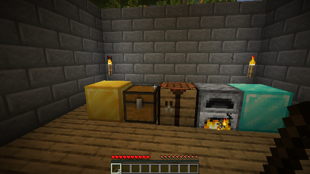

### T2 frame_0039

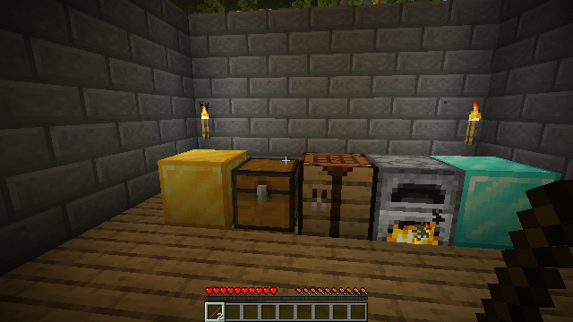

### T2 frame_0040

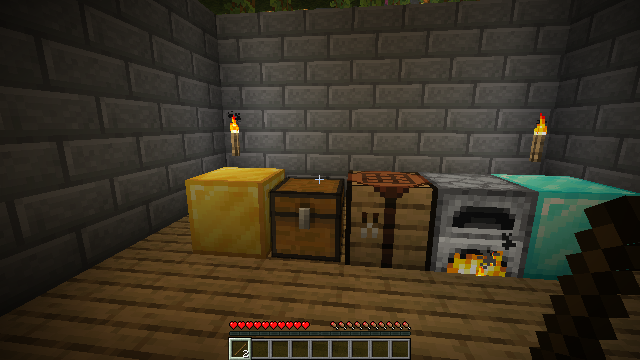

## T3 动作与逐 tick 图像

| 轮次 | tick范围 | 正式动作块 | CraftGround执行 |
|---:|---|---|---:|
| 1 | 0–1 | `<\|action_start\|> ; Mouse -35 0 <\|action_end\|>` | 56.39 ms |
| 2 | 1–2 | `<\|action_start\|> ; Mouse -100 0 <\|action_end\|>` | 52.61 ms |
| 3 | 2–3 | `<\|action_start\|> ; Mouse -170 0 <\|action_end\|>` | 56.38 ms |
| 4 | 3–4 | `<\|action_start\|> ; Mouse 85 0 <\|action_end\|>` | 54.43 ms |
| 5 | 4–5 | `<\|action_start\|> ; Mouse -205 0 <\|action_end\|>` | 55.59 ms |
| 6 | 5–6 | `<\|action_start\|> ; Mouse -270 0 <\|action_end\|>` | 58.23 ms |
| 7 | 6–7 | `<\|action_start\|> ; Mouse 999 0 <\|action_end\|>` | 50.11 ms |
| 8 | 7–8 | `<\|action_start\|> ; Mouse -999 0 <\|action_end\|>` | 65.70 ms |
| 9 | 8–10 | `<\|action_start\|> ; Mouse -450 0 ; MouseRight <\|action_end\|>` | 79.98 ms |
| 10 | 10–12 | `<\|action_start\|> ; Mouse 450 0 ; MouseRight <\|action_end\|>` | 72.28 ms |

上表的“正式动作块”是从模型 JSON 数组中抽取后交给执行器的 `action_text`，不是模型原始回复。
下面逐轮同时展示原始回复、抽取结果和解码结果。

### T3 第 1 轮模型输出与执行载荷

当轮 Prompt 摘要：

```text
The images are past Minecraft observations in chronological order. Infer one reasonable future action block. Choose a suitable number of 50 ms ticks from the visible action type and required duration instead of waiting for a supplied target length. Keep brief actions short; sustained movement, mining, attacking, drawing, eating, or continuous use may last up to 60 ticks. Omit unsupported 1-2 pixel camera jitter and do not invent GUI clicks or auxiliary keys without visual evidence.
Action format example for a 3-tick block: "<|action_start|> ; W ; Mouse 4 -2 W ; W <|action_end|>". Each JSON array item must be one string action block; do not return nested tick arrays.
Output the complete executable JSON action array first. Then start a new line with "Reason:" and briefly explain the visual evidence, intent, and duration choice. The action array must remain independently parseable because generation may stop after it.
```

Terra 原始输出：

```text
["<|action_start|> ; Mouse -35 0 <|action_end|>"]
Reason: ????????,??????????????????
```

从 JSON 数组抽取并提交给执行器的 `action_text`：

```text
<|action_start|> ; Mouse -35 0 <|action_end|>
```

`decode_lumine_action()` 解析后的逐 tick chunks：

```json
[
  {
    "keys": [],
    "mouse": [
      -35,
      0
    ],
    "scroll": 0
  }
]
```

### T3 第 2 轮模型输出与执行载荷

当轮 Prompt 摘要：

```text
The images are past Minecraft observations in chronological order. Infer one reasonable future action block. Choose a suitable number of 50 ms ticks from the visible action type and required duration instead of waiting for a supplied target length. Keep brief actions short; sustained movement, mining, attacking, drawing, eating, or continuous use may last up to 60 ticks. Omit unsupported 1-2 pixel camera jitter and do not invent GUI clicks or auxiliary keys without visual evidence.
Action format example for a 3-tick block: "<|action_start|> ; W ; Mouse 4 -2 W ; W <|action_end|>". Each JSON array item must be one string action block; do not return nested tick arrays.
Output the complete executable JSON action array first. Then start a new line with "Reason:" and briefly explain the visual evidence, intent, and duration choice. The action array must remain independently parseable because generation may stop after it.
```

Terra 原始输出：

```text
["<|action_start|> ; Mouse -100 0 <|action_end|>"]
Reason: ?????????????,????????????????????????
```

从 JSON 数组抽取并提交给执行器的 `action_text`：

```text
<|action_start|> ; Mouse -100 0 <|action_end|>
```

`decode_lumine_action()` 解析后的逐 tick chunks：

```json
[
  {
    "keys": [],
    "mouse": [
      -100,
      0
    ],
    "scroll": 0
  }
]
```

### T3 第 3 轮模型输出与执行载荷

当轮 Prompt 摘要：

```text
The images are past Minecraft observations in chronological order. Infer one reasonable future action block. Choose a suitable number of 50 ms ticks from the visible action type and required duration instead of waiting for a supplied target length. Keep brief actions short; sustained movement, mining, attacking, drawing, eating, or continuous use may last up to 60 ticks. Omit unsupported 1-2 pixel camera jitter and do not invent GUI clicks or auxiliary keys without visual evidence.
Action format example for a 3-tick block: "<|action_start|> ; W ; Mouse 4 -2 W ; W <|action_end|>". Each JSON array item must be one string action block; do not return nested tick arrays.
Output the complete executable JSON action array first. Then start a new line with "Reason:" and briefly explain the visual evidence, intent, and duration choice. The action array must remain independently parseable because generation may stop after it.
```

Terra 原始输出：

```text
["<|action_start|> ; Mouse -170 0 <|action_end|>"]
Reason: ??????????,?????,?????????????????
```

从 JSON 数组抽取并提交给执行器的 `action_text`：

```text
<|action_start|> ; Mouse -170 0 <|action_end|>
```

`decode_lumine_action()` 解析后的逐 tick chunks：

```json
[
  {
    "keys": [],
    "mouse": [
      -170,
      0
    ],
    "scroll": 0
  }
]
```

### T3 第 4 轮模型输出与执行载荷

当轮 Prompt 摘要：

```text
The images are past Minecraft observations in chronological order. Infer one reasonable future action block. Choose a suitable number of 50 ms ticks from the visible action type and required duration instead of waiting for a supplied target length. Keep brief actions short; sustained movement, mining, attacking, drawing, eating, or continuous use may last up to 60 ticks. Omit unsupported 1-2 pixel camera jitter and do not invent GUI clicks or auxiliary keys without visual evidence.
Action format example for a 3-tick block: "<|action_start|> ; W ; Mouse 4 -2 W ; W <|action_end|>". Each JSON array item must be one string action block; do not return nested tick arrays.
Output the complete executable JSON action array first. Then start a new line with "Reason:" and briefly explain the visual evidence, intent, and duration choice. The action array must remain independently parseable because generation may stop after it.
```

Terra 原始输出：

```text
["<|action_start|> ; Mouse 85 0 <|action_end|>"]
Reason: ??????????,??????????,????????????
```

从 JSON 数组抽取并提交给执行器的 `action_text`：

```text
<|action_start|> ; Mouse 85 0 <|action_end|>
```

`decode_lumine_action()` 解析后的逐 tick chunks：

```json
[
  {
    "keys": [],
    "mouse": [
      85,
      0
    ],
    "scroll": 0
  }
]
```

### T3 第 5 轮模型输出与执行载荷

当轮 Prompt 摘要：

```text
The images are past Minecraft observations in chronological order. Infer one reasonable future action block. Choose a suitable number of 50 ms ticks from the visible action type and required duration instead of waiting for a supplied target length. Keep brief actions short; sustained movement, mining, attacking, drawing, eating, or continuous use may last up to 60 ticks. Omit unsupported 1-2 pixel camera jitter and do not invent GUI clicks or auxiliary keys without visual evidence.
Action format example for a 3-tick block: "<|action_start|> ; W ; Mouse 4 -2 W ; W <|action_end|>". Each JSON array item must be one string action block; do not return nested tick arrays.
Output the complete executable JSON action array first. Then start a new line with "Reason:" and briefly explain the visual evidence, intent, and duration choice. The action array must remain independently parseable because generation may stop after it.
```

Terra 原始输出：

```text
["<|action_start|> ; Mouse -205 0 <|action_end|>"]
Reason: ????? tick ??????????,???????,-205 ???????????
```

从 JSON 数组抽取并提交给执行器的 `action_text`：

```text
<|action_start|> ; Mouse -205 0 <|action_end|>
```

`decode_lumine_action()` 解析后的逐 tick chunks：

```json
[
  {
    "keys": [],
    "mouse": [
      -205,
      0
    ],
    "scroll": 0
  }
]
```

### T3 第 6 轮模型输出与执行载荷

当轮 Prompt 摘要：

```text
The images are past Minecraft observations in chronological order. Infer one reasonable future action block. Choose a suitable number of 50 ms ticks from the visible action type and required duration instead of waiting for a supplied target length. Keep brief actions short; sustained movement, mining, attacking, drawing, eating, or continuous use may last up to 60 ticks. Omit unsupported 1-2 pixel camera jitter and do not invent GUI clicks or auxiliary keys without visual evidence.
Action format example for a 3-tick block: "<|action_start|> ; W ; Mouse 4 -2 W ; W <|action_end|>". Each JSON array item must be one string action block; do not return nested tick arrays.
Output the complete executable JSON action array first. Then start a new line with "Reason:" and briefly explain the visual evidence, intent, and duration choice. The action array must remain independently parseable because generation may stop after it.
```

Terra 原始输出：

```text
["<|action_start|> ; Mouse -270 0 <|action_end|>"]
Reason: ????????,??????????????,???????????
```

从 JSON 数组抽取并提交给执行器的 `action_text`：

```text
<|action_start|> ; Mouse -270 0 <|action_end|>
```

`decode_lumine_action()` 解析后的逐 tick chunks：

```json
[
  {
    "keys": [],
    "mouse": [
      -270,
      0
    ],
    "scroll": 0
  }
]
```

### T3 第 7 轮模型输出与执行载荷

当轮 Prompt 摘要：

```text
The images are past Minecraft observations in chronological order. Infer one reasonable future action block. Choose a suitable number of 50 ms ticks from the visible action type and required duration instead of waiting for a supplied target length. Keep brief actions short; sustained movement, mining, attacking, drawing, eating, or continuous use may last up to 60 ticks. Omit unsupported 1-2 pixel camera jitter and do not invent GUI clicks or auxiliary keys without visual evidence.
Action format example for a 3-tick block: "<|action_start|> ; W ; Mouse 4 -2 W ; W <|action_end|>". Each JSON array item must be one string action block; do not return nested tick arrays.
Output the complete executable JSON action array first. Then start a new line with "Reason:" and briefly explain the visual evidence, intent, and duration choice. The action array must remain independently parseable because generation may stop after it.
```

Terra 原始输出：

```text
["<|action_start|> ; Mouse 999 0 <|action_end|>"]
Reason: ???????????,????????????????????,??????????
```

从 JSON 数组抽取并提交给执行器的 `action_text`：

```text
<|action_start|> ; Mouse 999 0 <|action_end|>
```

`decode_lumine_action()` 解析后的逐 tick chunks：

```json
[
  {
    "keys": [],
    "mouse": [
      999,
      0
    ],
    "scroll": 0
  }
]
```

### T3 第 8 轮模型输出与执行载荷

当轮 Prompt 摘要：

```text
The images are past Minecraft observations in chronological order. Infer one reasonable future action block. Choose a suitable number of 50 ms ticks from the visible action type and required duration instead of waiting for a supplied target length. Keep brief actions short; sustained movement, mining, attacking, drawing, eating, or continuous use may last up to 60 ticks. Omit unsupported 1-2 pixel camera jitter and do not invent GUI clicks or auxiliary keys without visual evidence.
Action format example for a 3-tick block: "<|action_start|> ; W ; Mouse 4 -2 W ; W <|action_end|>". Each JSON array item must be one string action block; do not return nested tick arrays.
Output the complete executable JSON action array first. Then start a new line with "Reason:" and briefly explain the visual evidence, intent, and duration choice. The action array must remain independently parseable because generation may stop after it.
```

Terra 原始输出：

```text
["<|action_start|> ; Mouse -999 0 <|action_end|>"]
Reason: ????????;????????,?? 150 ???????????????
```

从 JSON 数组抽取并提交给执行器的 `action_text`：

```text
<|action_start|> ; Mouse -999 0 <|action_end|>
```

`decode_lumine_action()` 解析后的逐 tick chunks：

```json
[
  {
    "keys": [],
    "mouse": [
      -999,
      0
    ],
    "scroll": 0
  }
]
```

### T3 第 9 轮模型输出与执行载荷

当轮 Prompt 摘要：

```text
The images are past Minecraft observations in chronological order. Infer one reasonable future action block. Choose a suitable number of 50 ms ticks from the visible action type and required duration instead of waiting for a supplied target length. Keep brief actions short; sustained movement, mining, attacking, drawing, eating, or continuous use may last up to 60 ticks. Omit unsupported 1-2 pixel camera jitter and do not invent GUI clicks or auxiliary keys without visual evidence.
Action format example for a 3-tick block: "<|action_start|> ; W ; Mouse 4 -2 W ; W <|action_end|>". Each JSON array item must be one string action block; do not return nested tick arrays.
Output the complete executable JSON action array first. Then start a new line with "Reason:" and briefly explain the visual evidence, intent, and duration choice. The action array must remain independently parseable because generation may stop after it.
```

Terra 原始输出：

```text
["<|action_start|> ; Mouse -450 0 ; MouseRight <|action_end|>"]
Reason: ??????????,???????????????,???? tick ?????
```

从 JSON 数组抽取并提交给执行器的 `action_text`：

```text
<|action_start|> ; Mouse -450 0 ; MouseRight <|action_end|>
```

`decode_lumine_action()` 解析后的逐 tick chunks：

```json
[
  {
    "keys": [],
    "mouse": [
      -450,
      0
    ],
    "scroll": 0
  },
  {
    "keys": [
      "MouseRight"
    ],
    "mouse": [
      0,
      0
    ],
    "scroll": 0
  }
]
```

### T3 第 10 轮模型输出与执行载荷

当轮 Prompt 摘要：

```text
The images are past Minecraft observations in chronological order. Infer one reasonable future action block. Choose a suitable number of 50 ms ticks from the visible action type and required duration instead of waiting for a supplied target length. Keep brief actions short; sustained movement, mining, attacking, drawing, eating, or continuous use may last up to 60 ticks. Omit unsupported 1-2 pixel camera jitter and do not invent GUI clicks or auxiliary keys without visual evidence.
Action format example for a 3-tick block: "<|action_start|> ; W ; Mouse 4 -2 W ; W <|action_end|>". Each JSON array item must be one string action block; do not return nested tick arrays.
Output the complete executable JSON action array first. Then start a new line with "Reason:" and briefly explain the visual evidence, intent, and duration choice. The action array must remain independently parseable because generation may stop after it.
```

Terra 原始输出：

```text
["<|action_start|> ; Mouse 450 0 ; MouseRight <|action_end|>"]
Reason: ????????,?????????? tick ??????????????
```

从 JSON 数组抽取并提交给执行器的 `action_text`：

```text
<|action_start|> ; Mouse 450 0 ; MouseRight <|action_end|>
```

`decode_lumine_action()` 解析后的逐 tick chunks：

```json
[
  {
    "keys": [],
    "mouse": [
      450,
      0
    ],
    "scroll": 0
  },
  {
    "keys": [
      "MouseRight"
    ],
    "mouse": [
      0,
      0
    ],
    "scroll": 0
  }
]
```

完整机器日志：[`T3/trajectory.json`](../runs/craftground-lumine-terra-batch4/T3/trajectory.json)。

### T3 frame_0000

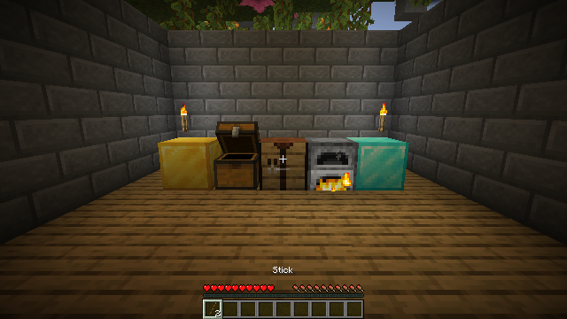

### T3 frame_0001

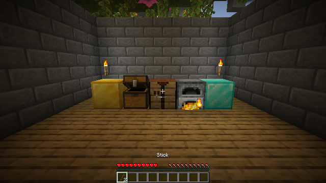

### T3 frame_0002

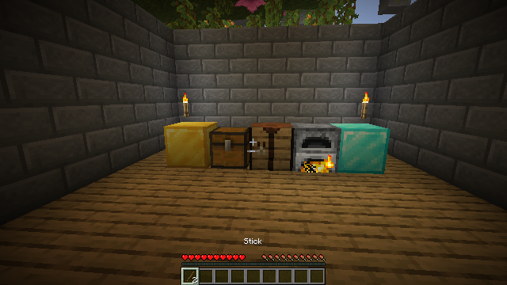

### T3 frame_0003

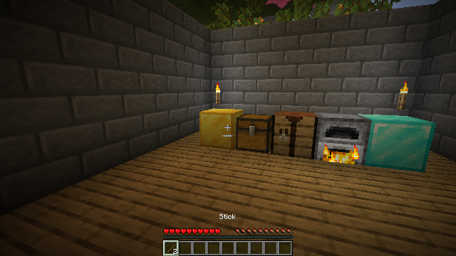

### T3 frame_0004

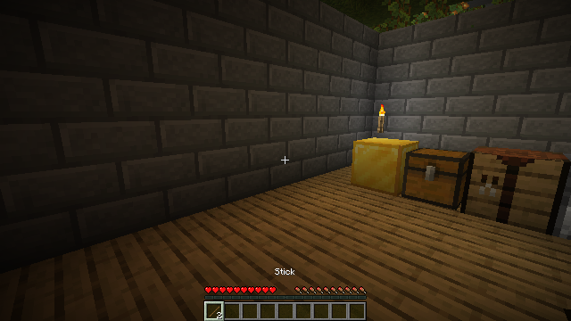

### T3 frame_0005

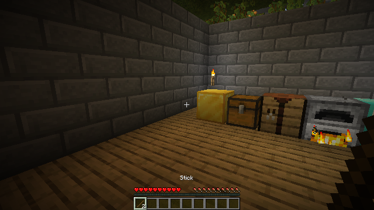

### T3 frame_0006

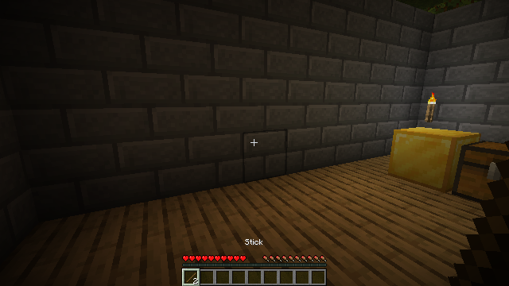

### T3 frame_0007

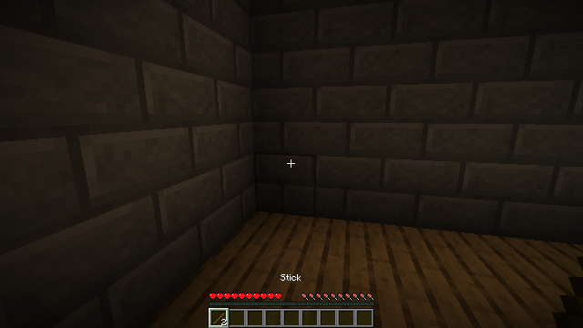

### T3 frame_0008

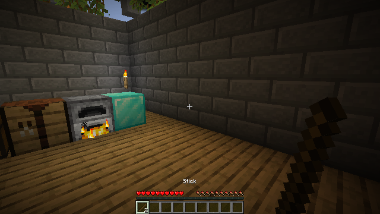

### T3 frame_0009

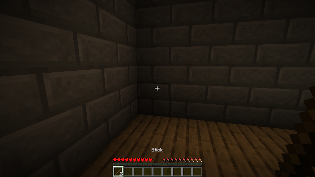

### T3 frame_0010

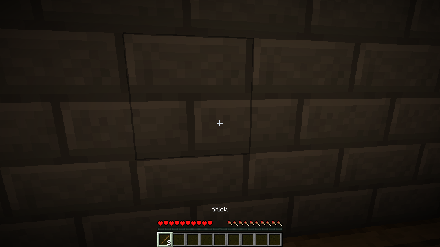

### T3 frame_0011


### T3 frame_0012

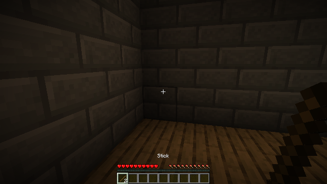

## T4 动作与逐 tick 图像

| 轮次 | tick范围 | 正式动作块 | CraftGround执行 |
|---:|---|---|---:|
| 1 | 0–12 | `<\|action_start\|> ; Mouse -35 0 W ; W ; W ; W ; W ; W ; W ; W ; W ; W ; W ; W <\|action_end\|>` | 712.25 ms |
| 2 | 12–14 | `<\|action_start\|> ; Mouse -30 0 ; MouseRight <\|action_end\|>` | 112.56 ms |
| 3 | 14–15 | `<\|action_start\|> ; Mouse -200 180 <\|action_end\|>` | 51.19 ms |
| 4 | 15–18 | `<\|action_start\|> ; MouseRight ; MouseRight ; MouseRight <\|action_end\|>` | 162.74 ms |
| 5 | 18–19 | `<\|action_start\|> ; Mouse 180 -80 <\|action_end\|>` | 51.17 ms |
| 6 | 19–22 | `<\|action_start\|> ; MouseRight ; MouseRight ; MouseRight <\|action_end\|>` | 149.64 ms |
| 7 | 22–23 | `<\|action_start\|> ; W MouseRight <\|action_end\|>` | 57.54 ms |
| 8 | 23–24 | `<\|action_start\|> ; Mouse 0 0 <\|action_end\|>` | 52.97 ms |
| 9 | 24–25 | `<\|action_start\|> ; MouseRight <\|action_end\|>` | 41.53 ms |

上表的“正式动作块”是从模型 JSON 数组中抽取后交给执行器的 `action_text`，不是模型原始回复。
下面逐轮同时展示原始回复、抽取结果和解码结果。

### T4 第 1 轮模型输出与执行载荷

当轮 Prompt 摘要：

```text
????????????????,???????????;???? 13 ? 50 ms tick?
```

Terra 原始输出：

```text
["<|action_start|> ; Mouse -35 0 W ; W ; W ; W ; W ; W ; W ; W ; W ; W ; W ; W <|action_end|>"]
Reason: ?????????????,????????????,???????
```

从 JSON 数组抽取并提交给执行器的 `action_text`：

```text
<|action_start|> ; Mouse -35 0 W ; W ; W ; W ; W ; W ; W ; W ; W ; W ; W ; W <|action_end|>
```

`decode_lumine_action()` 解析后的逐 tick chunks：

```json
[
  {
    "keys": [
      "W"
    ],
    "mouse": [
      -35,
      0
    ],
    "scroll": 0
  },
  {
    "keys": [
      "W"
    ],
    "mouse": [
      0,
      0
    ],
    "scroll": 0
  },
  {
    "keys": [
      "W"
    ],
    "mouse": [
      0,
      0
    ],
    "scroll": 0
  },
  {
    "keys": [
      "W"
    ],
    "mouse": [
      0,
      0
    ],
    "scroll": 0
  },
  {
    "keys": [
      "W"
    ],
    "mouse": [
      0,
      0
    ],
    "scroll": 0
  },
  {
    "keys": [
      "W"
    ],
    "mouse": [
      0,
      0
    ],
    "scroll": 0
  },
  {
    "keys": [
      "W"
    ],
    "mouse": [
      0,
      0
    ],
    "scroll": 0
  },
  {
    "keys": [
      "W"
    ],
    "mouse": [
      0,
      0
    ],
    "scroll": 0
  },
  {
    "keys": [
      "W"
    ],
    "mouse": [
      0,
      0
    ],
    "scroll": 0
  },
  {
    "keys": [
      "W"
    ],
    "mouse": [
      0,
      0
    ],
    "scroll": 0
  },
  {
    "keys": [
      "W"
    ],
    "mouse": [
      0,
      0
    ],
    "scroll": 0
  },
  {
    "keys": [
      "W"
    ],
    "mouse": [
      0,
      0
    ],
    "scroll": 0
  }
]
```

### T4 第 2 轮模型输出与执行载荷

当轮 Prompt 摘要：

```text
????????????????,????????????,???????;???? 2 ? 50 ms tick?
```

Terra 原始输出：

```text
["<|action_start|> ; Mouse -30 0 ; MouseRight <|action_end|>"]
Reason: ?????????,???????????????????,?????? GUI?
```

从 JSON 数组抽取并提交给执行器的 `action_text`：

```text
<|action_start|> ; Mouse -30 0 ; MouseRight <|action_end|>
```

`decode_lumine_action()` 解析后的逐 tick chunks：

```json
[
  {
    "keys": [],
    "mouse": [
      -30,
      0
    ],
    "scroll": 0
  },
  {
    "keys": [
      "MouseRight"
    ],
    "mouse": [
      0,
      0
    ],
    "scroll": 0
  }
]
```

### T4 第 3 轮模型输出与执行载荷

当轮 Prompt 摘要：

```text
?????? GUI,????????????;???????????????????,???? 1 ? 50 ms tick?
```

Terra 原始输出：

```text
["<|action_start|> ; Mouse -200 180 <|action_end|>"]
Reason: ?????????????,??????????;?????????,????
```

从 JSON 数组抽取并提交给执行器的 `action_text`：

```text
<|action_start|> ; Mouse -200 180 <|action_end|>
```

`decode_lumine_action()` 解析后的逐 tick chunks：

```json
[
  {
    "keys": [],
    "mouse": [
      -200,
      180
    ],
    "scroll": 0
  }
]
```

### T4 第 4 轮模型输出与执行载荷

当轮 Prompt 摘要：

```text
??????????,????????????????????;???? 3 ? 50 ms tick?
```

Terra 原始输出：

```text
["<|action_start|> ; MouseRight ; MouseRight ; MouseRight <|action_end|>"]
Reason: ???????????????,??????????????????????
```

从 JSON 数组抽取并提交给执行器的 `action_text`：

```text
<|action_start|> ; MouseRight ; MouseRight ; MouseRight <|action_end|>
```

`decode_lumine_action()` 解析后的逐 tick chunks：

```json
[
  {
    "keys": [
      "MouseRight"
    ],
    "mouse": [
      0,
      0
    ],
    "scroll": 0
  },
  {
    "keys": [
      "MouseRight"
    ],
    "mouse": [
      0,
      0
    ],
    "scroll": 0
  },
  {
    "keys": [
      "MouseRight"
    ],
    "mouse": [
      0,
      0
    ],
    "scroll": 0
  }
]
```

### T4 第 5 轮模型输出与执行载荷

当轮 Prompt 摘要：

```text
?????????????????????;???????????,???? 1 ? 50 ms tick?
```

Terra 原始输出：

```text
["<|action_start|> ; Mouse 180 -80 <|action_end|>"]
Reason: ?????????,????????????????,??????????
```

从 JSON 数组抽取并提交给执行器的 `action_text`：

```text
<|action_start|> ; Mouse 180 -80 <|action_end|>
```

`decode_lumine_action()` 解析后的逐 tick chunks：

```json
[
  {
    "keys": [],
    "mouse": [
      180,
      -80
    ],
    "scroll": 0
  }
]
```

### T4 第 6 轮模型输出与执行载荷

当轮 Prompt 摘要：

```text
???????????? tick;???????????????????????,???? 3 ? 50 ms tick?
```

Terra 原始输出：

```text
["<|action_start|> ; MouseRight ; MouseRight ; MouseRight <|action_end|>"]
Reason: ??????? tick ????,????????????????????????
```

从 JSON 数组抽取并提交给执行器的 `action_text`：

```text
<|action_start|> ; MouseRight ; MouseRight ; MouseRight <|action_end|>
```

`decode_lumine_action()` 解析后的逐 tick chunks：

```json
[
  {
    "keys": [
      "MouseRight"
    ],
    "mouse": [
      0,
      0
    ],
    "scroll": 0
  },
  {
    "keys": [
      "MouseRight"
    ],
    "mouse": [
      0,
      0
    ],
    "scroll": 0
  },
  {
    "keys": [
      "MouseRight"
    ],
    "mouse": [
      0,
      0
    ],
    "scroll": 0
  }
]
```

### T4 第 7 轮模型输出与执行载荷

当轮 Prompt 摘要：

```text
?????????;??????????? tick ??,?????????????
```

Terra 原始输出：

```text
["<|action_start|> ; W MouseRight <|action_end|>"]
Reason: ??????????,??????????????????????????
```

从 JSON 数组抽取并提交给执行器的 `action_text`：

```text
<|action_start|> ; W MouseRight <|action_end|>
```

`decode_lumine_action()` 解析后的逐 tick chunks：

```json
[
  {
    "keys": [
      "W",
      "MouseRight"
    ],
    "mouse": [
      0,
      0
    ],
    "scroll": 0
  }
]
```

### T4 第 8 轮模型输出与执行载荷

当轮 Prompt 摘要：

```text
????????????? GUI;????????? tick ?????,???????????
```

Terra 原始输出：

```text
["<|action_start|> ; Mouse 0 0 <|action_end|>"]
Reason: ???????????????????,?????????? tick ??????,????????
```

从 JSON 数组抽取并提交给执行器的 `action_text`：

```text
<|action_start|> ; Mouse 0 0 <|action_end|>
```

`decode_lumine_action()` 解析后的逐 tick chunks：

```json
[
  {
    "keys": [],
    "mouse": [
      0,
      0
    ],
    "scroll": 0
  }
]
```

### T4 第 9 轮模型输出与执行载荷

当轮 Prompt 摘要：

```text
???? tick ?,????????;??????????????? GUI,???? 1 ? 50 ms tick?
```

Terra 原始输出：

```text
["<|action_start|> ; MouseRight <|action_end|>"]
Reason: ??????? tick,??????????;???????????? GUI?
```

从 JSON 数组抽取并提交给执行器的 `action_text`：

```text
<|action_start|> ; MouseRight <|action_end|>
```

`decode_lumine_action()` 解析后的逐 tick chunks：

```json
[
  {
    "keys": [
      "MouseRight"
    ],
    "mouse": [
      0,
      0
    ],
    "scroll": 0
  }
]
```

完整机器日志：[`T4/trajectory.json`](../runs/craftground-lumine-terra-batch4/T4/trajectory.json)。

### T4 frame_0000

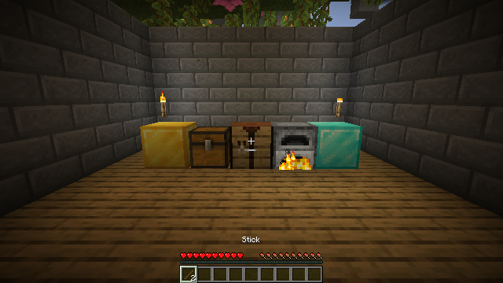

### T4 frame_0001

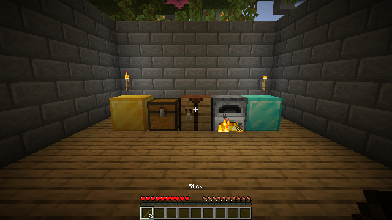

### T4 frame_0002

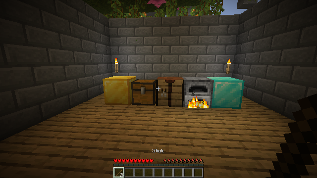

### T4 frame_0003

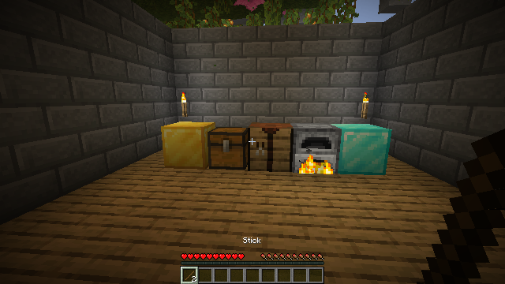

### T4 frame_0004

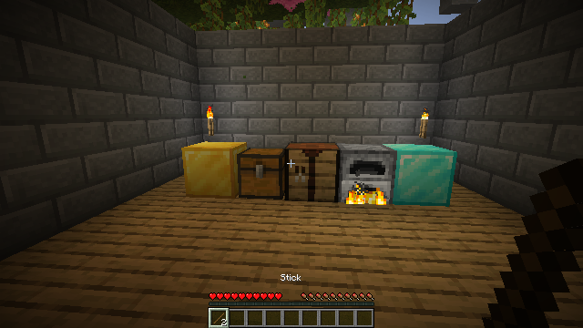

### T4 frame_0005

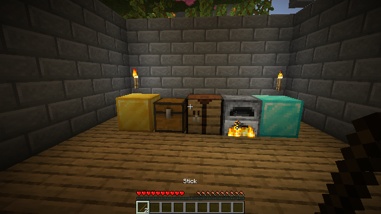

### T4 frame_0006

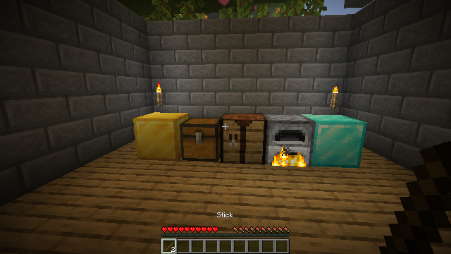

### T4 frame_0007

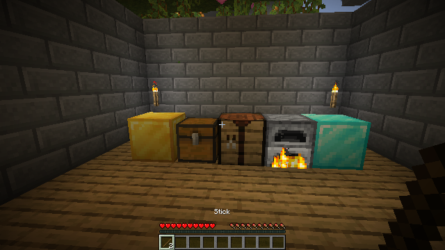

### T4 frame_0008

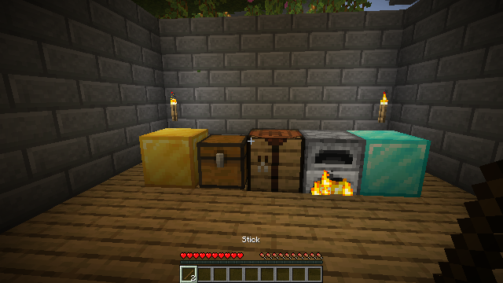

### T4 frame_0009

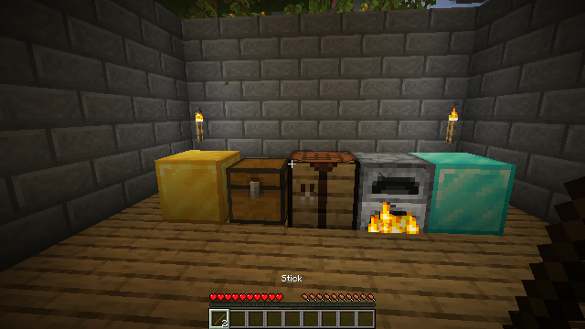

### T4 frame_0010

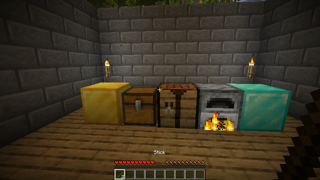

### T4 frame_0011

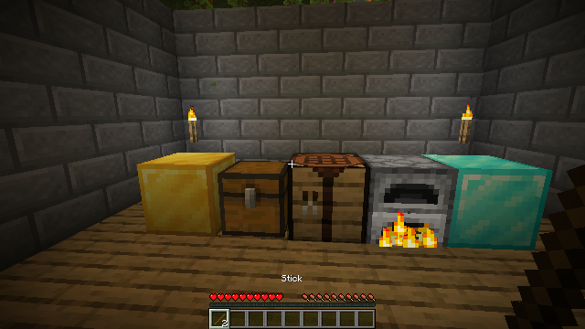

### T4 frame_0012

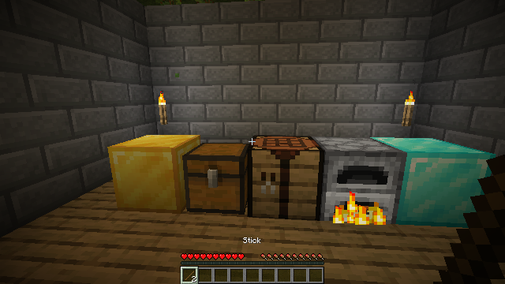

### T4 frame_0013

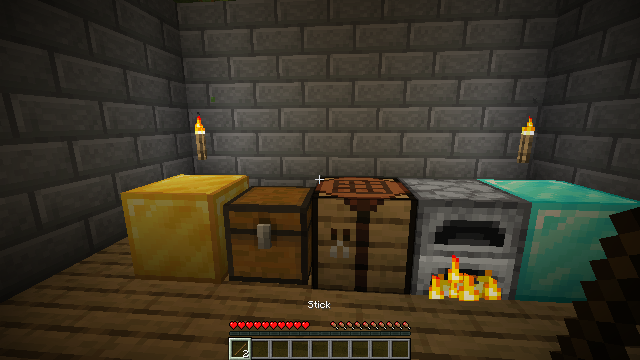

### T4 frame_0014

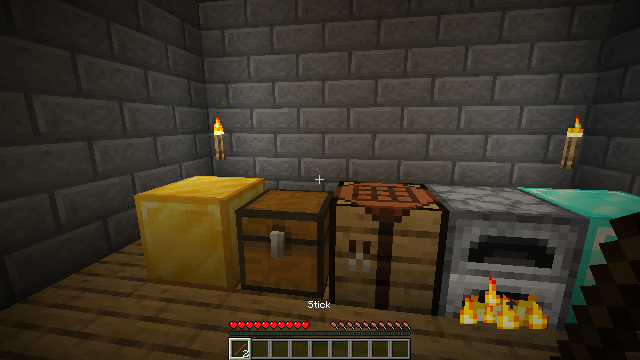

### T4 frame_0015

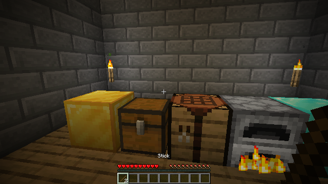

### T4 frame_0016


### T4 frame_0017

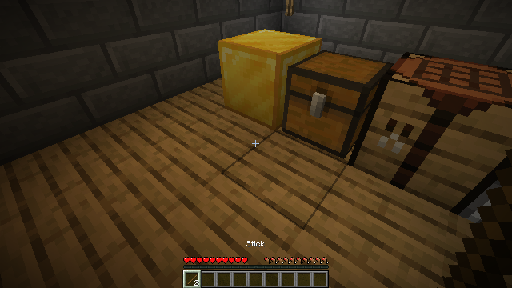

### T4 frame_0018

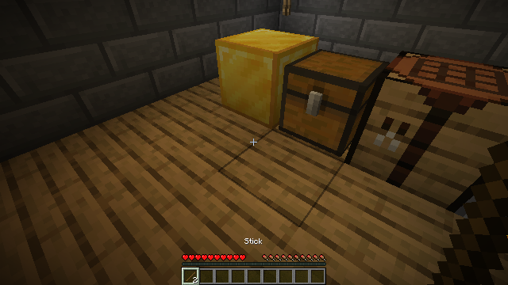

### T4 frame_0019

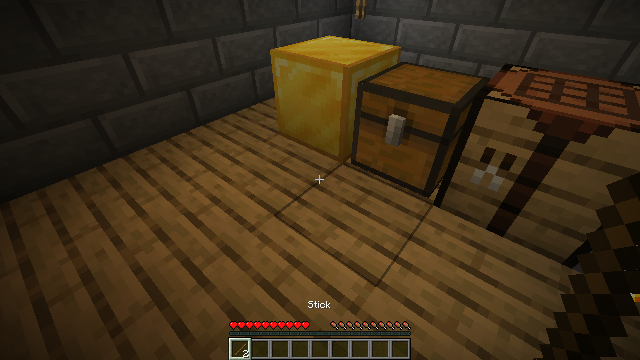

### T4 frame_0020

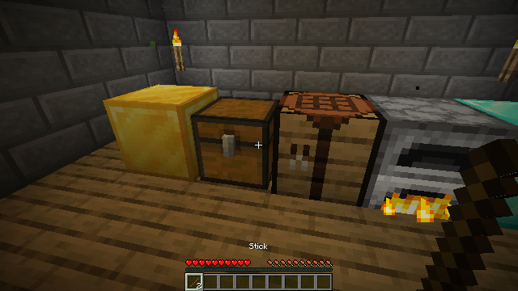

### T4 frame_0021

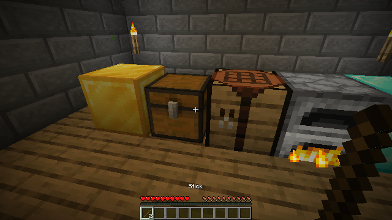

### T4 frame_0022

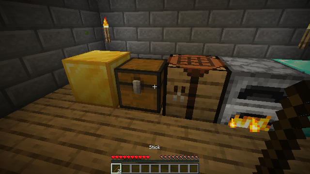

### T4 frame_0023

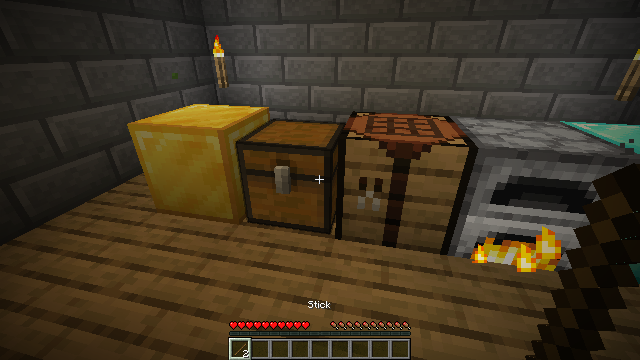

### T4 frame_0024

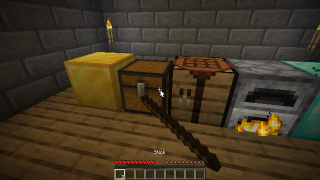

### T4 frame_0025

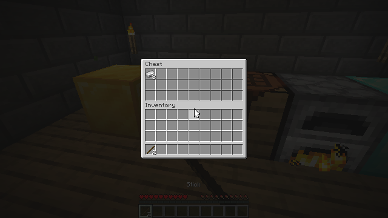

## 独立评估

Batch 平均分：`39.0`。

## 原始输出编码说明

部分回合的 `Reason:` 和 `prompt_summary` 中文在 PowerShell、WSL 与 HTTP JSON 的跨环境传输中
被记录为问号。动作 JSON 数组、`action_text`、解析 chunks、tick、RGB 和执行结果没有损坏。
报告按日志原样展示问号，不推测或重写丢失文本。后续应让客户端直接以 UTF-8 字节发送 JSON。

- 第 1 名：T4，分数 91，优势 +52.00。
- 第 2 名：T2，分数 38，优势 -1.00。
- 第 3 名：T1，分数 17，优势 -22.00。
- 第 4 名：T3，分数 10，优势 -29.00。

评估原文：[`evaluation.json`](../runs/craftground-lumine-terra-batch4/evaluation.json)。

## 控制代码

- 动作协议：[`datasets/action_codec.py`](../datasets/action_codec.py)
- SFT Prompt：[`datasets/minestudio_finetune/sft_protocol.py`](../datasets/minestudio_finetune/sft_protocol.py)
- CraftGround 适配服务：[`tools/craftground_closed_loop_server.py`](../tools/craftground_closed_loop_server.py)
- 本报告生成器：[`tools/generate_lumine_closed_loop_report.py`](../tools/generate_lumine_closed_loop_report.py)

## 下次运行

```bash
PYTHONPATH=. .venv/bin/python tools/craftground_closed_loop_server.py \
  --runtime /tmp/tao-craftground-reset-runtime \
  --output runs/craftground-lumine-terra-batch4 \
  --port 18400 --max-ticks 400 --max-turns 10
```

服务接收项目动作文本：

```json
{
  "action_text": "<|action_start|> ; W ; Mouse -20 10 W ; MouseRight <|action_end|>",
  "model": {"model": "gpt-5.6-terra", "prompt_kind": "project_history_to_future_action"}
}
```
