# Codebase Analysis: Architecture, Method Call Graphs, and Code Usage

本报告全面梳理了当前世界模型代码库的各个文件、类和方法的功能（第一部分），提炼了精确到方法层面的代码引用关系（第二部分），并明确标识了哪些代码在实际流程中被使用，哪些为预留、被废弃或目前未被使用的代码（第三部分）。

---

## 第一部分：各文件、类及方法功能描述

### 1. `blocks/` (积木组件库)

#### [blocks/](file:///c:/Users/zznZZ/Desktop/tao-not-42-base-refactor-world-model-contract/blocks/) (各积木组件已重构并细分至 spatial.py, similarity.py, encodings.py, dynamics.py, regularization.py, attention.py 中)
* **`_base_grid(h, w, device, dtype)`**: 辅助函数。创建大小为 `[2, H, W]` 的 2D 坐标采样网格，坐标顺序为 `(x, y)`。
* **`class Warp(nn.Module)`**: 局部光流重采样模块。输入特征图与光流位移，通过 `grid_sample` 进行双线性凸插值采样，坐标计算使用双精度/fp32以确保数值稳定性。
* **`class GlobalTransformApply(nn.Module)`**: 全局仿射屏幕空间变换模块。使用给定的 `theta` 矩阵对输入特征图进行仿射变换采样。
* **`class LocalCorr(nn.Module)`**: 有界半径的余弦互相关模块。首先对两个输入特征在通道维上做 $\ell_2$ 归一化（$\epsilon=1e-4$），再在限制半径内计算成对的余弦相似度特征图。
* **`class SoftArgmaxFlow(nn.Module)`**: 软相关性流估计模块。通过对相关性矩阵进行 `softmax` 运算，并乘以预存的位置偏置网格，输出期望的 $2\mathrm{D}$ 运动位移。
* **`class ConvGRUCell(nn.Module)`**: 2D卷积 GRU 单元。通过卷积运算更新门限和候选状态，以非扩张的凸更新公式 `(1-z)*h + z*n` 融合记忆。
* **`class GatedResidual(nn.Module)`**: 带受限增益的门控残差连接。对更新量乘以有界的学习参数 $\gamma$（限制在 $\pm g_{max}$ 内），以控制递归和残差深度下的数值稳定性。
* **`class FiLM(nn.Module)`**: 特征线性调制模块。通过一个零初始化的双层 MLP 预测乘性调节系数 $\gamma$ 和加性偏置 $\beta$，以对特征图做 `x * (1 + gamma) + beta` 的条件仿射调制。
* **`class PreLNAttn(nn.Module)`**: 预归一化（Pre-LN）多头注意力模块。支持自注意力（self-attention）或交叉注意力（cross-attention）。当 `store_attn=True` 时进入慢速模式并保存 attention 权重。
* **`class PositionalEmbed(nn.Module)`**: 2D正弦位置编码模块。产生 `[1, d, H, W]` 的位置编码，利用正弦和余弦频率嵌入 x 和 y 方向。
* **`class ProtoDecode(nn.Module)`**: 线性系数与掩码原型合成解码模块。利用 einsum 对系数和原型特征做矩阵乘积，并使用有界 Sigmoid 激活输出局部掩码概率图。
* **`class StochLatent(nn.Module)`**: 随机潜变量采样模块。支持重参数化的高斯采样或直通估计（straight-through estimator）的 Gumbel-Softmax 离散分类分布采样，计算并输出 KL 散度。
* **`class SIGReg(nn.Module)`**: 经验高斯分布 sliced 正则化模块。通过随机投影将高维嵌入降到 $1\mathrm{D}$，利用 Epps-Pulley 经验特征函数检验，配合自适应的积分梯形权重，将投影分布对齐到标准正态分布，防表征坍缩。
* **`rot6d_to_matrix(x, eps)`**: 辅助函数。使用三维 Gram-Schmidt 正交化，将输入的 6D 向量转换成 $SO(3)$ 旋转矩阵。
* **`make_4x4(R, t)`**: 辅助函数。将 $3\times3$ 旋转矩阵 `R` 与 $3\times1$ 平移向量 `t` 拼接成 $4\times4$ 的齐次坐标变换矩阵。
* **`box_iou(a, b, kind, eps)`**: 辅助函数。计算 xyxy 格式边界框集合的 IoU 或 GIoU。
* **`class BoundedActivation(nn.Module)`**: 数值有界激活函数类。执行各类有界激活机制（深度、光流、位置、概率），对应 exponential clamp、tanh scaling、softplus 等。
* **`class Accumulator(nn.Module)`**: 仿 NALU/NAC 的高精度精确计数累加器。使用限制在 `(-1, 1)` 的伪离散权重，以确保数值范围外推的泛化性能。
* **`class DiscreteRouter(nn.Module)`**: 可微的离散分支路由器。使用直通式 Gumbel-Softmax 在训练时做硬采样选择，在评估时直接 argmax 取独热分支。
* **`class BEVSplat(nn.Module)`**: 3D-to-BEV 投影 splatting 模块。结合相机内参和外参（位姿），将像素特征及对应深度投影到 $3\mathrm{D}$ 世界坐标系，并 scatter量化累加到俯视 BEV 栅格中。
* **`class ContinuousTimeEncoding(nn.Module)`**: 连续时间（帧跨度）正弦编码模块。以帧为单位对可变时间 $\Delta t$ 产生可微的正弦和余弦高维编码特征。
* **`class SpatialPosEmbed(nn.Module)`**: 傅里叶特征空间坐标位置编码模块。对注视裁剪（fovea）的 $2\mathrm{D}$ 坐标 `(x, y)` 及其尺度对数 `log(s)` 做多频段傅里叶变换并映射成特征嵌入。

#### [blocks/yolo.py](file:///c:/Users/zznZZ/Desktop/tao-not-42-base-refactor-world-model-contract/blocks/yolo.py)
* **`autopad(k, p, d)`**: 辅助函数。自动计算填充以使卷积后的空间分辨率在步长为 1 时保持不变。
* **`class Conv(nn.Module)`**: 标准的 `Conv2d - BatchNorm2d - SiLU` 组合模块。
* **`class DWConv(Conv)`**: 深度可分离卷积模块。
* **`class Bottleneck(nn.Module)`**: 残差瓶颈模块。
* **`class C3(nn.Module)`**: CSP Bottleneck 结构模块，使用 3 个卷积和 Bottleneck 链。
* **`class C3k(C3)`**: 允许自定义卷积核大小的 C3 变体模块。
* **`class C2f(nn.Module)`**: YOLOv8 中的 CSP 多分支跨级特征融合模块。
* **`class C3k2(C2f)`**: YOLO11 变体模块。在 C2f 结构中支持 `PSABlock` 注意力或 `C3k` 的开关配置。
* **`class Attention(nn.Module)`**: 仿 YOLOE 的多头空间通道自注意力模块。
* **`class PSABlock(nn.Module)`**: 位置敏感注意力（Position-Sensitive Attention）块，由 `Attention` 和两层线性 FFN 串联而成。
* **`class C2PSA(nn.Module)`**: 融合 CSP 和 `PSABlock` 的高阶特征模块。
* **`class SPPF(nn.Module)`**: 快速空间金字塔池化模块。通过并行串联的 `MaxPool2d` 提取多尺度空间特征。
* **`class Concat(nn.Module)`**: 沿通道维或指定维的张量拼接层。

---

## 第二部分：`net/` (核心网络架构)

#### [net/backbone.py](file:///c:/Users/zznZZ/Desktop/tao-not-42-base-refactor-world-model-contract/net/backbone.py)
* **`load_backbone(kind, repo_override=None)`**: 视觉骨干加载函数。通过 HuggingFace 加载冻结的 `dinov3` 或 `dinov2` 模型。返回骨干网络 Module 实例、patch 边长、隐藏状态维度与 register token 数量。

#### [net/effect_tokenizer.py](file:///c:/Users/zznZZ/Desktop/tao-not-42-base-refactor-world-model-contract/net/effect_tokenizer.py)
* **`class EffectTokenizer(nn.Module)`**: 不可逆事件分词器。对前后帧的不可逆潜变化 $\Delta z_{inv} = z_{inv,next} - z_{inv,t}$ 提取帧级净效应后进行向量量化（EMA方式和死码重启），映射到离散事件词表并生成 commitment 损失。
* **`class GeneratorBank(nn.Module)`**: 可逆连续生成元算子组。在可逆潜空间 $z_{rev}$ 上进行线性 basis 映射形成有界增量生成元，协同预测器输出的系数 $c$ 进行可逆演化。

#### [net/heads.py](file:///c:/Users/zznZZ/Desktop/tao-not-42-base-refactor-world-model-contract/net/heads.py)
* **`class EventVocabHead(nn.Module)`**: 不可逆事件分类预测头。从 Transformer query 隐状态中回归并分类预测离散事件码 $\mathcal{D}$ 的对数概率。
* **`class AffordanceHead(nn.Module)`**: 反事实效应幅度预测头。回归预测 $\|e\| = \|\hat{z}_{inv}(do\ a) - \hat{z}_{inv}(do\ null)\|$, 使用 softplus 激活保证非负性。
* **`class SurpriseHead(nn.Module)`**: 认知 surprise 多头预测器。通过多头集成独立线性预测未来，其预测值 variance 均值用于表征模型的不确定性/认知 surprise。

#### [net/world_model.py](file:///c:/Users/zznZZ/Desktop/tao-not-42-base-refactor-world-model-contract/net/world_model.py)
* **`class _Adapter(nn.Module)`**: 视觉特征编码映射网络。包含 Pre-LN 结构多头注意力自编码及 FFN 模块，将骨干特征降维并拆分为连续有界的 $z_{rev}$ 潜特征和直通高斯/分类随机采样 $z_{inv}$ 潜特征。
* **`class MinecraftWorldModel(nn.Module)`**: 序列对齐的后果结构世界模型主干。
  * **`__init__(...)`**: 初始化加载冻结的 DINO 骨干，构建 online 编码器 `adapter`、EMA教师目标编码器 `target_adapter`、时空/时间位置编码器，以及预测器 Transformer `blocks`、生成元算子组 `generators`、事件词表分类头、affordance头和surprise头。
  * **`train(mode=True)`**: 重置训练状态，确保被冻结的预训练 `backbone` 始终处于评估模式。
  * **`extract_feats(img)`**: 视觉特征提取，对图像做尺寸调整后前向提取特征并丢弃 register tokens。
  * **`encode(feats)`** / **`encode_obs(img, feats)`**: 在线编码映射。
  * **`encode_target(feats)`**: JEPA 目标编码。使用 EMA 的教师编码器在无梯度下获取稳定目标。
  * **`update_ema()`**: EMA 参数同步，平滑更新目标编码器权重。
  * **`forward(z_frames, t_frames, act, t_act, query_t, null=False)`**: 序列↔序列未来对齐前向。将多个上下文帧的 token 向量、动作条件 token 向量和未来 $t^*$ 帧的 query token 向量一次性拼入 Transformer 核。利用生成元系数 $c$ 和事件码分类预测演化得到目标未来帧预测 $\hat{z}$，并读出反事实效应值与不确定性度量。

#### [net/dreamer/](file:///c:/Users/zznZZ/Desktop/tao-not-42-base-refactor-world-model-contract/net/dreamer/) (做对照用的第三方世界模型 DreamerV3 模块，通过垫片完全解耦自包含)
* **`net/dreamer/_compat.py`**: Dreamer 垫片。除了 re-export 概率分布和序列扫描算子外，在本地完全复刻了 Dreamer 原 tools.py 里的初始化与训练胶水代码（`RequiresGrad`, `Optimizer`, `weight_init`, `uniform_weight_init`, `tensorstats`, `to_np`），实现了 `net/dreamer/` 模块的深度内聚和与主项目的解耦。
* **`net/dreamer/config.py`**: 提供 `DREAMER_DEFAULTS` 字典和 `build_dreamer` 构造入口。
* **`net/dreamer/models.py`**: 包含 `WorldModel` (RSSM、图像/动作编码解码、KL 散度和重构损失计算) 和 `ImagBehavior` (Actor-Critic 脑内自想象训练大循环)。
* **`net/dreamer/networks.py`**: RSSM 动力学以及卷积 Encoder/Decoder/MLP 等底层模块实现。

---

## 第三部分：`domains/` (数据读取与预处理)

#### [domains/minecraft/control_remap.py](file:///c:/Users/zznZZ/Desktop/tao-not-42-base-refactor-world-model-contract/domains/minecraft/control_remap.py)
* **`class ControlRemap`**: 控制动作重映射管理器。用于评估/测试模型在权重冻结时，仅靠 context 记忆进行 in-context 动作重映射识别的泛化水平。
  * **`_sample_key_perm(B, generator, holdout)`**: 采样出 $B$ 个键盘重映射置换。若为训练分支（`holdout=False`），则进行拒采判定，确保生成的置换方案严格不与 holdout 集相交，保障 train 与 holdout 的置换方案 disjoint。
  * **`sample(B, device, generator, holdout)`**: 采样包含键盘置换（`key_perm`）、相机交换（`cam_swap`）和相机符号取反（`cam_sign`）的 remapping 字典。
  * **`apply(act, spec)`**: 对动作张量 `act` 应用采样到的重映射方案。

#### [domains/minecraft/task_text.py](file:///c:/Users/zznZZ/Desktop/tao-not-42-base-refactor-world-model-contract/domains/minecraft/task_text.py)
* **`class TaskTextEncoder`**: 任务描述文本编码器。
  * **`encode(texts)`**: 获取任务文本对应的句向量。内置查表缓存机制 `_cache` 以消除重复计算。
  * **`_embed(s)`**: 编码逻辑。在 `"minilm"` 模式下加载 MiniLM 提取句特征并做 $\ell_2$ 归一化；在 `"mock"` 降级模式下基于字符串 md5 产生确定性的归一化随机向量（确保在没有网络/显存不足时能区分任务类型）。

#### [domains/minecraft/vpt_action.py](file:///c:/Users/zznZZ/Desktop/tao-not-42-base-refactor-world-model-contract/domains/minecraft/vpt_action.py)
* **`camera_to_bin(x)`**: 连续相机移动值映射为 mu-law 归一化的 $11\mathrm{D}$ 离散 bin 索引。
* **`bin_to_camera(idx)`**: 分箱索引逆向还原为连续相机移动值（常数中心点）。
* **`encode_vpt_jsonl(d)`**: 单帧 VPT jsonl 数据转化为 `ACTION_DIM=22` 维契约张量（首两位为鼠标 dx/dy，后二十位为按键状态）。

#### [domains/minecraft/vpt_dataset.py](file:///c:/Users/zznZZ/Desktop/tao-not-42-base-refactor-world-model-contract/domains/minecraft/vpt_dataset.py)
* **`_action_vec(act_dict, camera_scale)`**: 提取单帧 jsonl 字典动作为归一化动作张量。
* **`_pair_list(data_dir)`**: 寻找目录下所有匹配对的 `.mp4` 视频和 `.jsonl` 动作数据。
* **`_decode_clip(mp4_path, jsonl_path, seq_len)`**: 一次性读取并解码单段 clip 为 tensor 动作和图像的元字典。
* **`class VPTDataset(Dataset)`**: 静态内存预加载的数据集类。
  * **`__getitem__(idx)`**: 随机截取 `seq_len` 的序列窗口，注入随机绝对时间差 `time_offset` 后输出。
* **`class VPTStreamDataset(IterableDataset)`**: 流式滚动加载的高性能数据集类。
  * **`_load_clip(mp4, jsonl)`**: 解码单个 clip 为低分辨率的 uint8 图像数组与动作，以此在常驻内存中只占极小体积（$128\mathrm{px}$ 下仅 $\approx0.3\mathrm{GB}$/段）。
  * **`_split_actions(act, start, skips)`**: 对切片区间的连续帧动作进行采样合并。输出区间内逐帧原始动作（`act_seq`，右侧零填充）和区间合并动作效应（`act_agg`：鼠标取区间平均，键盘按过即为 1）。
  * **`__iter__()`**: 流式迭代生成器主循环。在后台线程异步触发 `_spawn_loader` 换入全新 clip 段，在主前向循环中直接从内存中的 `clips` 列表随机取片，过滤掉 GUI 占比过大的无效帧，并进行可变跨度 $\Delta t \sim U\{1..frame\_skip\}$ 的 jumpy 采样。

---

## 第四部分：`train/` (训练与可视化逻辑)

#### [train/minecraft/losses.py](file:///c:/Users/zznZZ/Desktop/tao-not-42-base-refactor-world-model-contract/train/minecraft/losses.py)
* **`dz_pred_loss(mu, dz_tg, eps)`**: 计算自监督潜状态增量 $\Delta z$ 预测损失。对目标采用自适应软地板（denom + 10% 批均值，防止大量静止样本的底噪稀释梯度），残差进行 Huber 化（3倍 RMS 截断，使异常爆炸的梯度有界）。返回归一化比值，并计算真运动样本对应的 `pred_move`（作为诚实模型指标）。
* **`slot_diversity_loss(attn)`**: 槽间多样性损失。在注意力空间内惩罚槽间交叉注意力图的成对重叠度，逼迫不同 slots 绑定不同区域，防止 slot 冗余。
* **`minecraft_inv_dyn_loss(...)`**: 逆动力学损失。槽路与 patch-mean 旁路分开计算独立的 CE 鼠标损失 and BCE 键盘损失（发生键盘状态跳变时刻加权 `kb_edge_w`），防止旁路太强把槽路及可控闸 $c$ 的梯度饿死。
* **`plan_bc_loss(plan, act_agg, dt, t, K, move_w)`**: 动作规划头的行为克隆损失。对 K 个未来动作分支计算分类 CE、BCE 以及 onset 和 duration 的 SmoothL1 损失。
* **`kl_diag_gauss(mu_q, lv_q, mu_p, lv_p)`**: 计算对角多元高斯的 KL 散度，作为 $\xi$ 隐通道的信息价格惩罚。

#### [train/minecraft/_seq.py](file:///c:/Users/zznZZ/Desktop/tao-not-42-base-refactor-world-model-contract/train/minecraft/_seq.py)
* **`roll_hist(a_hist, t_hist, hv, action, dt_cur)`**: 历史动作滚动辅助函数。将历史各步的结束时刻距“现在”的帧数均累加 `dt_cur`，并将新发生的动作追加到序列尾部。
* **`_to_float_img(img)`**: 图像转换辅助函数。将 uint8 的 `[0, 255]` 图像归一化到 `[0.0, 1.0]` 的 float32。

#### [train/minecraft/minecraft_viz.py](file:///c:/Users/zznZZ/Desktop/tao-not-42-base-refactor-world-model-contract/train/minecraft/minecraft_viz.py)
* **`collect_rollout(...)`**: 模型推演与诊断轨迹数据采集函数。img: [B,T,3,H,W] 归一化后取样本 0。
  包含闭环感知段与开环推演段（使用自身的预测 $\hat{z}$ 累加推演），采集各项预测误差、逆动力学读出、可控闸 $c$ 极化和未来计划快照。
* **`_attn_overlays(attn_map, frame, n_show)`**: 贪心挑选出空间互异且局部特征最显著的 `n_show` 个 slots，对它们在当前帧上渲染注意力热图叠加。
* **`render_panel(traj, out_path, title)`**: 使用 matplotlib 在后台线程绘制一张汇聚了六个子图（A-F）的诊断面板并保存为 PNG 图像。
* **`visualize_minecraft(...)`**: 可视化面板落盘主入口。

#### [train/minecraft/train_minecraft.py](file:///c:/Users/zznZZ/Desktop/tao-not-42-base-refactor-world-model-contract/train/minecraft/train_minecraft.py)
* **`_resolve_gpu_util()` / `_gpu_util()`**: 瞬时 GPU 负载采样。
* **`_run_sequence(...)`**: 训练时序的核心截断 BPTT 步骤。提取特征，计算 JEPA 目标。时间步循环内计算 $\xi$ 后验和先验，执行模型前向，若是开环支路（$\alpha$ 课程），则在 $\hat{z}$ 基础上混合并再次推演。计算各项预测损失、逆动力学、计划和 KL 损失，以及最后的 `sigreg` 表征防坍缩损失和 `div` 槽多样性损失。通过 scaler 执行梯度反向传播。
* **`train_epoch(...)`**: Epoch 级的训练循环。循环迭代 `steps_per_epoch` 个批次，执行可选的动作重映射，前向反向，并使用优化器更新以及模型 EMA 平稳目标更新。
* **`main()`**: 命令行训练启动入口。初始化各组件、数据集、模型、优化器和 lr 调度器，执行训练大循环，并在周期性节点触发 holdout 数据集评估、可视化及 wandb 远程同步。

#### [train/vpt/distill_vpt.py](file:///c:/Users/zznZZ/Desktop/tao-not-42-base-refactor-world-model-contract/train/vpt/distill_vpt.py)
* **`vpt_distill_loss(...)`**: 轨迹蒸馏损失。在 logits 空间加上 sidecar 偏置后，计算与动作轨迹目标的 BCE 和加权 CE。
* **`_run_distill_sequence(...)`**: 运行包含动作计划蒸馏与 `sigreg` 的 BPTT 前向反向传播。
* **`train_epoch(...)` / `evaluate(...)`**: 蒸馏训练 epoch 大循环与 holdout 数据上的消融评估（计算 `sidecar_gain`）。
* **`main()`**: 蒸馏训练命令行主入口。

---

## 第五部分：`utils/` & `tools/` (辅助与测试脚本)

#### [utils/io.py](file:///c:/Users/zznZZ/Desktop/tao-not-42-base-refactor-world-model-contract/utils/io.py)
* **`load_yaml(path)`**: 配置文件读取函数。读取 YAML 格式预设配置文件并返回 Python 原生 plain dict 字典。
* **`get_hf_token(colab_secret_name, set_environ)`**: HuggingFace token 双重解析助手。按环境变量 -> Colab Secret -> 本地 .env 文件 -> 已登录本地缓存的优先级提取 Token，并写回 `os.environ` 自动完成鉴权，支持 Gated 视觉模型（DINOv3）的后台加载。

#### [tools/oracle_idm.py](file:///c:/Users/zznZZ/Desktop/tao-not-42-base-refactor-world-model-contract/tools/oracle_idm.py)
* **`fetch_clips(cache_dir, clips_per_task, ...)`**: 多线程并行下载真 BASALT clip 录像。
* **`raw_to_converted_line(d, task)`**: 转换数据格式以适配本仓动作切片。
* **`parse_actions(jsonl_path)`**: 解析 jsonl 动作为归一化的 22 维向量。
* **`class PoolOracle` / `class GridOracle` / `class CNNOracle`等**: 非参数/弱参数分析器。直接在 DINO 冻结特征上分析动作的可反推精度（分析逆动力学信息极限与本仓池化瓶颈）。

#### [tools/vpt_teacher.py](file:///c:/Users/zznZZ/Desktop/tao-not-42-base-refactor-world-model-contract/tools/vpt_teacher.py)
* **`class VPTTeacher`**: `minerl-free` 版本的 OpenAI VPT 代理包装器。
  * **`step(img_rgb)`**: 接收图像前向并更新其 Transformer 内部隐状态。
  * **`to_contract(pd)`**: 将联合动作分布边缘化降维并重排，映射成我们 22 维契约的 soft 动作目标（用于蒸馏）。

#### [tools/test_dinov3_hf.py](file:///c:/Users/zznZZ/Desktop/tao-not-42-base-refactor-world-model-contract/tools/test_dinov3_hf.py)
* **`main()`**: 命令行测试入口。从 HuggingFace 缓存加载 DINOv3 (ViT-B/16)，模拟 128x128 尺度下执行前向运算以验证 VRAM 和时间开销。

---

## 第六部分：方法级代码引用与调用关系（Call Graph）

以下是整个世界模型在**训练/评估/推演**主循环中，各方法之间的级联调用关系：

```mermaid
graph TD
    %% 主训练流程
    train_minecraft.py["train_minecraft.py (main)"] -->|实例化| MinecraftWorldModel["net/world_model.py: MinecraftWorldModel"]
    train_minecraft.py -->|实例化| VPTStreamDataset["domains/vpt_dataset.py: VPTStreamDataset"]
    train_minecraft.py -->|实例化| ControlRemap["domains/control_remap.py: ControlRemap"]
    train_minecraft.py -->|实例化| TaskTextEncoder["domains/task_text.py: TaskTextEncoder"]
    train_minecraft.py -->|实例化| SIGReg["blocks/regularization.py: SIGReg"]
    
    train_minecraft.py -->|循环调用| train_epoch["train_minecraft.py: train_epoch"]
    train_epoch -->|动作重映射| ControlRemap_apply["control_remap.py: ControlRemap.apply"]
    train_epoch -->|求句嵌入| TaskTextEncoder_encode["task_text.py: TaskTextEncoder.encode"]
    
    train_epoch -->|截断 BPTT 训练| _run_sequence["train_minecraft.py: _run_sequence"]
    
    %% 在线前向推演
    _run_sequence -->|1. 提取 patch 特征| extract_feats["world_model.py: MinecraftWorldModel.extract_feats"]
    _run_sequence -->|2. 在线编码| encode["world_model.py: MinecraftWorldModel.encode"]
    encode -->|调用 _Adapter| _Adapter_forward["world_model.py: _Adapter.forward"]
    
    _run_sequence -->|3. EMA 目标编码| encode_target["world_model.py: MinecraftWorldModel.encode_target"]
    
    _run_sequence -->|4. 前向动力学推演| world_model_forward["world_model.py: MinecraftWorldModel.forward"]
    world_model_forward -->|可逆演化| GeneratorBank_forward["effect_tokenizer.py: GeneratorBank.forward"]
    world_model_forward -->|预测事件码概率| EventVocabHead_forward["heads.py: EventVocabHead.forward"]
    world_model_forward -->|预测反事实效应| AffordanceHead_forward["heads.py: AffordanceHead.forward"]
    world_model_forward -->|预测认知 surprise| SurpriseHead_forward["heads.py: SurpriseHead.forward"]
    
    %% 损失计算
    _run_sequence -->|5. 计算潜对齐损失| latent_align_loss["train/minecraft/losses.py: latent_align_loss"]
    _run_sequence -->|6. 计算多上下文一致损失| agreement_loss["train/minecraft/losses.py: agreement_loss"]
    _run_sequence -->|7. 计算辅助离散通道CE| event_ce["train/minecraft/losses.py: event_ce"]
    _run_sequence -->|8. 计算效应头回归损失| noop_loss["train/minecraft/losses.py: noop_loss"]
    _run_sequence -->|9. 计算路径无关损失| path_invariance_loss["train/minecraft/losses.py: path_invariance_loss"]
    _run_sequence -->|10. 表征防坍缩正则| SIGReg_forward["blocks/regularization.py: SIGReg.forward"]
    
    _run_sequence -->|11. 滚动动作历史| roll_hist["train/minecraft/_seq.py: roll_hist"]
    
    %% 平滑更新与评估
    train_epoch -->|12. 优化步更新 EMA 教师| model_ema_update["net/world_model.py: MinecraftWorldModel.update_ema"]
    train_epoch -->|13. 周期评估| evaluate["train/minecraft/eval.py: evaluate"]
    evaluate -->|评估开环| rollout_probe["train/minecraft/eval.py: rollout_probe"]
    
    train_epoch -->|14. 周期可视化| visualize_minecraft["train/minecraft/minecraft_viz.py: visualize_minecraft"]
    visualize_minecraft -->|累积推演数据| collect_rollout["train/minecraft/minecraft_viz.py: collect_rollout"]
    visualize_minecraft -->|槽注意力分析| _attn_overlays["train/minecraft/minecraft_viz.py: _attn_overlays"]
    visualize_minecraft -->|绘制画板| render_panel["train/minecraft/minecraft_viz.py: render_panel"]
```

---

## 第七部分：代码被使用 vs 未被使用清单

本项目采用了模块化高阶重构，将模型核心逻辑转移到了基于 DINOv3 冻结骨干的 **$\Delta z$-JEPA 潜表征预测架构**。

### 1. 已被使用的核心代码 (Active)
* **`net/world_model.py`**：核心动力学模型，包含 online 编码器和 EMA 教师目标编码器，负责拼接 token 并在序列空间执行前向预测。
* **`net/effect_tokenizer.py`**：`EffectTokenizer`（事件分词）和 `GeneratorBank`（生成元算子）在特征空间中被调用以解耦可逆/不可逆流。
* **`net/heads.py`**：`EventVocabHead`、`AffordanceHead` 和 `SurpriseHead` 在训练/评估和可视化中被全程调用。
* **`net/backbone.py`**：`load_backbone` 用于在训练/评估和测试中加载预训练视觉特征提取器。
* **`net/dreamer/`**：做对照世界模型用的第三方模块。
* **`blocks/`**：各细分文件中的 `ContinuousTimeEncoding`（时间段条件）、`PreLNAttn`（Transformer 内部使用）、`SlotCompetitiveAttn`（竞争绑定，在 `blocks/attention.py` 内部）以及 `SIGReg`（Sliced各向同性高斯正则，防坍缩核心）被全程调用。
* **`domains/minecraft/vpt_dataset.py`**：中的 `VPTStreamDataset` 作为数据引擎，负责流式 uint8 加码、可变帧跨度 jumpy 采样以及动作区间合并计算。
* **`domains/minecraft/vpt_action.py`**：`camera_to_bin`、`bin_to_camera` 和 `encode_vpt_jsonl` 作为动作契约转换器，连接模型端与数据端。
* **`domains/minecraft/control_remap.py`**：`ControlRemap` 键盘与动作重置模块。
* **`domains/minecraft/task_text.py`**：`TaskTextEncoder` 在多任务混合训练中被调用。
* **`train/minecraft/losses.py`**：自监督/行为克隆损失函数。
* **`train/minecraft/train_minecraft.py`**：主训练脚本。
* **`train/minecraft/eval.py`**：评估和多步开环盲滚测试脚本。
* **`train/minecraft/minecraft_viz.py`**：可视化 PNG 面板绘图。
* **`train/minecraft/_seq.py`**：历史滚动 `roll_hist` 和格式转换。
* **`train/vpt/distill_vpt.py`**：VPT 轨迹蒸馏核心训练脚本，联合 `VPTBiasSidecar` 全局动作基率调节层进行消融分析。
* **`utils/io.py`**：合并重构后的配置文件 YAML 读取与 HuggingFace 登录 Token 获取逻辑。

### 2. 未被使用且被保留的预留代码 (Inactive / Reserved)
以下代码已在仓库中实现，但目前在 Minecraft 自监督学习主循环的生产代码中未被实例化或调用：

* **`blocks/yolo.py`**
  * **未被使用原因**：重构后弃用了 CNN/YOLO 等从头训练的局部感知视觉骨干，转为全部使用冻结的 DINO 视觉特征，因此 YOLO 相关的基础网络组件（`Conv`, `C3`, `C2f`, `SPPF` 等）全被闲置。根据重构评审决定，此文件被保留。
* **`blocks/` 各细分文件中的部分空间/流几何与采样组件**
  * **未被使用类**：`Warp` (光流采样)、`GlobalTransformApply` (仿射网格)、`LocalCorr` (余弦互相关)、`SoftArgmaxFlow` (期望流估计)、`ConvGRUCell` (ConvGRU)、`GatedResidual` (参数化残差)、`FiLM` (仿射调制类，模型中直接手写逻辑而未使用本类)、`PositionalEmbed` (正弦空间 PE)、`ProtoDecode` (原型解码)、`StochLatent` (随机采样类)、`rot6d_to_matrix` (6D旋转)、`make_4x4` (齐次矩阵)、`box_iou` (IOU)、`BoundedActivation` (有界激活)、`Accumulator` (精确计数)、`DiscreteRouter` (Gumbel分支)、`BEVSplat` (3D投影网格)、`SpatialPosEmbed` (傅里叶 fovea PE)。
  * **未被使用原因**：此类组件被保留为 `blocks/` 积木库以供未来的备选方案平替使用（例如做三维几何重建或局部注视 fovea 采样）。
