# CraftGround 观察驱动课程图与执行演练

本轮没有布置固定资源场景，也没有发放物品。系统先读取真实当前世界的图像、位置、准星、附近方块、背包和统计，由 Terra 策略替身生成课程候选并用可行性门筛选。

## 当前观察

### 初始图像锚点

位置=(2.5, 112.0, 8.5)；准星=未命中；背包={}；附近方块={'block.minecraft.air': 18, 'block.minecraft.dark_oak_leaves': 9}。

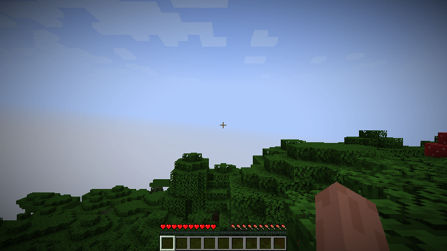

### 向下观察并右转 10 度

位置=(2.5, 112.0, 8.5)；准星=block.minecraft.dark_oak_leaves；背包={}；附近方块={'block.minecraft.air': 18, 'block.minecraft.dark_oak_leaves': 9}。

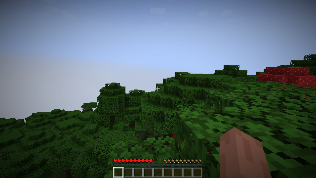

### 向下观察并右转 20 度

位置=(2.5, 112.0, 8.5)；准星=block.minecraft.dark_oak_leaves；背包={}；附近方块={'block.minecraft.air': 18, 'block.minecraft.dark_oak_leaves': 9}。

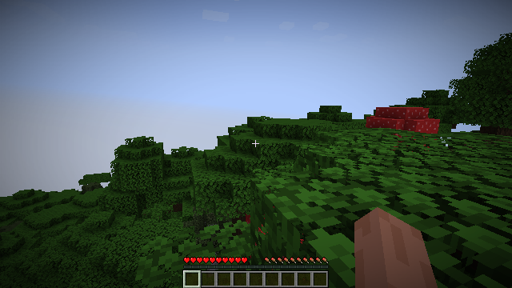

### 向下观察并右转 30 度

位置=(2.5, 112.0, 8.5)；准星=block.minecraft.dark_oak_leaves；背包={}；附近方块={'block.minecraft.air': 18, 'block.minecraft.dark_oak_leaves': 9}。

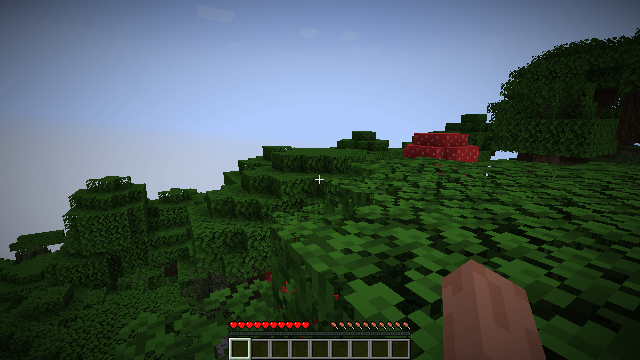

### 向下观察并右转 40 度

位置=(2.5, 112.0, 8.5)；准星=block.minecraft.dark_oak_leaves；背包={}；附近方块={'block.minecraft.air': 18, 'block.minecraft.dark_oak_leaves': 9}。

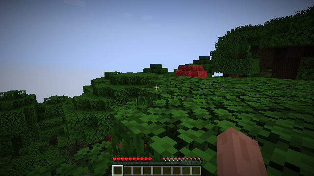

### 向下观察并右转 50 度

位置=(2.5, 112.0, 8.5)；准星=block.minecraft.dark_oak_leaves；背包={}；附近方块={'block.minecraft.air': 18, 'block.minecraft.dark_oak_leaves': 9}。

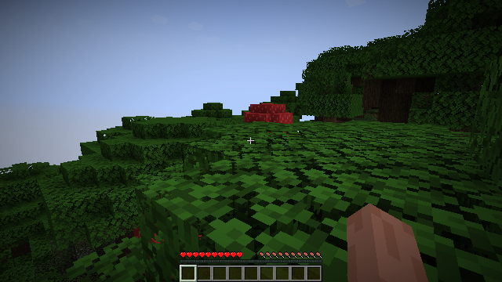

### 向下观察并右转 60 度

位置=(2.5, 112.0, 8.5)；准星=block.minecraft.dark_oak_leaves；背包={}；附近方块={'block.minecraft.air': 18, 'block.minecraft.dark_oak_leaves': 9}。

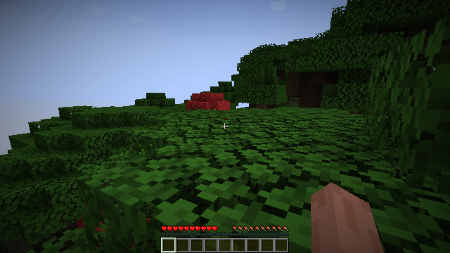

### 向下观察并右转 70 度

位置=(2.5, 112.0, 8.5)；准星=block.minecraft.dark_oak_leaves；背包={}；附近方块={'block.minecraft.air': 18, 'block.minecraft.dark_oak_leaves': 9}。

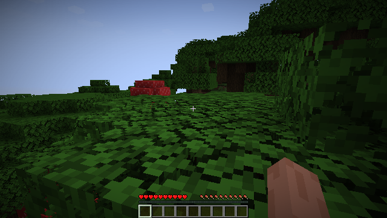

### 向下观察并右转 80 度

位置=(2.5, 112.0, 8.5)；准星=block.minecraft.dark_oak_leaves；背包={}；附近方块={'block.minecraft.air': 18, 'block.minecraft.dark_oak_leaves': 9}。

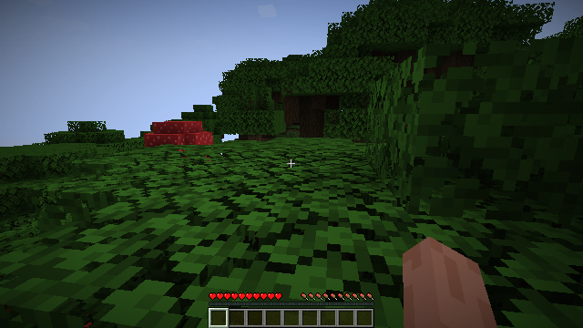

### 向下观察并右转 90 度

位置=(2.5, 112.0, 8.5)；准星=block.minecraft.dark_oak_leaves；背包={}；附近方块={'block.minecraft.air': 18, 'block.minecraft.dark_oak_leaves': 9}。

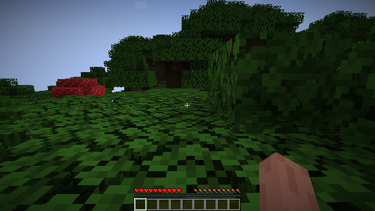

### 向下观察并右转 100 度

位置=(2.5, 112.0, 8.5)；准星=block.minecraft.dark_oak_leaves；背包={}；附近方块={'block.minecraft.air': 18, 'block.minecraft.dark_oak_leaves': 9}。

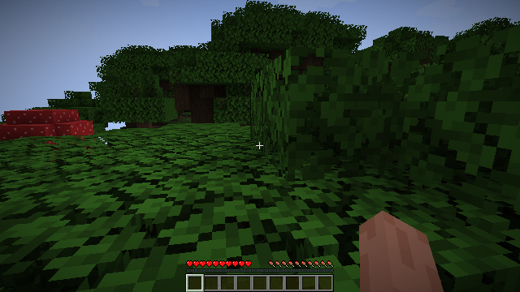

### 向下观察并右转 110 度

位置=(2.5, 112.0, 8.5)；准星=block.minecraft.dark_oak_leaves；背包={}；附近方块={'block.minecraft.air': 18, 'block.minecraft.dark_oak_leaves': 9}。

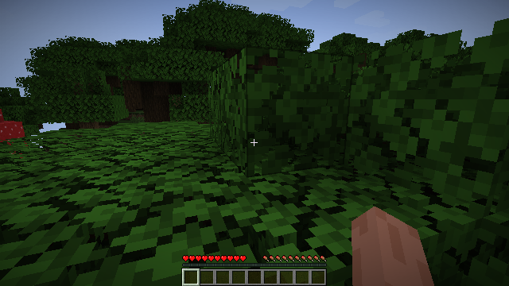

### 向下观察并右转 120 度

位置=(2.5, 112.0, 8.5)；准星=block.minecraft.dark_oak_leaves；背包={}；附近方块={'block.minecraft.air': 18, 'block.minecraft.dark_oak_leaves': 9}。

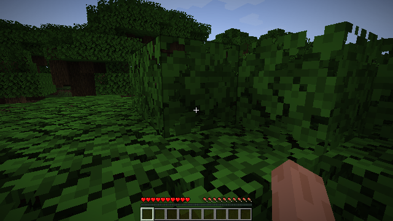

### 向下观察并右转 130 度

位置=(2.5, 112.0, 8.5)；准星=block.minecraft.dark_oak_leaves；背包={}；附近方块={'block.minecraft.air': 18, 'block.minecraft.dark_oak_leaves': 9}。

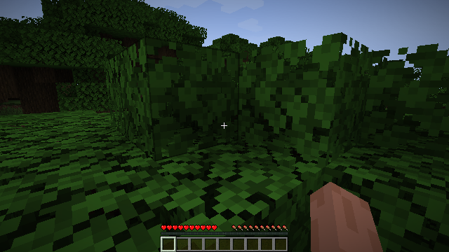

### 向下观察并右转 140 度

位置=(2.5, 112.0, 8.5)；准星=block.minecraft.dark_oak_leaves；背包={}；附近方块={'block.minecraft.air': 18, 'block.minecraft.dark_oak_leaves': 9}。

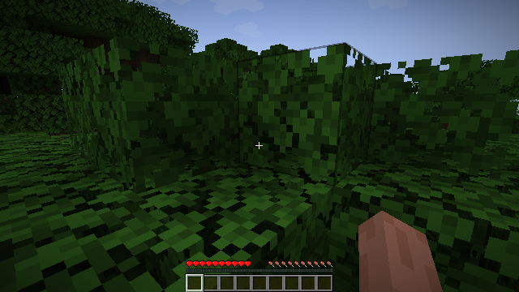

### 向下观察并右转 150 度

位置=(2.5, 112.0, 8.5)；准星=block.minecraft.dark_oak_leaves；背包={}；附近方块={'block.minecraft.air': 18, 'block.minecraft.dark_oak_leaves': 9}。

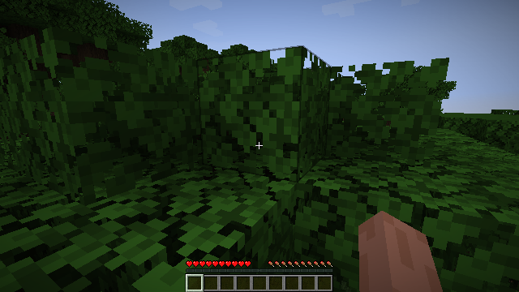

### 向下观察并右转 160 度

位置=(2.5, 112.0, 8.5)；准星=block.minecraft.dark_oak_leaves；背包={}；附近方块={'block.minecraft.air': 18, 'block.minecraft.dark_oak_leaves': 9}。

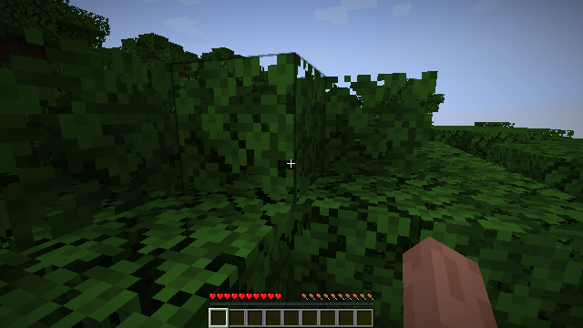

### 向下观察并右转 170 度

位置=(2.5, 112.0, 8.5)；准星=block.minecraft.dark_oak_leaves；背包={}；附近方块={'block.minecraft.air': 18, 'block.minecraft.dark_oak_leaves': 9}。

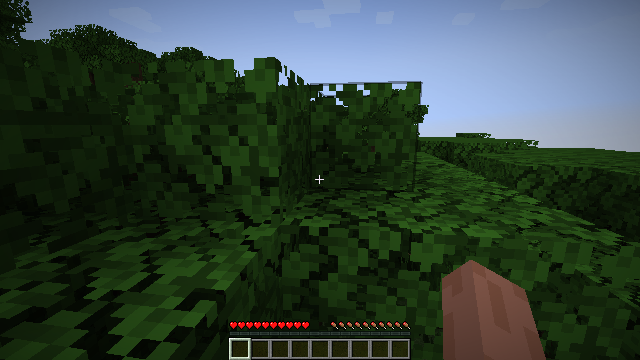

### 向下观察并右转 180 度

位置=(2.5, 112.0, 8.5)；准星=block.minecraft.dark_oak_leaves；背包={}；附近方块={'block.minecraft.air': 18, 'block.minecraft.dark_oak_leaves': 9}。

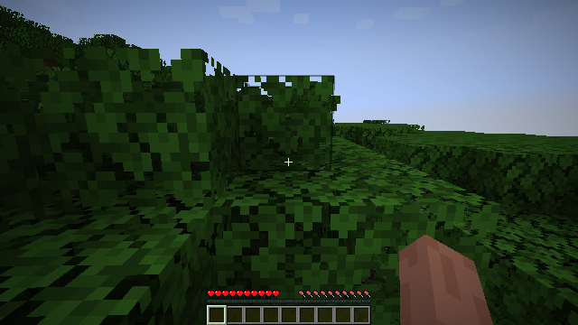

### 向下观察并右转 190 度

位置=(2.5, 112.0, 8.5)；准星=block.minecraft.dark_oak_leaves；背包={}；附近方块={'block.minecraft.air': 18, 'block.minecraft.dark_oak_leaves': 9}。

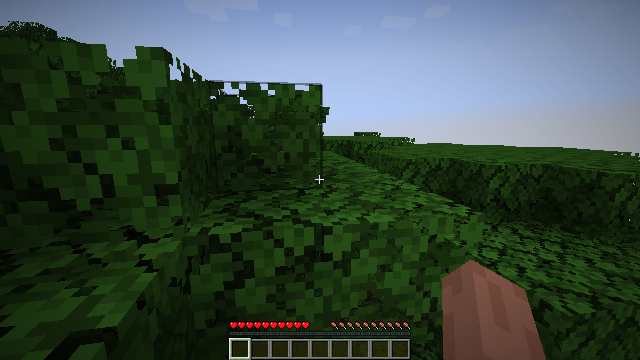

### 向下观察并右转 200 度

位置=(2.5, 112.0, 8.5)；准星=block.minecraft.dark_oak_leaves；背包={}；附近方块={'block.minecraft.air': 18, 'block.minecraft.dark_oak_leaves': 9}。

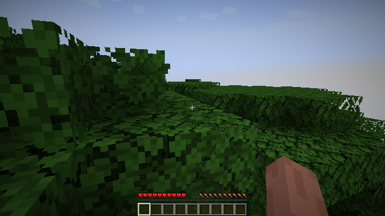

### 向下观察并右转 210 度

位置=(2.5, 112.0, 8.5)；准星=block.minecraft.dark_oak_leaves；背包={}；附近方块={'block.minecraft.air': 18, 'block.minecraft.dark_oak_leaves': 9}。

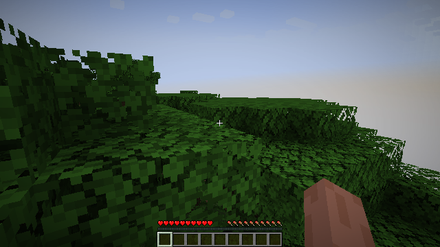

### 向下观察并右转 220 度

位置=(2.5, 112.0, 8.5)；准星=block.minecraft.dark_oak_leaves；背包={}；附近方块={'block.minecraft.air': 18, 'block.minecraft.dark_oak_leaves': 9}。

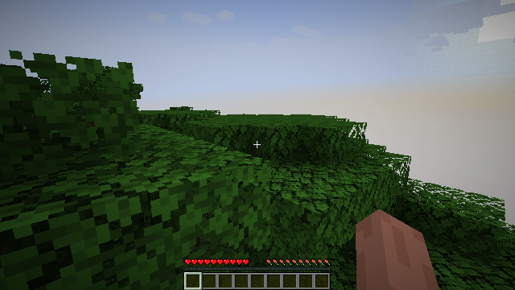

### 向下观察并右转 230 度

位置=(2.5, 112.0, 8.5)；准星=block.minecraft.dark_oak_leaves；背包={}；附近方块={'block.minecraft.air': 18, 'block.minecraft.dark_oak_leaves': 9}。

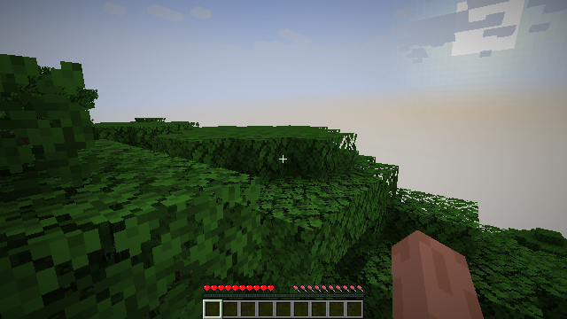

### 向下观察并右转 240 度

位置=(2.5, 112.0, 8.5)；准星=block.minecraft.dark_oak_leaves；背包={}；附近方块={'block.minecraft.air': 18, 'block.minecraft.dark_oak_leaves': 9}。

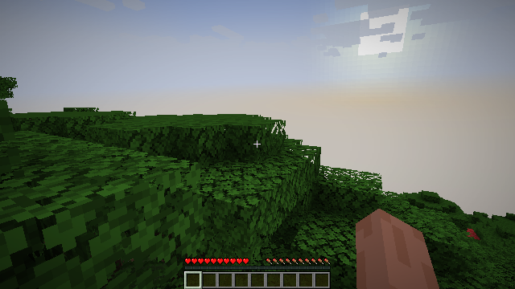

### 向下观察并右转 250 度

位置=(2.5, 112.0, 8.5)；准星=block.minecraft.dark_oak_leaves；背包={}；附近方块={'block.minecraft.air': 18, 'block.minecraft.dark_oak_leaves': 9}。

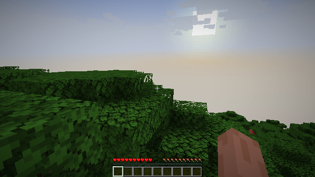

### 向下观察并右转 260 度

位置=(2.5, 112.0, 8.5)；准星=未命中；背包={}；附近方块={'block.minecraft.air': 18, 'block.minecraft.dark_oak_leaves': 9}。

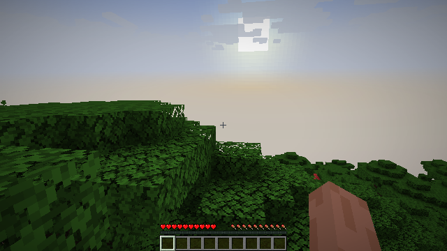

### 向下观察并右转 270 度

位置=(2.5, 112.0, 8.5)；准星=未命中；背包={}；附近方块={'block.minecraft.air': 18, 'block.minecraft.dark_oak_leaves': 9}。

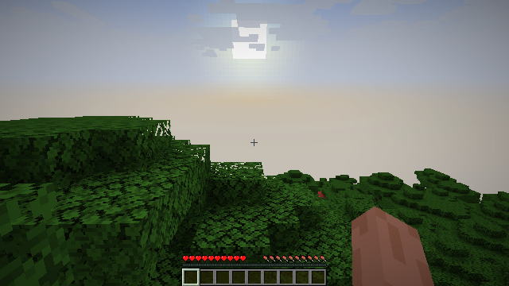

### 向下观察并右转 280 度

位置=(2.5, 112.0, 8.5)；准星=未命中；背包={}；附近方块={'block.minecraft.air': 18, 'block.minecraft.dark_oak_leaves': 9}。

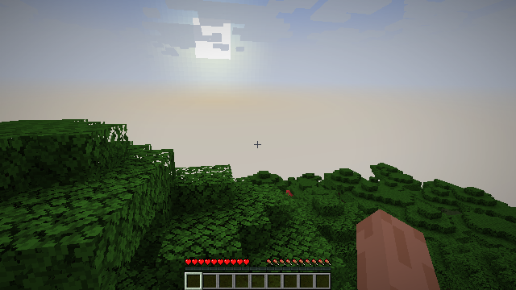

### 向下观察并右转 290 度

位置=(2.5, 112.0, 8.5)；准星=未命中；背包={}；附近方块={'block.minecraft.air': 18, 'block.minecraft.dark_oak_leaves': 9}。

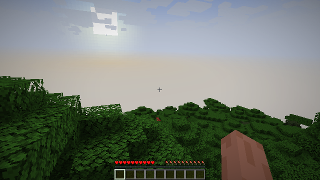

### 向下观察并右转 300 度

位置=(2.5, 112.0, 8.5)；准星=未命中；背包={}；附近方块={'block.minecraft.air': 18, 'block.minecraft.dark_oak_leaves': 9}。

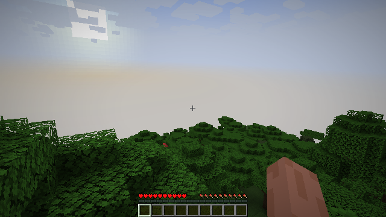

### 向下观察并右转 310 度

位置=(2.5, 112.0, 8.5)；准星=未命中；背包={}；附近方块={'block.minecraft.air': 18, 'block.minecraft.dark_oak_leaves': 9}。

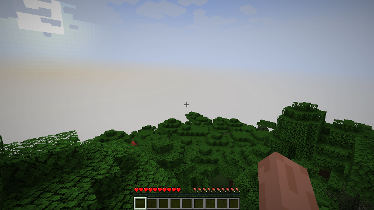

### 向下观察并右转 320 度

位置=(2.5, 112.0, 8.5)；准星=block.minecraft.dark_oak_leaves；背包={}；附近方块={'block.minecraft.air': 18, 'block.minecraft.dark_oak_leaves': 9}。

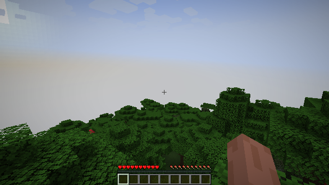

### 向下观察并右转 330 度

位置=(2.5, 112.0, 8.5)；准星=block.minecraft.oak_leaves；背包={}；附近方块={'block.minecraft.air': 18, 'block.minecraft.dark_oak_leaves': 9}。

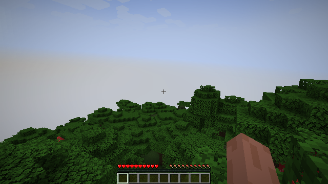

### 向下观察并右转 340 度

位置=(2.5, 112.0, 8.5)；准星=block.minecraft.dark_oak_leaves；背包={}；附近方块={'block.minecraft.air': 18, 'block.minecraft.dark_oak_leaves': 9}。

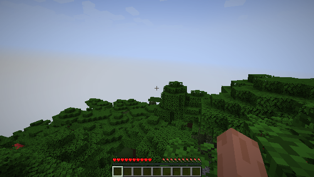

### 向下观察并右转 350 度

位置=(2.5, 112.0, 8.5)；准星=block.minecraft.oak_leaves；背包={}；附近方块={'block.minecraft.air': 18, 'block.minecraft.dark_oak_leaves': 9}。

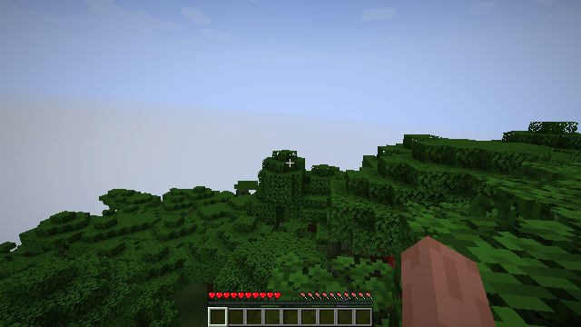

### 向下观察并右转 360 度

位置=(2.5, 112.0, 8.5)；准星=block.minecraft.dark_oak_leaves；背包={}；附近方块={'block.minecraft.air': 18, 'block.minecraft.dark_oak_leaves': 9}。

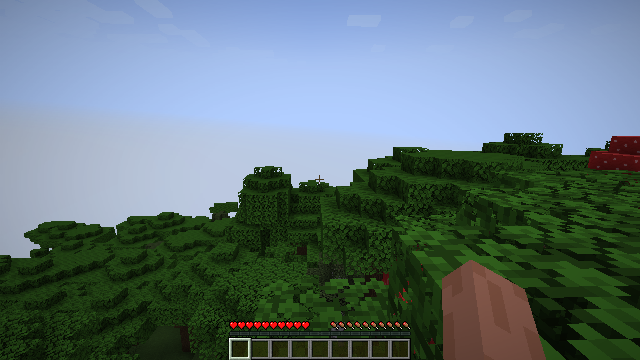

## Terra 课程候选与筛选

| 课程 | 前置条件 | Tick 预算 | 成功判据 | 难度 | 当前观察依据 | 结果 |
|---|---|---:|---|---|---|---|
| 准备：穿越已观测树冠 | 连续树冠；可见叶簇锚点 | 140 | 存活、落地且到已观测叶簇的距离显著缩短。 | 低 | 位置=(2.5, 112.0, 8.5)；扫描命中 block.minecraft.dark_oak_leaves 于 (56, 95, 75)。 | 选中 |
| 伐木：获得深色橡木原木 | 树干距离不超过 5 格；斧头或足够安全的徒手时间预算 | 180 | 服务器方块检查为空气、挖掘统计增加、原木进入背包。 | 中等 | 扫描发现远处树干，但当前距离过远且背包无斧头。 | 暂缓：当前观察未证明近距离树干或斧头，先执行接近准备节点。 |
| 采矿：挖掘已观测矿石或石头 | 近距离石头或矿石；镐或可取得的石质前置资源 | 220 | 服务器方块检查为空气、挖掘统计增加、掉落物进入背包。 | 较高 | 当前扫描未命中石头或矿石；背包也没有镐或石质资源。 | 暂缓：缺少当前可见石头/矿石，以及镐或石质前置资源。 |
| 远征准备：危险区域补给检查 | 食物；照明；工具耐久；方块；防护；返程冗余 | 80 | 六类补给均满足阈值和冗余系数。 | 较高 | 当前背包为 {}。 | 暂缓：背包为空，补给门不通过；后续应生成可验证的补给前置课程。 |
| 高风险专项：落地水（MLG water） | 水桶；可见安全落点；高处下落；快速 use 时机 | 120 | 存活、落地且水方块/水桶状态符合回收规则。 | 高 | 当前高度 y=112.0；水桶=False；扫描可见水面=False。 | 暂缓：当前没有水桶或可观测水面，物理前置缺失；保留为解锁后的专项课，不因风险过滤。 |
| 高风险专项：双格交替垂直挖掘 | 可见石头/矿石；镐；补给门通过 | 360 | 连续多步中保持支撑、目标方块变化和返程条件。 | 高 | 可见矿石/石头=False；背包有镐=False；补给门=False。 | 暂缓：当前物理前置不足，作为后续解锁分支保留，不按风险优先级删除。 |
| 高风险专项：安全阶梯挖掘与探底 | 可见石头/矿石；镐；补给门通过 | 360 | 连续多步中保持支撑、目标方块变化和返程条件。 | 高 | 可见矿石/石头=False；背包有镐=False；补给门=False。 | 暂缓：当前物理前置不足，作为后续解锁分支保留，不按风险优先级删除。 |

### 课程规格

#### 准备：穿越已观测树冠

- 可行性证据：起点与目标叶簇均来自本轮真实图像、raycast 和方块坐标；未补造资源。
- 前置技能：相机锚点保持；树冠移动；目标接近
- 风险控制：每条轨迹恢复同一快照；以存活、落地和真实距离变化评分。
- 恢复快照：课程出生快照
- 失败模式：偏离树冠、碰撞阻塞、坠落或距离未缩短。

#### 伐木：获得深色橡木原木

- 可行性证据：远处树干真实可见，但当前没有斧头且不在有效破坏距离内。
- 前置技能：接近树干；工具选择；持续破坏
- 风险控制：先完成接近节点；伐木失败回退到接近完成后的快照。
- 恢复快照：课程出生快照
- 失败模式：空手破坏超时、掉落或目标失焦。

#### 采矿：挖掘已观测矿石或石头

- 可行性证据：是否执行由当前扫描的石头/矿石和背包镐/石质资源共同决定。
- 前置技能：工具选择；持续挖掘；掉落物回收
- 风险控制：只在有回退快照、工具和可验证目标时进入。
- 恢复快照：课程出生快照
- 失败模式：工具不足、目标不可见或挖掘后不可恢复。

#### 远征准备：危险区域补给检查

- 可行性证据：食物、照明和工具均由背包观测验证；当前为空。
- 前置技能：背包审计；补给收集；返程规划
- 风险控制：风险区前拒绝出发并保留出生快照。
- 恢复快照：课程出生快照
- 失败模式：补给耗尽、照明不足或返程失败。

#### 高风险专项：落地水（MLG water）

- 可行性证据：MLG 需要水桶和明确可着水目标；二者会在后续快照中重新验证。
- 前置技能：高处下落；相机追踪；水桶 use
- 风险控制：每次尝试独立快照；失败立即 load；只在有水桶和可见落点时放行。
- 恢复快照：课程出生快照
- 失败模式：过早/过晚放水、无水桶、落点遮挡。

#### 高风险专项：双格交替垂直挖掘

- 可行性证据：双格/阶梯策略在存在可挖方块、镐和补给时物理可实现；否则生成准备型前置课程。
- 前置技能：镐选择；双格站位；风险感知
- 风险控制：每层记录方块、脚下支撑和回退快照；检测到水/岩浆/空洞即停止。
- 恢复快照：课程出生快照
- 失败模式：直落空洞、岩浆、水流或工具失效。

#### 高风险专项：安全阶梯挖掘与探底

- 可行性证据：双格/阶梯策略在存在可挖方块、镐和补给时物理可实现；否则生成准备型前置课程。
- 前置技能：镐选择；阶梯节奏；照明；返程规划
- 风险控制：每 8 tick 验证脚下支撑；补给门不足则转为准备课程。
- 恢复快照：课程出生快照
- 失败模式：照明耗尽、路径中断、掉落或资源耗尽。

## 执行的同快照 batch=8

选中课程：**准备：穿越已观测树冠**。快照=`observation_driven_prep_batch8`。两条 `reference_expert` 是下界锚定与克隆/排序参考；六条 `policy_sample` 是待训练模型样本。本机两类均由 Terra 代理生成，但保留来源，不伪装为真实策略 rollout。

| 候选 | 来源 | Tick | 距离变化 | 执行状态 | 分数 | 相对优势 |
|---|---|---:|---:|---|---:|---:|
| R01 | reference_expert | 124 | +13.25 | SUCCESS | 118.29 | +54.07 |
| R02 | reference_expert | 124 | +6.45 | PROGRESSING | 11.49 | -52.73 |
| P01 | policy_sample | 40 | +10.68 | FAILED | 9.08 | -55.14 |
| P02 | policy_sample | 40 | +8.13 | SUCCESS | 116.53 | +52.31 |
| P03 | policy_sample | 40 | +8.13 | SUCCESS | 116.53 | +52.31 |
| P04 | policy_sample | 40 | +8.13 | SUCCESS | 116.53 | +52.31 |
| P05 | policy_sample | 40 | +7.85 | PROGRESSING | 16.25 | -47.97 |
| P06 | policy_sample | 40 | +10.68 | FAILED | 9.08 | -55.14 |

### R01：reference_expert

沿已观测树干方向稳定前进并留出停稳时间。起始距树干=87.03；终态=73.78；真实移动进展=+13.25。

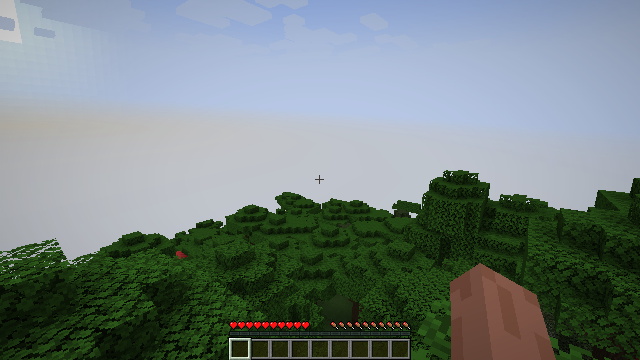

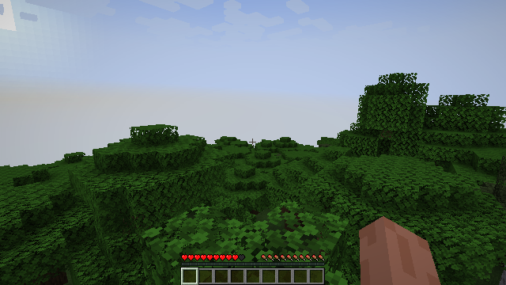

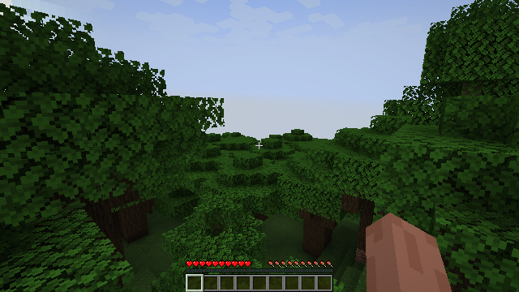

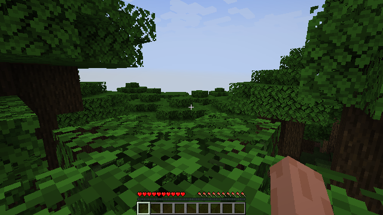

### R02：reference_expert

先谨慎前进，再连续前进以接近树干。起始距树干=87.03；终态=80.58；真实移动进展=+6.45。

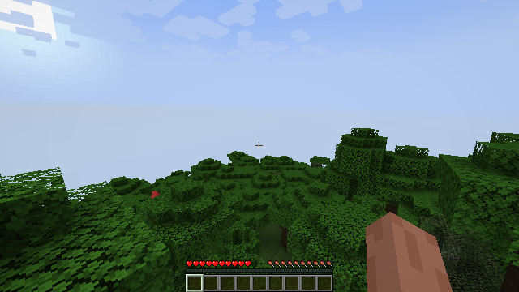

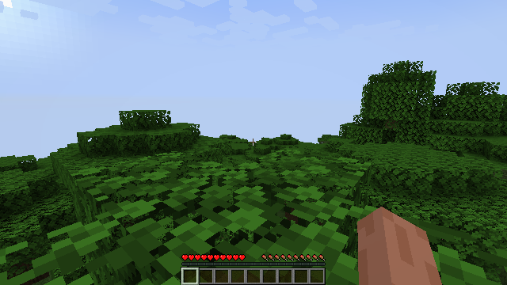

### P01：policy_sample

BC LoRA 从规范起点图像独立采样的 on-policy 动作。起始距树干=87.03；终态=76.34；真实移动进展=+10.68。

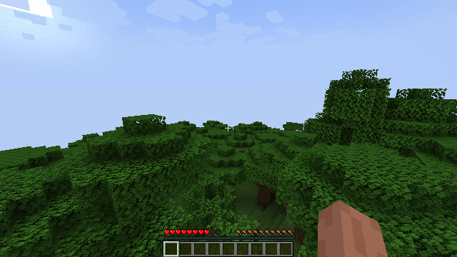

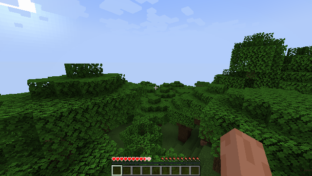

### P02：policy_sample

BC LoRA 从规范起点图像独立采样的 on-policy 动作。起始距树干=87.03；终态=78.90；真实移动进展=+8.13。

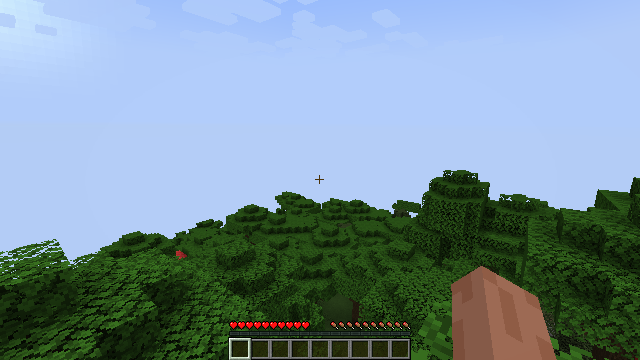

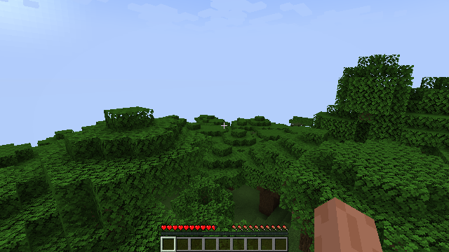

### P03：policy_sample

BC LoRA 从规范起点图像独立采样的 on-policy 动作。起始距树干=87.03；终态=78.90；真实移动进展=+8.13。

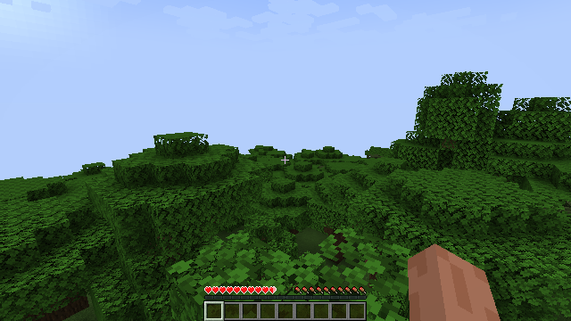

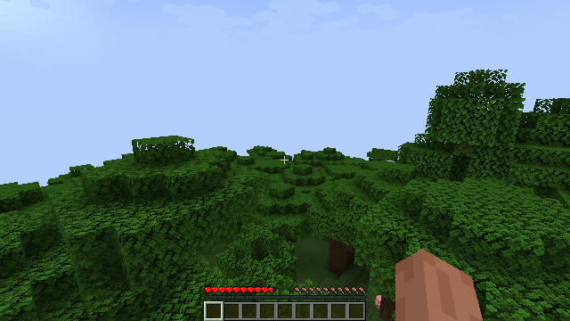

### P04：policy_sample

BC LoRA 从规范起点图像独立采样的 on-policy 动作。起始距树干=87.03；终态=78.90；真实移动进展=+8.13。

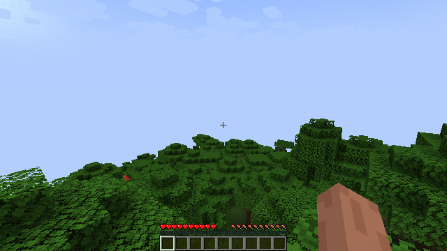

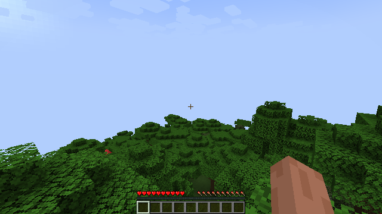

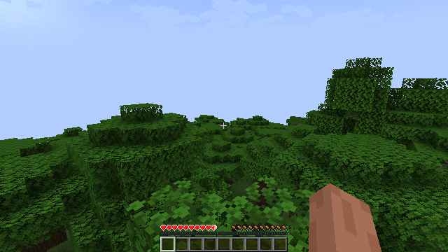

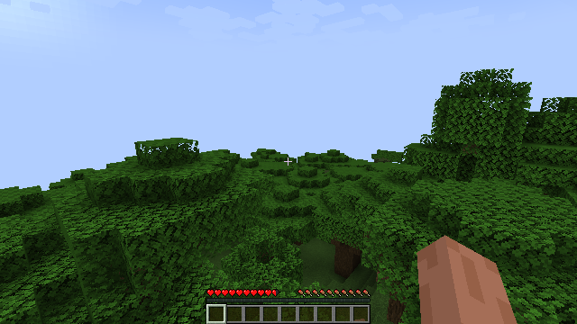

### P05：policy_sample

BC LoRA 从规范起点图像独立采样的 on-policy 动作。起始距树干=87.03；终态=79.17；真实移动进展=+7.85。

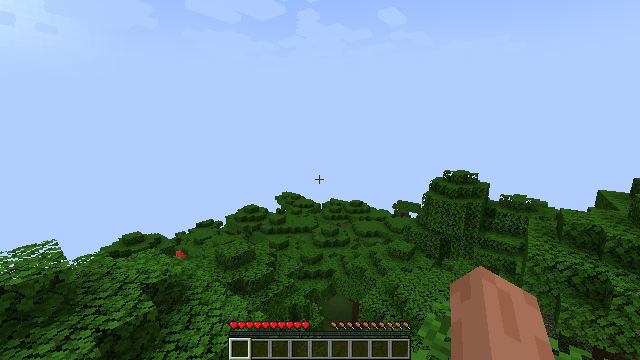

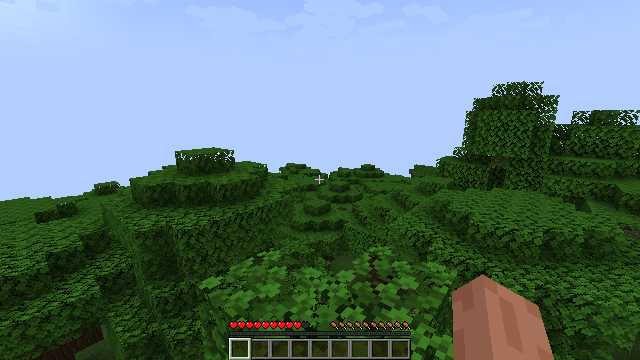

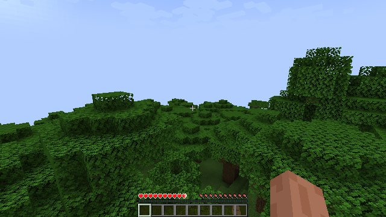

### P06：policy_sample

BC LoRA 从规范起点图像独立采样的 on-policy 动作。起始距树干=87.03；终态=76.34；真实移动进展=+10.68。

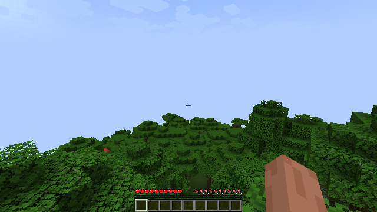

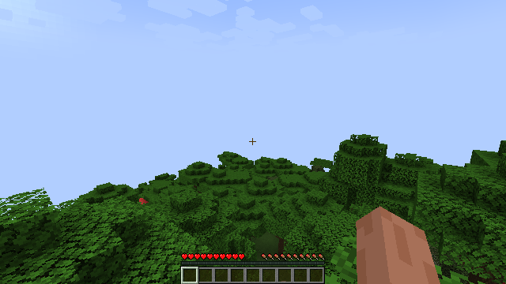

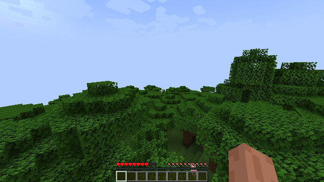

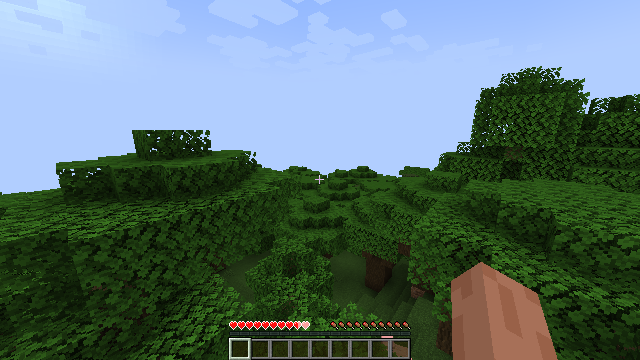

## 多起点课程银行设计

本轮只真实执行了一个树冠快照的准备课程。下表和能力清单定义后续采样合同，不将其描述为已经执行的轨迹或已经存在的快照。

| 维度 | 本轮已验证标签 |
|---|---|
| stage | early |
| inventory_loadout | empty |
| biome_terrain | tree_crown |
| hazard | fall |
| health_hunger | healthy |
| route | surface |
| strategy | safe_descent |
| version_mechanic | Minecraft Java 1.21.x |

快照准入：必须记录来源、真实观察或成功末态的可行性证据、八个课程维度；禁止使用作弊状态或物理不可能状态。采样先满足能力覆盖下限，再按失败次数提高重采样权重；不能总是从出生点线性推进。

| 能力种子 | 科技阶段 | 真实准入前置 | 版本/机制依赖 |
|---|---|---|---|
| 接近已观测树干 | early | 可见目标 | Minecraft Java 1.21.x 基础移动 |
| 铁镐采钻石 | iron | iron_pickaxe；visible_diamond_ore；safe_mining_route | Minecraft Java 1.21.x 钻石矿石挖掘 |
| 钻石镐采黑曜石 | diamond | diamond_pickaxe；visible_obsidian；safe_lava_control | Minecraft Java 1.21.x 黑曜石挖掘 |
| 垫脚方块与食物补给 | early | blocks；food | Minecraft Java 1.21.x 饥饿与放置机制 |
| 村庄利用 | early | visible_village；safe_route | Minecraft Java 1.21.x 村庄结构与交易 |
| 铁傀儡战斗 | iron | visible_iron_golem；weapon；escape_route | Minecraft Java 1.21.x 铁傀儡 AI |
| 一般战斗 | early | visible_hostile；weapon_or_safe_fallback | Minecraft Java 1.21.x 敌对生物 AI |
| 搭建下界门 | diamond | obsidian；ignition；portal_site | Minecraft Java 1.21.x 下界门 |
| 堡垒与烈焰人生存 | nether | active_portal；fire_resistance_plan；visible_fortress_or_blaze | Minecraft Java 1.21.x 下界堡垒与烈焰人 |
| 刷铁机 | iron | village_resources；villagers；zombie_or_equivalent | 以目标版本实测的刷铁机机制 |
| 船机制处理末影人 | end | boat；visible_enderman；safe_area | Minecraft Java 1.21.x 船与末影人碰撞机制 |
| 末影之眼寻找要塞 | end_ready | ender_eye；overworld_route | Minecraft Java 1.21.x 末影之眼定位要塞 |
| 不同装备组合击杀末影龙 | end | active_end_portal；combat_loadout；recovery_plan | Minecraft Java 1.21.x 末影龙战斗 |

路线校正：末影之眼仅用于主世界寻找要塞和末地门；前往下界必须通过黑曜石下界门。只有与当前快照维度和真实前置相符的能力课可进入执行队列。

## 快照边界与课程更新

每条轨迹恢复后均执行 W 坐标位移探针；若无位移则发送 inventory/E 并二次验证。起点的位置与朝向必须完全恢复，才允许执行。

| 候选 | 首次 W 位移 | GUI 中和 | 起点偏差 |
|---|---:|---|---|
| R01 | 0.098 | 否 | {'x': 0.0, 'y': 0.0, 'z': 0.0, 'yaw': 0.0, 'pitch': 0.0} |
| R02 | 0.019 | 是 | {'x': 0.0, 'y': 0.0, 'z': 0.0, 'yaw': 0.0, 'pitch': 0.0} |
| P01 | 0.019 | 是 | {'x': 0.0, 'y': 0.0, 'z': 0.0, 'yaw': 0.0, 'pitch': 0.0} |
| P02 | 0.098 | 否 | {'x': 0.0, 'y': 0.0, 'z': 0.0, 'yaw': 0.0, 'pitch': 0.0} |
| P03 | 0.098 | 否 | {'x': 0.0, 'y': 0.0, 'z': 0.0, 'yaw': 0.0, 'pitch': 0.0} |
| P04 | 0.098 | 否 | {'x': 0.0, 'y': 0.0, 'z': 0.0, 'yaw': 0.0, 'pitch': 0.0} |
| P05 | 0.098 | 否 | {'x': 0.0, 'y': 0.0, 'z': 0.0, 'yaw': 0.0, 'pitch': 0.0} |
| P06 | 0.019 | 是 | {'x': 0.0, 'y': 0.0, 'z': 0.0, 'yaw': 0.0, 'pitch': 0.0} |

成功率=`50%`，平均分=`64.222`。未达到 `75%` 门槛；不替换出生快照，保留真实失败轨迹以校准。

## 长任务与 PRO 6000 流水

短任务至少输出 8 tick，在剩余 4 tick 时预取。当前准备任务为 120 tick 左右的长序列，推理在剩余四分之一处启动预取，剩余 4 tick 是最迟触发线。动作按图像锚点消费，过期 tick 丢弃，从仍追得上的最新 tick 接续。PRO 6000 的优先级为在线推理、待执行候选、相对优势、训练 batch；参考轨迹用于下界锚定、克隆和排序，不与 policy rollout 混淆。

本机没有部署训练模型，未测量真实模型 GPU 利用率、推理时延或吞吐量。
